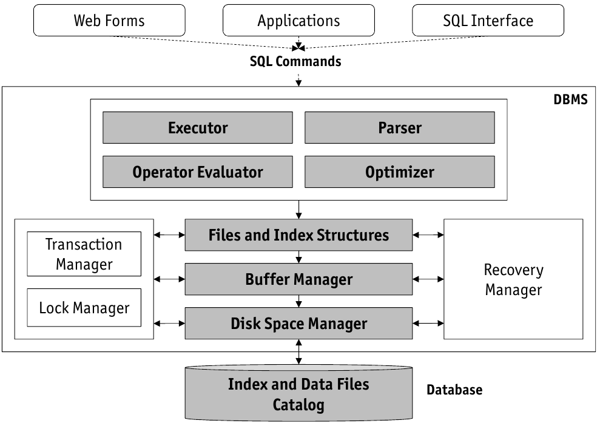

\Gruppe{Stephan Heidinger}{DBSAI - Zusammenfassung v0.1}
\Header{Database Systems Architecture and Implementation}{WS 2014/15}{Stephan Heidinger}

\begin{shaded}
This document has been published under a Creative Commons - Attribution-NonCommercial-ShareAlike (\textbf{CC by-nc-sa}). The conditions of the licence can be found \href{http://creativecommons.org/licenses/by-nc-sa/3.0/}{here}. \\
\centerline{\href{http://creativecommons.org/licenses/by-nc-sa/3.0/}{\includegraphics[width=3cm]{../cc-by-nc-sa.png} } }
\end{shaded}

\hm
Find any errors? Please send them back, I want to keep them!}

- - - -

