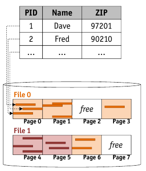
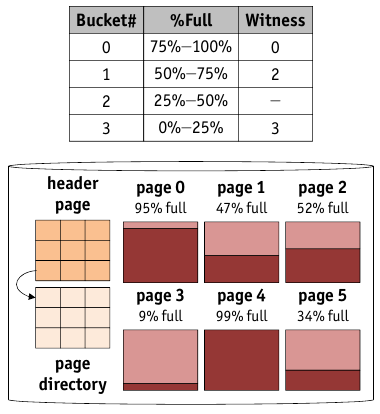

# Database Files

* Conceptual Level: _relational_ DBMS manages _tables of rows_ and _indexes_
* Physical Level: implemented as _files of record_

    * _file_ consists of _one or more pages_
    * _page_ contains _one or more records_
    * _record_ corresponds to _one row_



## Database Heap Files

* Most simple file structure in database

    * _unordered_ collection of records
    * each record as a _unique record identifier_ ($rid$)
    * heap file maps given $rid$ to the page containing the record
    * heap file interface:
    
        * ```f <- create(n)```
        
            * to implement efficiently: heap file has to keep track of all pages with free space in the file $f$

        * ```delete(n)```
        * ```rid <- insertRecord(f,r)```
        * ```deleteRecord(f,rid)```
        * ```r <- getRecord(f,rid)```
        * ```openScan(f)```
        
            * Heap file has to keep track of all pages in the file $f$

* simple structures with those properties:

    * (doubly) _linked list_ of pages
    
    
    
        * ```f <- createFile(n)```
        
            1. DBMS allocates a free page (_header page_) and stores entry ```<n, header page>``` to known location on disk
            2. header page is initialized to point to two doubly linked lists of pages: _full pages_ and _pages with free space_
            3. initialize both lists empty
            
        * ```rid <- insertRecord(f,r)```
        
            1. _find page_ $p$ in the free list with space $> |r|$
            2. should this fail, ask disk manager to _allocate new page_ $p$
            3. record $r$ is _written_ to page $p$
            4. since generally $|r| << |p|$, $p$ will belong to _list of free space_
            5. a _unique_ $rid$ for $r$ is computed and returned
            
        * ```deleteRecord(f,r)```
        
            * may result in _moving the containing page_ from list of full pages to list of free space
            * may also lead to _page deallocation_ if page is completely free

        * ```openScan(f)```

            * _both_ page lists have to be traversed

    * _directory_ of pages

        * _header page_ contains first page of chain of _directory pages_
        * each entry in a directory page identifies a page of the file
        * $|page directory| << |data pages|$
        * free space management is managed in directory

        * _exact_ counter value: $nfree$

            * each transaction which changes space updates this counter
            * may become bottleneck (locking, etc, necessary)

        * _fuzzy_ information: $\lfloor \nicefrac{nfree}{8} \rfloor$

            * directory only needs to be updated for "large changes" in free space
            * exact information is kept in the page

    

## Record Insertion Strategies

* **Append Only**: Always insert into last page, if not possible: create new page
* **Best Fit**: Search all pages and pick page with amount of free space most closely matching required space
* **First Fit**: Search from beginning and pick first sufficient space
* **Next Fit**: maintain running pointer and continue searching from here

### Free Space Witnesses



* Accelerate search for free space with _witnesses_
* classify pages into buckets
* for each bucket, remember _witness page_
* only perform standard best/first/next fit search, if not witness page for this bucket present
* populate witness information while searching

### Linked List vs. Directory

* Linked List

    * Pro:
    
        * Easy to implement
    
    * Con:
    
        * most pages will end up in free space list
        * searching for space may take long

* Directory

    * Pro: free space management very efficiently
    * Con: memory overhead to host page directory
