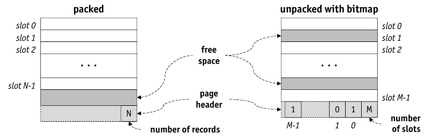
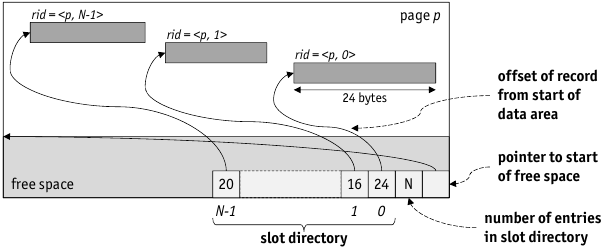

# Fixed Length Record

* All records on the page/in the file are the _same size_ $s$

    * ```getRecord(f,<p,n>)``` given the $rid<p,n>$ => the record is at (byte) offset $n/times s$ on page $p$
    * ```deleteRecord(f,<p,n>)```: copy the bytes of last occupied slot on page $p$ to offset $n/times s$, mark slot as free (=> page is packed, i.e. all occupied slots start at the page)
    * ```insertRecord(f,r)```: find page $p$ with free space $\geq s$, copy $r$ to first free slot on $p$, mark slots as occupied

## Free Slot Bitmap



* Avoid record copying and therefore $rid$ modification
* Delete simply sets bit $n$ in bitmap to 0
* bitmap is a not a header, so that bitmap and data grow towards each other

# Variable-Length Records

* Records can have variable length (e.g. ```VARCHAR(n)```) => page fragmentation
* ```insertRecord(f,r)```: find an empty slot of size $\geq |r|$ => wasted space is minimal
* compacting remaining records into _continuous area of free space_ => get rid of holes produced by ```deleteRecord(f,rid)```
* Solution: maintain _slot directory_ on each page

    * free space management similar to heap file
    * contains $<offset, length>$, offset is measured in bytes from the start
    * during ```deleteRecord(f,<p,n>)```: set directory entry $n$ to $-1$ to indicate reusability
    * store length of records, store tombstones on delete
    
    
