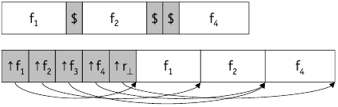
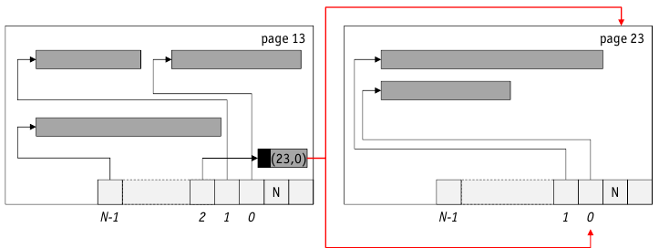

# Record Formats

* attributes are considered atomic in RDBMS
* record field type defines length

    * fixed length (Integer, Bigint, Char(n), Date, …)
    * variable-length (Varchar(n), Clob(n), …)

* On ```Create Table```: DBMS computes field size information for records of file => recorded in _system catalog_
* **Fixed Length**: each field has fixed length and number of field is also fixed

    * fields can be stored _consecutively_
    * address can be calculated with only number of preceding fields (and information from system catalog)

* **Variable-Length**: multiple variants how to store:

    

    * use delimiter symbol: Special Symbol to sparate record fields, may not be used in fields now
    * use array of $n+1$offsets pointing to actual location
    * Array approach typically superior:
    
        * direct access to any field
        * ```NULL``` values can be recognized by pointer comparision $start = end$
    
    * _Combination_ of delimiter and array approach is also possible, variable length fields stored at end of record, fixed length at the beginning
    * Variable length variant might even be usefull for fixed-length record
    
        * support for null values
        * schema evolution

# Addressing Schemes

* Criteria for "good" record ids:

    * given a $rid$ => no more than one page I/O to get to record
    * $rid$s should be stable under all circumstances (moving within or across pages)

* Direct Addressing

    * **Relative Byte Address** (RBA): disk file => persistent virtual address space, byte-offset as $rid$
    
        * Pro: very efficient access to pages and records within pages
        * Con: no stability wrt moving records
        
    * **Page Pointers** (PP): use disk page numbers as $rid$
    
        * Pro: very efficient access to page, locating records withing page cheap (in-memory)
        * Con: stable wrt moving records in a page, but not across pages

* Indirect Addressing: **Logical Sequence Numbers** *LSN): Assign logical numbers to record, use address translation table to map LSN to PP or RBA

    * Pro: full stability wrt relocations of records
    * Con: additional I/O operation to translate table (often in the buffer)
    
* Fancy Indirect Addressing: **LSN with probable Page Pointers** (LSN/PPP): try to avoid extra I/O operations by adding PPP to LSN, where PPP is PP at time of insertion (if record is moved, PP _not_ updated)

    * Pro: full stability wrt all record relocations and PPP may save extra I/O, if still correct
    * Con: two additional page I/O operations if PPP no longer valid (read "old" page, read translation table, rew new page)
    
* **Tuple Identifier** (TID): use $<pageNo, slotNo>$ par as $rid$

    

    * $slotNo$ is an index in page-local offset array
    * => guarantees stability wrt relocation within page
    * stability wrt relocation across => leave _forwarding address_ (tombstone)
    * Used by most DBMS
