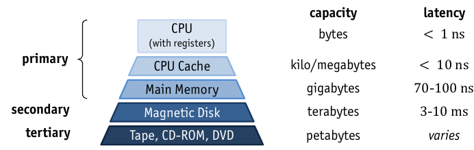
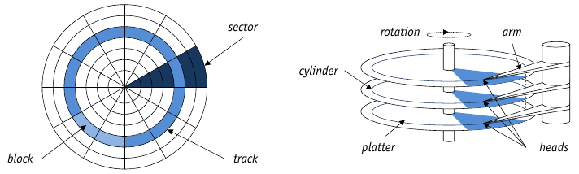

# Disks

* Different types of storage have different speeds/latencies and capacities (Figure~\ref{image:MemoryHierarchy})

    

## Magnetic Disk Setup



* **Platters**: One or Two sided
* Concentric Ring: **Tracks**
* Arc-Shaped **sectors**
* **Cylinder**: set of tracks with the same diameter
* **block**: multiple of sector size

\text{\tiny see Figure~\ref{image:magneticDisk}}

### Access Time

* To read data, head and disk need to be in correct position.

    => **Access Time**: $\Sigma t = t_s + t_r + t_t$ with:
    
    * **seek time** ($t_s$): disk head moves into position (_correct track_)
    * **rotational delay** ($t_r$): disk rotates under head (_correct block_)
    * **transfer time** ($t_t$): actual transfer of block data

### Sequential vs. Random Access

* **Sequential Access**: Access adjacent blocks: Very fast as there is no additional seek time or rotational delay
* **Random Access**: wait for disk and head to align to correct block.
* => Avoid Random Access wherever possible.

### Performance Tricks

* **track skewing**: align sector 0 of each track in a way to avoid rotational dealay
* **request scheduling**: for multiple requests, choose an access path that requires least arm movement
* **zoning**: outer tracks are longer => divide into more sectors

### Implications for DBMS

* I/O dominates time for DBMS operations
* Disk block is unit of measurement which DBMS has to work with.
* Reduce _Number_ of I/O operations.
* Reduce _Duration_ of I/O Operations

### RAID Systems

* **R**edundant **A**rray of **I**ndependent **D**isks
* Hardware or Software Implementation
* **Redundancy**: Replicate data over multiple disks => **Reliability**
* **Data Striping**: distribute data over multiple disks => **Performance**
* RAID-Levels

    * **0**: non redundant, just striping
    * **1**: Mirroring, no striping, just replication
    * **10** (0+1): Combination of 0 and 1
    * **2**: Error-Correction Codes (ECC)
    * **3**: Bit-Interleaved parity, one parity disk
    * **4**: Block-Interleaved Parity, like 3, but block wise distribution
    * **5**: Block-Interleaved Distributed Parity, parity distributed over all disks
    * **6**: P+Q Redundancy, like 5, but additional parity blocks

## Solid-State Disks

* very **low latency read access**
* random writes significantly slower
* current topic of research

## Network and Cloud-based Storage

* network not the bottleneck any more
* Storage Area Network:

    * Emulate interface of block structured disks
    * simplify maintainability by abstraction* fault tolerance can be increased

# Disk Space Manager

* Abstracts from file System
* DBMS issues ```allocate```/```deallocate``` and ```read```/```write``` commands to disk space manager
* Provides concept of **page**

    * disk block, that has been brought into memory => blocks and pages are of same size
    * _sequences of pages_ are mapped to _continuous sequences of blocks_
    * unit of storage for higher layers
    * page number <--> physical location

## Free Space

* Disk Space Manager keeps track of **used** and **free** blocks.

    * _Linked List_ of free blocks
    * free block _bitmap_
