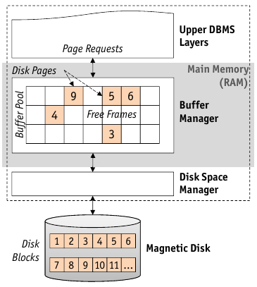
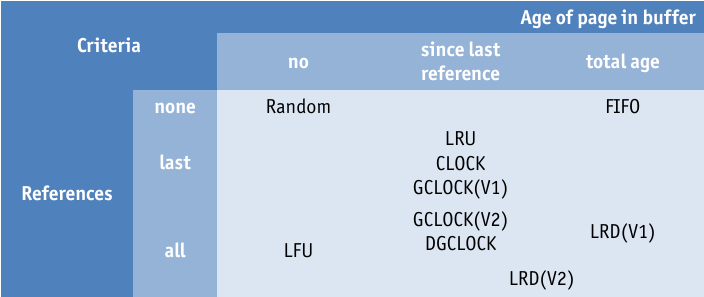
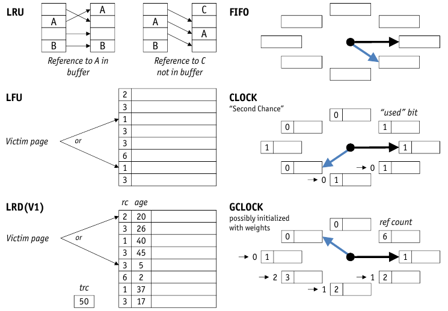
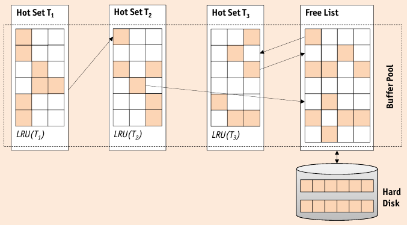

# Buffer Manager

* mediate between external storage and main memory
* The **Buffer Pool** is a main memory area managed by the buffer manager

    * organized as collection of **frames**
    * pages loaded and brought into frames as needed
    * **replacement policy** decides, when to evict pages



## Buffer Manager Interface

* Higher-level code request (**pin**s) pages and releases (**unpin**s) pages

    * ```pin(pageNo)```

        * request page number $pageNo$ from buffer manager
        * if needed, load page and mark as clean ($\neg dirty$)
        * return reference to frame containing page number $pageNo$

    * ```unpin(pageNo, dirty)```

        * release page number $pageNo$, make it candidate for eviction
        * if page was modified, $dirty$ must be true
    
    * ```pin()``` and ```unpin()``` have to be balanced
    * $clean$ pages are not written back to disk
    * ```unpin()``` does not trigger I/O
    * pages with ```pinCount == 0``` are candidates for eviction
    * ```flushPage(p)``` can be used to _force_ disk I/O
    * _concurrency_ is achieved by __concurrency control__, a higher level

### Buffer Allocation Policies

* **Buffer Allocation Problem**: How much buffer space should be allocated to each transactions? _static_ vs. _dynamic_ assignement
* **Local Policies**:

    * allocate buffer frames to transaction _without_ taking reference behaviour into account
    * has to have mechanism for handling allocation for frames for shared pages
    * _Pro_:
    
        * one transaction cannot hurt other transactions
        * all transactions are treated equally
    
    * _Cons_:
    
        * possible _bad_ utilization of buffer space
        * some transactions may occupy vast amounts of buffer space while others have to little space (**"internal page thrashing"**)

* **Global Policies**:

    * consider reference behaviour of all other transactions
    
        * all pages have access to newly loaded pages
        * all other pages are likely to be replaced
        * other transactions may need to reload pages again (**"external page thrashing"**)

### Buffer Allocation Policies

* **Page Replacement Problem**: Which page will be replaced, when a new request arrives into a full buffer pool?

    * _One Buffer Pool_: good space utilization, fragmentation problem
    * _Multiple Buffer Pool_: no fragmentation, worse utilization, global allocation/replacement strategy very complicated
    * Local: using various informations (catalog, index, data, …)
    * Local: each transaction gets a certain fraction of the buffer pool
    
        * **static partitioning**: assign buffer budget once
        * **dynamic partitioning**: adjust buffer budget of transaction according to past reference pattern or semantic information
        
    * mixed policies are possible, but are quite complex
    
### Dynamic Buffer Allocation Policies

* **Local LRU**

    * Keep separate _LRU-stack_ for each transaction
    * Keep global _free list_ for pages unpinned by any transaction
    * Strategy:

        1. replace a page from the free list_
        2. replace a page from the LRU-stack of the requesting transaction
        3. replace a page from the transaction with the largest LRU-stack

* **Working Set Model** ($\approx$ virtual memory management of OS)

    * avoid thrashing by allocating "just enough" buffers to each transaction
    * _approach_: observe number of different page requests by each transaction in a certain intervall of time (window $\tau$)
    
        * => deduce optimal buffer budget, allocate according to ratio between optimal sizes

### Buffer Replacement Policies



* **FIFO** (first in, first out)
* **LRU** (least recently used) evicts page with the oldest ```unpin()```
* **LRU-k** like LRU but evicts $k$ latest ```unpin()``` calls
* **MRU** (most recently used) evicts post that has been recently unpinned
* **LFU** (least frequently used)
* **LRD** (least reference density)

    * record three parameters:
    
        * ```trc(t)```: total reference count of transaction $t$
        * ```age(p)```: value of ```trc(t)``` at the time of loading $p$ into buffer
        * ```rc(p)```: reference count of page $p$
    
    * compute _mean reference density_ of page $p$ at time $t$ as
    $$ rd(p,t) := \frac{rc(p)}{trc(t) - age(p)} $$
    where $trc(t) - rc(p) \geq 1$

* **Clock** ("second chance") simulates LRU with less overhead
* **GCLOCK** (generalized clock)
* **WS, HS** ("working set", "hot seat")
* **Random**



These policies are _heuristics_ and can fail miserably in certain scenarios.

* Exploiting Semantic Knowledge

    * _Background_: query compiler/optimizer already
    
        * selects access plan (e.g. sequential scan vs. index)
        * estimates number of page I/O operations (for cost based optimization)
        
    * Idea: use this information to determine optimal buffer budget ("hot set")
    * => optimize overall system throughput + avoid thrashing
    
* Hot Set with Disjoint Page Sets

    1. Only queries whose Hot Set can be satisfied are activated
    2. higher demand queries have to wait
    3. each transaction applies a local LRU for its buffer budget
    
    * _no sharing_ of buffer pages
    * risk of _internal thrashing_
    * large Hot Sets _block_ other queries, risk of _starvation_
    
* Hot Set with Non-Disjoint Page Sets

    

    1. queries allocate buffer budget stepwise
    2. local LRU used for replacement
    3. request new page $p$
    
        1. if on own LRU stack, update LRU stack
        2. if in another transactions LRU stack, access page, don't update LRU
        3. if in _free list_, push page to own LRU
        
    4. call to ```unpin(pageNo)```: push page onto free list
    5. filling empty buffer frames: taken from bottom of the free list stack

* Priority Hints

    * with ```unpin(pageNo)```, an indication is passed along
    
        * **preferred page** (managed in transaction-local partition)
        * **ordinary page** (managed in global partition)
    
    * strategy: when replacing
    
        1. try to replace ordinary page from global using LRU
        2. replace a preferred page of the requesting transaction using MRU
        
    * Much simpler than Hot Set, similar Performance
    * easy to deal with "too small" partitions

### Prefetching

* Buffer manager tries to _anticipate_ page requests => read ahead to improve performance and lower I/O

    * _Prefetch lists_: on-demand, asynchronous read-ahead
    * _heuristic_ (speculative) prefetching

## Double Buffering

* DBMS buffer manager can interfere with OS buffer manager => I/O invisible to DBMS can happen or I/O expected might not take place

    * **virtual page fault**: page resides in DBMS buffer, but swapped out of OS
    * **buffer fault**: page does not reside in DBMS buffer, but in OS buffer
    * **double page fault**: page does not reside in DBMS buffer, frame is swapped out of OS => one I/O for frame and one for page
    
* DBMS buffer => needs to be _memory resident_ in OS
