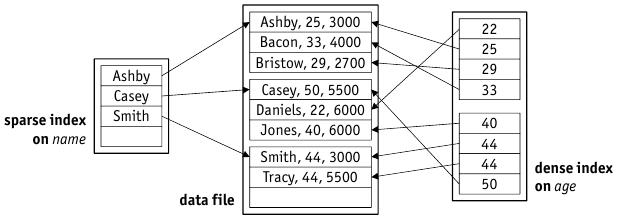

# File Organisation and Indexes

* Heap File is _just enough_ to maintain collection of records => only sequential scan
* For some queries, particular file organisation might be usefull.
* Different File Organisations:

    1. _heap file_: randomly ordered
    2. _sorted_ files on one or more record fields
    3. _hashed_ files on one or more record fields
    
* Compare Files with simple cost model, five disciplines:

    1. _scan_: read all records
    2. search with _equality test_
    3. search with _range selection_
    4. _insert_ a given record into file's organisation
    5. _delete_ a record (by $rid$), maintaining file's organisation
    
## Cost model

* _block I/O_ typically major factor
* _CPU time_ also important
* parameters:

    * _b_: number of pages in file
    * _r_: number of records on a page
    * _D_: time to read/write a **d**isk page
    * _C_: **C**PU time needed to process record
    * _H_: CPU to,e to apply a function (**H**ash) to a record

* simple **Hash Function** h

    * hash function determines page number only, record placement is stored inside page
    * if a page $p$ is filled to capacity, chain of overflow pages is maintained
    * pages are typically filled up to $80\%$ when heap file is initialized

### Cost of _Scan_:

* Involves _reading all $b$ pages_ and _processing each record $r$_ on each page
* **Heap File**:

    * $Scan_{heap} = b\cdot (D + r \cdot C)$
    
* **Sorted File**: sort order does not help, just scan

    * $Scan_{sort} = b \cdot (D + r \cdot C)$

* **Hashed File**: hash function does not help, scan from beginning, hash file will very probably have random access

    *$Scan_{hash} = \underset{=1.25}{\underbrace{\nicefrac{100}{80}}} \cdot b \cdot (D + r \cdot C)$

### Cost of Search with _Equality Test_

1. **Heap** file:

    * equality test on _primary key_:
    
        $Search_{heap} = \nicefrac{1}{2} \cdot b \cdot (D + r \cdot C)$
    
    * equality test _not on primary key_:
    
        $Search_{heap} = b \cdot (D + r \cdot C)$

2. **Sorted** file (sorted on _A_)

    * assume equality test on _A_ (else its just a scan): use binary search
    
        $Search_{sort} = \log_2 b \cdot D + \log_2 r \cdot C$

3. **Hashed** file (hashed on _A_)

    * assume equality test on _A_ => best equality search support (ignoring overflow chains)
    
    * equality test on _primary key_:
    
        $Search_{hash} = H + D + \nicefrac{1}{2} \cdot r \cdot C$
    
    * equality test _not on primary key_
    
        $Search_{hash} = H + D + r \cdot C$ \text{\tiny note: no dependence on file size $b$ here}

### Cost of Search with _Range selection_

1. **Heap** file: Qualifying records can appear anywhere in the file:

    $Range_{heap} = b \cdot (D + r \cdot C)$
    
2. **Sorted** file (sorted on _A_): Use equality serach with $A=lower$, then sequential scan until $A>upper$ is found. $n$ denotes number of hits.

    $Range_{sort} = \log_2 b \cdot D + \log_2 r \cdot C + \lfloor \nicefrac{n}{r} \rfloor \cdot D + n \cdot C$

3. **Hashed** File (hashed on _A_): Hashing scatters the records, no improvement here

    $Range_{hash} = 1.25 \cdot b \cdot (D + r \cdot C)$
    
### Cost of _Insert_

1. **Heap** file: add record to arbitraty page, read and write this page

    $Insert_{heap} = 2 \cdot D + C$
    
2. **Sorted** file: On average, new record will be in the middle, all subsequent records must be shifted

    $Insert_{sort} = \underset{search}{\underbrace{\log_2 b \cdot D + \log_2 r|cdot C}} + \underset{shift latter half}{\underbrace{\nicefrac{1}{2} \cdot b \cdot (2 \cdot D + r \cdot C)}}$

3. **Hashed** File: Search for record, read and write page determined by hash function (assume there is space to hold new record)

    $Insert_{hash} = \underset{search}{\underbrace{H + D}} + C + D$
    
### Cost of _Delete_

1. **Heap** file: Assume file is not compacted after record is found and removed.

    $Delete_{heap} = \underset{search}{\underbrace{D}} + C + D$
    
2. **Sorted** file: Access record's page and then (on average) shift the latter half of file to compact

    $Delete_{sort} = D + \underset{\text{shift latter half}}{\underbrace{\nicefrac{1}{2} \cdot D + r \cdot C}}$

3. **Hashed** File: Direct access by $rid$, faster than hash.

    $Delete_{hash} = D + C + D$

### Performance Comparison

* **Range Selections**: _sorted_ file is superior from the beginning
* **Deletions**: _hashed_ file is linear, sorted file gets worse with number of records
* Selection of files is depending on what is to be expected

## Indexes

* B+ tree: offer advantages of sorted file _and_ support insertions and deletions efficiently
* **Idea**: If basic organisation does not support specific operation => _additionally_ maintain an index as auxiliary structure.

    * DBMS uses indexes like _guides_, each guide is specialized on specific attribute => the **search key**.
    1. Query index with **search key**
    2. Returned entry is the **index entry** $k^*$ (containing enough info to access the actual record in the file)
    3. Read actual record by using information from $k^*$, record will have an attribute with value $k$
    
* Index Entries:

    1. $<k, <\dots, A=k, \dots>>$
    
        * 1 => Data stored in the index, no additional storage necessary.
        * If multiple indexes are built, only one should have variant 1.
    
    2. $<k, rid>$
    3. $<k, [rid_1, rid_2, \dots]>$
    
        * fewer index entries for multiple matching records
        * index entries have variable length
    
    * Variant 2 and 3 use $rid$(s) to point to actual data file

### Clustered vs. Unclustered Indexes

* **Clustered** Index: Data is organized in the same way as the index (automatically with variant 1).
* **Unclustered** Index: Data can be organized in any which way.
* Cost for _Range Selection_ grows tremendously for unclustered index => Random I/O
* Each data fo;e can have _at most one clustered index_ (but any number of unclustered indexes)

### Dense vs. Sparse Indexes



* _Clustered index_ can be **space efficient**
* maintain one index entry $k^*$ **per data file page** => $k$ is the smallest key
* such indexes are called **sparse**, otherwise they are **dense**.
* unclustered sparse index is not possible

### Multi-Attribute Indexes

* indexes can use a combination of attribute values as key: ```<lastname, firstname> -> searchkey```
* support lookup on whole key or or _prefix_ of key.
* _multi-dimensional indexes_: support support for symmetric lookups
