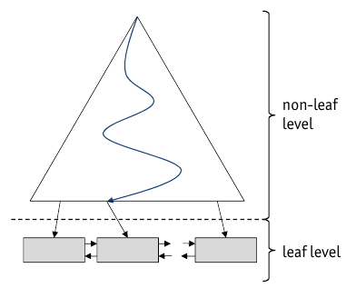
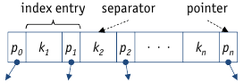
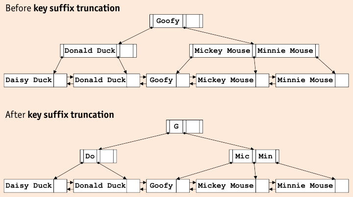

# Tree-Structured Indexes



* **Binary Search**: Needs sorted file

    * _Pro_: During Scan: page accesses are sequential
    * _Con_:
    
        * During Search: $\log_2(\# tuples)$ need to be read
        * About same number as tuples need to be read
        * large unpredictable jumps => prefetching impossible
        
* improve binary search by introduction _auxiliary structure_ that contains _one record per page of original (data) file_ => recursively apply until only one page left
* particularly usefull for _Range Selections_

## Indexed Sequeuntial Access Method (ISAM)



* **static** replacement of binary search phase => fewer pages read
* ISAM is a _sparse index_, since in an entry $<k_i, p_i>$, key $k_i$ is the first (minimal) attribute value on the data file.
* **Range Selection**:

    * conduct binary search on index file => do sequential scan of data file
    * index file much smaller than data file
    
* For large data files, recursively apply index creation step: _multi-level ISAM structure_
* => tree-structured hierarchy of index levels

    * each node corresponds to _one page_ (disk block)
    * ISAM structure is created _bottom up_
    
        1. sort data file on search key
        2. create index leaf level
        3. if topmost level contains more than one page, repeat procedure
        
    * non-leaf level remain **static**
    * in the leaf level, there may be overflow pages

* ISAM may lose balance after heavy updating
* typically $20\%$ free space to handle overflow problem
* static pages can't be locked, therefore there is no bottleneck here

ISAM is very well suited for relatively static data (were the distribution of data does not change much).

* _Fan-Out_: number of children for non-leaf nodes:

    * $n$ children per page, height $h$ => $n^h$ leaf pages

## B+ Tree Properties

* B+ Tree is a derivation of the ISAM index structure, fully dynamic wrt updates
* Search performance is only dependent on the _height_ of the B+ Tree (and height rarely exceeds $3$ due to high fan-out)
* B+ Trees **remain balanced**, **no overflow chains** develop
* B+ Trees support efficient **insert/delete operations**, data file can grow/shrink dynamically
* B+ Tree nodes have a minimum occupancy of $50\%$ (typically $66\%$)
* **Leaf Nodes** are connected using a doubly linked list
* Leaf nodes may contain the actual data (variant 1) or references (variant 2 and 3)
* Non-Leaf nodes have the same structure as ISAM non-leaf nodes

    * **Order $d$ of B+ Tree**:
    
        inner node: $d \leq n \leq 2 \cdot d$
        
        root node: $1 \leq n \leq 2 \cdot d$

    * each node contains $n+1$ pointers

* Leaf Nodes

    * Variant 1: index is data file as well
    * Variant 2 and 3: index may still be clustered or unclustered

## B+ Tree Operations

* Insert: B+ Tree remains balanced

    * All paths from the root to any leaf must be of _equal length_
    * Insertions and Deletions _must_ preserve this invariant

* ```insert(k)```

    1. start with root node, recursively insert entry into appropriate child node
    2. on leaf node level, recursion stops, page is $n$, $m$ is the number of entries in $n$
    3. if $m<2 \cdot d$ there is room left in $n$
    4. otherwise: split node
    
        1. create new node $n'$
        2. distribute entries of $n$ and $k$ over $n$ and $n'$
        3. insert a pointer to $n'$ pointing to new node into its parent

* Root node may have occupancy of $<50\%$
* tree height increases (only), if root node is split
* **Redistribution**: improve average occupancy in B+ Tree

    * before node is plit, entries are **redistributed** with a sibling
    * the **siblings** of a node $n$ is a node that is immediately to the left or right of $N$ and has the same parent as $n$

* ```delete(k)```

    1. start in root node, recursively delete node from appropriate child
    2. stop at leaf level
    3. if $m>d$, $n$ does not have minimum occupancy and $k^*$ can be deleted
    4. otherwise
    
        * redistribution with siblings, update parent to reflect changes
        * merge node $n$ with an adjacent sibling, update parent to reflect change
        
            * If last entry in root is deleted, height of tree decreases by 1.
    
    * In practice, merge/redistribution is often avoided by relaxing occupancy rule

## Duplicates in B+ Tree

* duplicates can be ignored if key is primary key
* using Variant 3: duplicates can be accommodated, but index entry sizes is now variable
* alternatively: change insert, search and delete algorithms

## B+ Tree Performance

* Higher Fan-Out is main factor in search effort (since it depends on height): $s=\log_F N$
* Size of page pointers depends on DBMS pointer representation/hardware specifics

    * $|p_i| << |k_i|$, especially for attributes like ```CHAR(\cdot)``` or ```VARCHAR(\cdot)```
    * **minimize key size**: actual key values not needed, as long as seperator is properly maintained
    
        
    
        * for text attributes: _prefixes of text_

* B+ Tree bulk loading: Build index from bottom up

    1. for each record with key $k$ in the data file, create sorted list of pages of index leaf entries $k^*$
    
        \text{\tiny For variants 2 or 3 this does not imply sorting the data file itself, variant 1 creates a clustered index}
    
    2. allocate empy index root node, let its $p_0$ to the first page of sorted $k^*$ entries
    3. for each leaf level node $n$, inset index entry $<\text{min key on } n, *n>$ into right-most index node just above leaf level
    
    * Bulk loading more (time efficient)

        * less tree traversals
        * less page I/O, i.e. buffer pool is used more effectively
        
* In practice, B+ Tree _order_ $d$ most often not used in practice (variable key value lengths, duplicates, variable number of $rid$s, different capacity in nodes, key compression)

    => in practice, use physical space criterion ("Every node needs to be at least half full)

* Note on clustered indexes:

    * splitting and merging leaf nodes _moves data entries_
    * depending on addressing scheme, $rid$s may change if entry is moved
    
        => May use search key of clustered index as (location independent) record address for non-clustered indexes to avoid $rid$ management

## B+ Tree invariants

* **Order** $d$
* **Occupancy**

    * each non-leaf node holds at least $d$ and at most $2d$ keys (exception, root node may hold down to 1 key)
    * each leaf node holds between $d$ and $2d$ keys
    
* **Fan-Out**: each non-leaf node holding $m$ keys has $m+1$ children
* **Sorted Order**:

    * all nodes contain entries in ascending key-order
    * child pointer $p_i(1 \leq i < m)$ if an internal node with $m$ keys $k_1, \dots, k_m$ leads to sub-tree where all keys $k$ are $k_i \leq k < k_{i+1}$
    * $p_0$ points to a sub-tree with keys $k < k_1$ and $p_m$ to a sub-tree with keys $k \leq k_m$
    
* **Balance**: all leaf nodes are on the same level
* **Height**: $\log_F N$

    * $N$ is the total number of index entries/records and $F$ is the average fan-out
    * because of high fan-out, B+ trees generally have low height (typically $\leq 3$)
