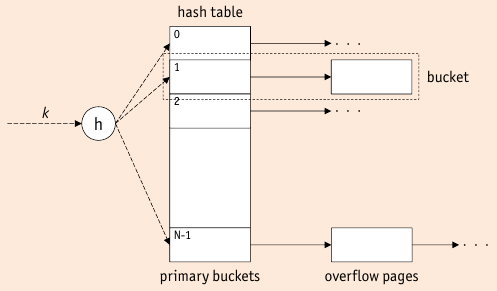
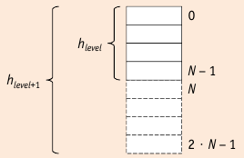

# Hash-Based Indexes

* Hash-Based Indexes are unrivaled wrt equality selections (in $1.2$ operations)
* Operations like equality joins need a large number of equality tests
* Comparison to B+ Trees

    * B+ Tree compares $k$ to other keys $k'$
    * hash indexes use the bits of $k$ itself to compute the address of the record

* Range Queries: Hash indexes have no support and are not well suited for range queries (scattering)

* Hashing granularity

    * Hashing in DBMS not in-memory => bucket oriented hashing
    * a bucket can _contain several records_ and may have an _overflow chain_
    * bucket = (set of) pages on secondary memory

## Static Hashing



* used to illustrate **basic concept** of hashing
* like ISAM, static hashing does not handle updates well
* Build static hash index:

    1. Allocate fixed area of $N$ (successive) disk pages => **primary buckets**
    2. In each bucket => pointer to overflow pages, initially -> `null`
    3. Define _hash function_ $h$ with range $[0,\dots,N-1]$, the **domain** of $h$ is the type of $A$

* Static Hashing Scheme

    1. apply hashing function $h$ to key value: ```h(k)```
    2. access primary bucket page with ```h(k)```
    3. search, insert, or delete the record with key $k$ on that page, if necessary, access overflow chain of bucket ``h(k)``
    
* In case of no overflow chains:

    * ``hsearch(k)`` => single I/O
    * ``hinsert(k)`` and ``hdelete(k)`` => two I/O
    
* don't want to prevent collisions => would need as many buckets as keys

    => it is important, that $h$ scatters the domain of $A$ evenly
    
* probability of Collisions => Birthday Paradoxon

### Hash Functions

* Actual key values are not random, good $h$

    => division of key value $$h(k) = k \mod N$$
    
    * prime numbers work best for $N$
    * choosing $N = 2^d$ for some $d$ only takes least $d$ bits of $k$
    
    => multiplication of key value $$h(k) = \lfloor N \cdot (Z \cdot k  - \lfloor Z \cdot k\rfloor ) \rfloor$$
    
    * _inverse golden ratio_ $Z = \nicefrac{2}{\sqrt{5} + 1} \approx 0.6180\dots$ good according to D. E. Knuth
    * for $Z = \nicefrac{\overset{\cdot}{Z}}{2^w}$, $N=2^d$, $w$ number of bits of CPU word) we get $h(k) = msb_d(\overset{\cdot}{Z} \cdot k)$, msb - _most significant bit_

* growing data file => overflow chains => no more predictable I/O behaviour

    * worst case: linear list (one long chain of overflow pages)

* shrinking data file => wasted space

## Dynamic Hashing

* refine the hashing principle and adapt well to record insertions and deletions
* **combine** the use of hash functions **with directories** that guide the way (extendible hashing)
* **adapt the hash function** (linear hashing)

### Extendible Hashing


* use in-memory bucket directory, primary buckets are contained
* Global Depth $n$: (gray box at hash directory): use the last $n$ bits of $h(k)$ to look up bucket pointer in directory, directory size is $2^n$
* Local Depth $d$: (gray box at individual buckets): hash values $h(k)$ of values in this bucket agree on their last $d$ bits
* ```insert(k)```

    1. compute ```h(k)```
    2. use last $n$ bits of ``h(k)`` to lookup bucket pointer in directory
    3. if _primary bucket_ still has capacity, store ``h(k)^*`` in it
    4. if not
    
        1. split bucket A by creating new bucket A2 and use bit position $d+1$ to redistribute entries
        2. local depth is incremented
        3. if $d>n$ double space of directory
        
            1. pointer of A2 points to new bucket now
            2. all other pointers point to the corresponding "old" bucket

* ```hdelete(k*)```: locate and remove entry $k^*$

    * If bucket is empty after deleting, merge with its split bucket.
    * In practice, this is not done.

### Linear Hashing



* No hash directory, only actual hash table buckets
* linear hashing defines flexible criteria to determine when bucket is split
* may perform bad, if key distribution is skewed
* **linear hashing** uses **ordered family of hash functions**

    * $h_0, h_2, h_3, \dots$ with hash function for each _level_
    * range of $h_{level+1}$ is _twice as large_ as range of $h_{level}$

* Basic Hashing Scheme

    1. Initialize ``level <- 0``, ``next <- 0``
    2. _current hash function_ in use for searches is $h_{level}$

        _active hash buckets_ are those in the range of $h_{level}$

    3. Whenever
    
        * current hash table overflows
        * Insertions filled a primary bucket beyong $c\%$ occupancy
        * Overflow chain of a bucket grew longer than $p$ pages
        * or <insert criterion>
    
        the bucket at hash table position ``next`` is split

    * _Note_ the bucket that triggers the split is generally not split.

* ``splitBucket(next)``

    1. allocate new bucket and append it to hash table at position $2^{level} \cdot N = next$
    2. redistribute entries in bucket next by rehashing them via $h_{level+1} (some will remain in bucket ``next``, some will move to new bucket)
    3. increment ``next``
    * All Buckets with positions $<$ ```next``` have already been rehashed
    * With every bucket split, next walks down the hash table. Searching needs to take current ``next`` position into account
    
        $h_{level}(k) \begin{cases}
            < next: & \text{bucket already split, rehash: find record in bucket } h_{level+1}(k) \\
            \geq next: & \text{bucket not yet split, i.e. bucket found}
        \end{cases}$
    
    * rehashing means rehashing overflow chain as well

### Extendible vs. Linear Hashing

linear hashing => directory can be avoided by cleverness
