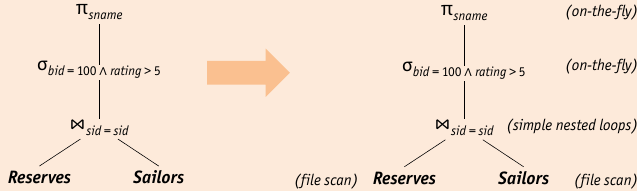
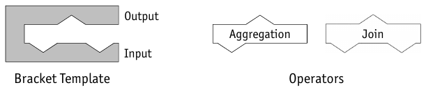
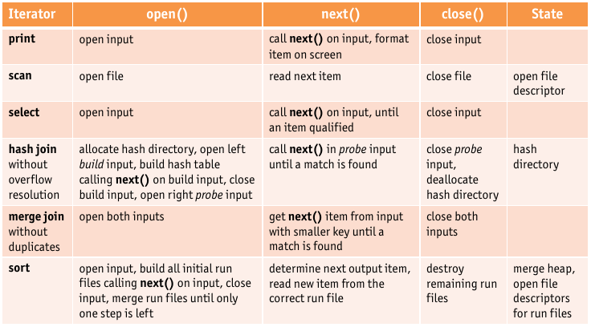
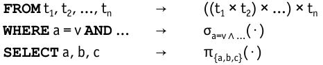
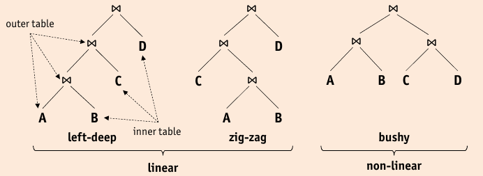

# Relational Operator Evaluation

* Focus on $\sigma, \pi, \Join$ operator as used in SPJ-queries (select, project, join)
* Cost analysis: only I/O cost considered in number of page I/O operations.

## Selection

* Selections are of the form: $\sigma_{R.attr \textbf{op} value} (R)$

    * If there is no index on $R.attr$, R has to be scanned.
    * if _one or more_ indexes match the selection, this index can be used
    
* Projection are of the form $\pi_{ \{R.attr1, R.attr2, \dots \} } (R)$

    * dropping attributes is easy
    * **duplicate elimination** is expensive
    * Without duplicate elimination (no ```DISTINCT```)
    
        * scan of the table, retrieve projected subset
        * scan of an index whose key contains all necessary attributes
        
    * With duplicate elimination
    
        1. retrieve subset of projected attributes via scan
        2. sort retrieved tuples with projected attributes as sort key
        3. scan tuples and discard adjacent duplicates
        * typically requires two or three passes
        
            1. scan entire table, only write out subset of projected attributes
            2. maybe intermediate pass which reads from and writes to disk
            3. final pass of sorting: scans all tuples but only one copy of each subset is written out.
    * presence of appropriate indexes can lead to _less expensive_ plans than sorting for duplicate elimination
    
        * if an index whose search key contains all attributes exists => sort index entries
        * if prefix of search key contains retains all attributes

* Joins are of the form $R \Join_{R.attr = S.attr} S$

    * Joins are **common and expensive** => widely studied
    * DBMS typically have _several algorithms_ to compute joins

* Other Operators:

    * ``GROUP BY``: typically through sorting or tree index with attributes as search key
    * aggregation: _temporary counters_ in main memory
    * set operations (union, difference, intersection): as in projection, _duplicate elimination_ is expensive, partitioning approach can be adapted
    
## Query Optimization



* SQL gives great flexibility => DBMS can choose from many differeny strategies

    * Quality of _query optimizer_ greatly influences performance
    * _Plan Enumerator_ enumerates number of alternative plans
    * _Plan Cost Estimator_ assigns a cost to each alternative plan
    * plan with least estimated cost is chosen

* Queries are treated as $\sigma-\pi-\Join$ algebra expressions, remaining operators are applied to result
* Query Optimization has three steps:

    1. **enumeration**: enumerate alternative plans
    2. **estimation**: estimate the cost of all plans
    3. **choosing**: choose the plan with the lowest cost
    * Typically only a subset of all plans is evaluated because of search space size

* Query evaluation plan consists of relational algebra tree extended with annotations at nodes

### Multi-Operator queries

* If a query is composed of several operators, query optimizer can decide on how the plans

    * communicate and pass results
    
        * _materialized_: output is written to temporary table
        * _pipelined_: results are directly "streamed" from one operator to another
        * pipeline has lower overhead cost, but might not be applicable for all applications (sorted output)
    
    * are scheduled and interleaved
    
        * _bracket model_: explicit scheduling
        
            
            
            * central scheduler can fit single operator into bracket on demand
            * each operator runs on its own thread and controls it
            * Synchronization points and communication needs must be known to bracket implementation
        
        * _iterator model_: implicit scheduling
        
            
        
            * all operators implement _uniform iterator interface_
            * hides internal implementation details
            * assumes pipelined evaluation
            * requires operations
            
                ```open()```: initalizes iterator, opens input/output buffers, used to pass modifiers (selection criterion, …)
                
                ```next()```: pulls next tuple from each input, executes operator-specific code, place result in output-buffer, updates interior state
                
                ```close()``` deallocates state information

### Pushing Operators

* Joins are expensive: size of two inputs determine cost
* reducing input size will speed up join
    
    => **push selections** to early stages to reduce input size
    
* **pushing projections** is also helpfull

### Plan Enumeration

1. Transform SQL query into relational algebra

    

2. Apply relational algebra equivalences to convert initial expression into equivalent expression

    * _selections_ ($\sigma$) and _cross-products_ ($\times$) can be combined into _joins_ ($\Join$)
    * _selections_ ($\sigma$) and _projections_ ($\pi$) can be pushed ahead of _joins_ ($\Join$) to reduce size of inputs
    * _joins_ ($\Join$) can be extensively reordered
    
        

* **Left-Deep Plans** => typically the only plans considered

    * use **dynamic programming** to efficiently search this class
    * apply selections and projections as early as possible
    
    => query optimizer will _not_ find the best plan, if the best plan is not left-deep

### Cost Estimation

* Cost Estimation consists of:

    1. reading input tables (for some join and sort algorithms multiple times)
    2. writing intermediate results
    3. sorting the final result (for duplicate elimination or output order)
    
    * If a plan produces sorted order, this does not have to be done explicitly.
    * If fully pipelined (common) no intermediate results are written.
    * Cost of fully pipelined plans is dominated by reading input tables
    * Not fully pipelined:
    
        * Cost may greatly yield from intermediate results.
        * Intermediate tables need to be read _and_ written.
        
* Operator Result Size:

    $\sigma$: estimated by multiplying with reduction factor
    
    $\pi$ equal to input size (no duplicate elimination)
    
    $\Join$ estimated by multiplying maximum result size (product of input sizes) with reduction factor (of join condition)