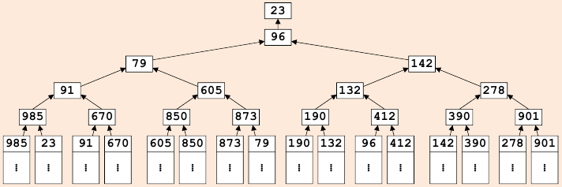
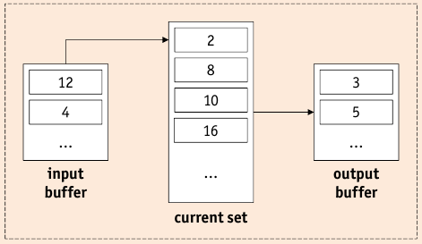

# External Sorting

* sorted wrt to _sort key_ $k$ and ordering $\theta$, if for any two records $r_1,r_2$ their keys are in $\theta$-order: $$r_1\theta r_2 \qquad \Leftrightarrow \qquad r_1.k \theta r_2.k$$
* key may be a ordered list of attributes: order is defined _lexicographically_: $k=(A,B), \theta \leq$ $$r_1 < r_2 \qquad \Leftrightarrow \qquad r_1.A < r2.A \vee (r_1.A = r_2.A \wedge r_1.B < r2.B)$$
* If data to be sorted is to large for available buffer pool => external sorting is required

## Two-Way Merge Sort

* Two-Way Merge Sort can sort files of arbitrary size with only _three pages_ of available buffer space.
* Two-Way Merge Sort uses multiple **passes** which create subfiles called **runs**

    1. **Pass 0** sorts each of the $2^k$ input pages individually in _main memory_, resulting in $2^k$ sorted runs.
    2. **Subsequent Passes** merge pairs of runs into larger runs. Pass $n$ produces $2^{k-n}$ runs.
    3. **Pass** $k$ produces one final run, the complete sorted file.
    
* During each pass, every page of the file is read and written => $2 \cdot k \cdot N$ page I/O operations are needed.

* **Pass 0**:

    1. Read $N$ pages, one page at a time.
    2. Sort records, page-wise, in main memory.
    3. Write sorted pages to disk (each file => in a _run_).
    * This pass requires _one page_ of buffer space.

* **Pass $n$**:

    1. Open two runs $r_1$ and $r_2$ from Pass $n-1$ for reading.
    2. Merge records from $r_1$ and $r_2$, reading input page by page.
    3. Write new $2^n$-page run to disk, page by page
    
* Restriction to three buffer pages is voluntary. Two-Way Merge Sort can be used for worst case scenarios.

## External Merge Sort

* Improvements: over Two-Way Merge Sort

    * **Reduce number of runs** by using full buffer space to avoid creating one-page runs in Pass 0.
    * **Reduce number of passes** by mergin more than two runs at a time.
    
* If $B$ pages are available in buffer pool:

    * $B$ pages can be read at a time during Pass 0 and sorted in memory.
    * $B-1$ pages can be merged at a time (one page is the write buffer)
    
* **Pass 0**:

    1. Read $N$ pages, _$B$ pages at a time_.
    2. Sort records, page-wise, in main memory
    3. Write sorted pages to disk (=> $\lceil \nicefrac{N}{B} \rceil$ runs )
    * This pass uses $B$ pages of buffer space.
    
* **Pass $n$**

    1. Open $B-1$ runs $r_1, \dots, r_{B-1}$ from Pass $n-1$ for reading.
    2. Nerge records from $r_1, \dots, r_{B-1}$ from Pass $n-1$ for reading.
    3. Write new $b \cdot (B-1)^n$ - page run to disk, page by page
    * This pass requires $B$ pages of buffer space.
    
* Each pass reads, processes and writes _all $N$ pages_.
* Number of initial runs determines number of passes.

    * in Pass 0: $\lceil \nicefrac{N}{B} \rceil$ are written.
    * number of additional passes: $\lceil \log_2 \lceil \nicefrac{N}{B} \rceil \rceil$
    * With $B$ pages of buffer space, we can to a $(B-1)$-way merge: $\lceil \log_{B-1} \lceil \nicefrac{N}{B} \rceil \rceil$ additional passes instead
    * => total number of page I/O: $$2 \cdot N \cdot (1 + \lceil \log_{B-1}\lceil \nicefrac{N}{B} \rceil \rceil)$$

### Blocked I/O

* improve I/O pattern by using _blocked I/O_

    * allocate $b$ pages for each input => read _blocks of $b$ pages_ during merge

        * reduces I/O cost per page
        * decreases fan-in => increases number of I/O operations

    * => total number of page I/O: $$2 \cdot N \cdot (1 + \lceil \log_{\lfloor \nicefrac{B}{b} \rfloor}\lceil \nicefrac{N}{B} \rceil \rceil)$$

* in practice, main memory is enough to sort in just one merge pass, even with blocked I/O

### CPU load

* External merge sort is much more CPU intensive => I/O is still dominating factor.
* Use selection tree (Figure~\ref{image:selectionTree})
* Cuts down comparison cost from $B-2$ to $\log_2(B-1)$.

## Replacement Sort

* Number of runs still determines number of required passes.
* Produce initial runs with more than $B$ pages. (Figure~\label{image:ReplacementSort})

* Replacement Sort:

    1. Open empty run file for writing.
    2. Load next page of file to be sorted into input buffer.
    
        * If input file is exhausted, goto 4

    3. While there is space in the current set, move a record from input buffer to current set.
    
        * If input buffer is empty, goto 2.
        
    4. In current set, pick record $r$ with smallest key value $k$ such tath $k \geq k_{out}$, where $k_{out}$ is the maximum key value in output buffer. Move $r$ to output buffer. If output buffer is full, append output buffer to current run.
    5. If all $k$ in current set are $<k_{out}$, append output buffer to current run, close current run. Open new empty run file for writing.
    * Step 4 will benefit from techniques like selection tree (Figure~\ref{image:selectionTree}), esp. if $B-2$ is large.

* External Sort follows _divide and conquer_ principle => independent sub-tasks => execute in parallel
* CPU should never remain idle: avoid waiting for input to be reloaded or output to be appended.
* **Double Buffering**:

    1. create **shadow buffers** for each input and output buffer
    2. switch to "double buffer" one original buffer is empty/full
    3. original buffer is **asynchronously** read or written

## B+ Tree Sorting

* If B+ Tree index matches a sorting task, using the index _may_ be better.

    * If index is clustered: data file is already $\theta$-sorted, sufficient to read all pages from index.
    * If index is unclustered: worst case: one page I/O per record.

