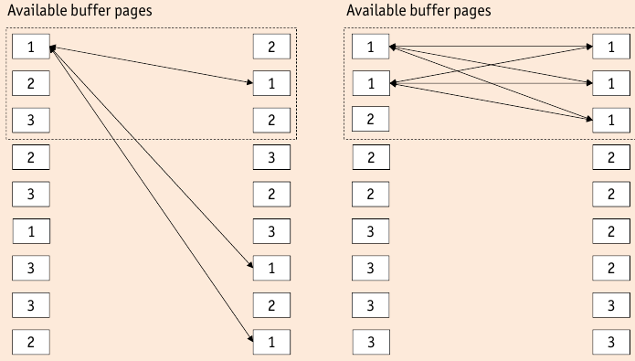
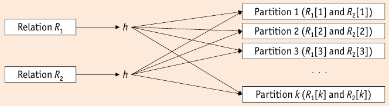
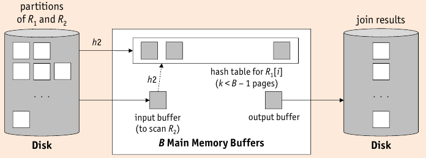

# Evaluating Relational Operators

* Operators can be implemented with different algorithms, exploiting physical system:

    * presence or absence of indexes on input files
    * sortedness of input-files
    * size of input files
    * available buffer-space in the pool
    * buffer replacement policy

* Specific operator => **physical operator**

    * implement **logical operators** (of the relational algebra)
    * Common implementation techniques:
    
        * **indexing**: use an index that satisfies a selection or join condition
        * **iteration**: process all tuples of input table or scan all index data entries (of an index that contains all attributes, not using the index structure)
        * **partitioning**: decompose operation into less expensive collections of operations by partitioning tuples on sort key (e.g. sorting and hashing)

## Join

* semantics of **join operator** $\Join_p$ => equivalent to combination of **cross product** $\times$ and **selection** $\sigma_p$
* naive way would be enumeration of all pairs in the cross product and pick satisfying predicates afterwards

### Nested Loops Join

$$R_1 \Join^{NL} R_2 \;\hat{=}\; \sigma (R_1 \times R_2)$$

* $R_1$ is the _outer_, $R_2$ the _inner_ relation
* I/O cost: $\underset{\text{outer loop}}{\underbrace{\Vert R_1 \Vert}} + \underset{\text{inner loop}}{\underbrace{\vert R_1 \vert \cdot \Vert R_2 \Vert}}$

* **Pro**: only needs _three pages of buffer space_ (two to read $R_1$ and $R_2$, one to write)
* **Con**: huge I/O cost (effectively enumerates cross product)

### Block Nested Loops Join

* saves random access cost by reading $R_1$ and $R_2$ in blocks of $b_1$ and $b_2$ pages

    * $R_1$ is read once with $\lceil \nicefrac{\Vert R_1 \Vert}{b_1} \rceil$ disk seeks
    * $R_2$ is scanned $\lceil \nicefrac{\Vert R_1 \Vert}{b_1} \rceil$ with $\lceil \nicefrac{\Vert R_1 \Vert}{b_1} \rceil \cdot \lceil \nicefrac{\Vert R_2 \Vert}{b_2} \rceil$ disk seeks
    
* Building **Hash Table** on $R_1$ speed up _in-memory join_=> works only for equi-joins

    * compare $r_2$ with $r_1$: $r_2 \overset{?}{=} h(r_2.A_2)$

### Index Nested Loops Join

* index on the inner relation (swap outer <--> outer if necessary)
* index must match join condition $p$
* avoids enumeration of cross-product
* For each tuple in $R_1$ query the index for matching $R_2$-tuples
* Cost-breakdown:

    1. **Access** of index to find first matching entry.
    2. **Scan** index to retrieve _all_ $n$ matching $rid$s (sequential I/O, typically negligible)
    3. **fetching** the $n$ matching tuples $R_2$-tuples

* Cost depends on size of **join result**

    * $\Vert R_1 \Vert + \vert R_1 \vert \cdot \text{(cost of one index access to )} R_2$

### Sort-Merge Join

* use sorting on join attribute to partition both inputs
* typically used for _equi-joins_
* Merge Phase similar to merge phase of external sort => input relations are two runs that have to be merged

    * duplicate elimination has to be done
    
* Sort Merge Join

    1. Sort both inputs, if not already sorted.
    2. open output buffer, input buffers for $R_1$ and $R_2$
    3. while both inputs not empty pull a record depending on which is smaller
    4. put record into output buffer

* I/O cost:

    * best-case: $\Vert R_1 \Vert + \Vert R_2 \Vert$
    * worst-case: $\Vert R_1 \Vert \cdot \Vert R_2 \Vert$

* Sort-Merge Join can be integrated into final pass of external sort.
* blocked I/O, double buffering, replacement sort => apply to speed up sorting and merging
* output is sorted on join attribute

### Grace Hash Join

* **family of Hash Joins** work in two phases

    1. **partitioning** (building) phase: divide $R_1$ and $R_2$ into $k$ partitions $R_1[k], R_2[k] (Figure~\ref{images:GraceHashJoinPartitioning})
    2. **probing** (matching) phase: only compare tuples in partition $R_1[i]$ to those in $R_2[i]$ (Figure~\ref{images:GraceHashJoinProbing})
    * divide and conquer => many small in-memory joins
    * $R_1[i] \;\Join\; R_2[i] = \varnothing$ for all $i \not= j$

* I/O cost: $\underset{\text{partitioning phase}}{\underbrace{\underset{\text{read}}{\underbrace{\Vert R_1 \Vert + \Vert R_2 \Vert}} + \underset{\text{write}}{\underbrace{\Vert R_1 \Vert + \Vert R_2 \Vert}}}} + \underset{\text{probing phase}}{\underbrace{\Vert R_1 \Vert + \Vert R_2 \Vert}} \;=\; 3 \cdot (\Vert R_1 \Vert + \Vert R_2 \Vert)$

* Partitions have to fit into memory for probing phase => maximize number of partitions

    * $B$ buffer pages => $B-1$ partitions
    * assumes equal distribution, each partition has size $\frac{\Vert R \Vert}{B-1}$
    * size of in-memory hash table is $\frac{f \cdot \Vert R \Vert}{B-1}$, where $f>1$ is a _fudge factor_ 
    * probing phase needs to keep hash table and in/output buffer: $B \;>\; \frac{f \cdot \Vert R \Vert}{B-1} + 2$
    * algorithm needs _approximately_ $B \;>\; \sqrt{f \cdot \Vert R \Vert}$ buffers to perform well
    * sometimes requires multiple passes (recursive partitioning)
    
        * input table $R$ has more than $(B-1)^2$ pages
        * values of $R$ not uniforml enough over partitions

### Hybrid Hash Join

* If more than $B \;>\; \sqrt{f \cdot \Vert R \Vert}$ buffer pages are available, **hybrid hash join** has better performance
* Suppose $B \;>\; f \cdot (\nicefrac{\Vert R \Vert}{k})$ for some int $k$

    * if $R$ is divided into $k$ partitions of size $\nicefrac{\Vert R \Vert}{k}$ an in-memory hash table for each partition can be created
    * $k$ output buffers, one input buffer are needed to partition $R$ (and $S$) => $B-(k+1)$ extra buffers

* Suppose $B - (k+1) \;>\; f \cdot (\nicefrac{\Vert R \Vert}{k})$, i.e. there is enough space to hold an in-memory hash table for a parition of $R$

    * _partitioning of $R$_: build hash table for first partition of $R$
    * _partitioning of $S$_: probe hash table with tuples of first partition of $S$
    * after partitioning phase, first partitions of $R$ and $S$ already joined.

* Saves I/O cost for writing and reading first partitions.

* _Hash Join vs Block Nested Loops Join_:

    * if hash table of entire smaller relation fits into memory, both are the same
    * if both relations are large relative to buffer size => Hash Join is much more effective

* _Hash Join vs. Sort Merge Join_:

    * $3 \cdot (N + M)$ page I/O$
    
        * cost of _hash join_ if there are $B \;>\; \sqrt{\Vert M \Vert}$ buffer pages ($M$ is the smaller relation)
        * cost of _sort-merge join_, if there are $B \;>\; \sqrt{\Vert N \Vert}$ buffer pages ($N$ is the larger relation)
    
    * Sort-Merge Join is less sensitive to skew
    * Hash-Join costs less, if buffer pages between $\sqrt{\Vert M \Vert}$ and $\sqrt{\Vert N \Vert}$
    * Sort-Merge Join produces _sorted result_

### General Join Conditions

* _Equalities_ over combination of attributes

    * _index nested loops join_ can build new index on combination of attributes or use existing index
    * _hash join_ and _sort-merge join_ partition over combination of attributes

* _Inequalities_

    * _index nested loops join_ requires a B+ Tree index
    * _hash join_ and _sort-merge join_ are not applicable

* other algorithms remain unaffected

