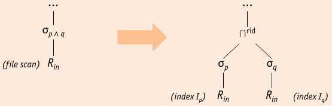

## Selection

* selection $\sigma_p$ => _iteration_ and _indexing_
* physical operator depends on _sortedness_ and presence/absence of _indexes_:

### no index, unsorted data

* read whole input file $R_{in}$, writes records that satisfy predicate $p$ to output file $R_{out}$
* no condition on input file (sortedness, …)
* predicate $p$ can be arbitrary
* I/O cost: $\underset{\text{input cost}}{\underbrace{\Vert R_{in} \Vert}} + \underset{\text{output cost}}{\underbrace{sel(p) \cdot \Vert R_in \Vert}}$

    * for pipelined plans, selection applied without output costs

### no index, sorted data

* use binary search to find first input, scan for rest
* I/O cost: $\undercomment{input cost}{\log_2 \Vert R_{in} \Vert} + \undercomment{sorted scan}{sel(p) \cdot \Vert R_{in} \Vert} + \undercomment{output cost}{sel(p) \cdot \Vert R_{in} \Vert}$
* binary search cannot be used in pipelined plan, without additional I/O

### B+ tree index

* Cost depends on 

    * number of qualifying tuples
    * clusteredness

* Implementation:

    * Descend B+ Tree to first entry satisfying $p$
    * if index is clustered: continue to scan inside $R_in$
    * if index is unclustered:
    
        1. gather the $rid$s of all matching entries
        2. sort entries on $rid$ field
        3. access pages in sorted $rid$ order

* lack of clustering only minor issue, if $sel(p) \approx 0$
* I/O cost: $\undercomment{B+ tree access}{\approx 3} + \undercomment{sorted scan}{sel(p) \cdot \Vert R_{in} \Vert} + \undercomment{output cost}{sel(p) \cdot \Vert R_{in} \Vert}$

### hash index, equality selection

* matching selection predicate $p$ _matches hash index_ on $R_{in}.A iff it contains a term of the form $A=c$, where $c$ is a constant
* ```h(c)``` returns the address of the bucket containing qualifying records
* additional cost due to overflow chains may apply
* $sel(p)$ most likely close to $0$
* I/O cost: $\undercomment{Hash Access}{\approx 1.2} + \undercomment{output cost}{sel(p) \cdot \Vert R_{in} \Vert}$

### General Selection Conditions

* selection predicates like $\sigma_{A \theta c}(R_in)$ are only special case
* More complex predicates need to be supported: use of $\wedge$ (```AND```) and $\vee$ (```OR```) to combine _simple comparisons_ of form $A \theta c$, where $\theta \in \{ <, \leq, =, \geq, > \}$
* conjunctive predicate $p$ matches a (multi-attribute)

    * hash index, if $p$ _covers_ the key
    * B+ tree index, if $p$ is a _prefix_ of the key

* **conjunctive Normal Form** CNF => conjuncts of the form $A \theta c$, connected by $\wedge$ (``AND``)

* In practice: conjuncts are connected by $\vee$ (``OR``) (=> disjunctive)

* **Disjunctive Normal Form** (DNF): disjuncts of the form $A \theta c$ connected by $\vee$ (``OR``)

* If the selection predicate is a _conjunction of terms_:

    1. _single file scan_
    2. _single index_: that matches a subset of (primary) conjuncts and apply all non-primary conjuncts to each retrieved tuple (on-the-fly)
    3. _multiple indexes_ that each match a subset of conjuncts

#### Selection without Disjunction



* predicate does not match a single index, both conjuncts $p$ and $q$ match indexes $I_p$ and $I_q$

    * transform $\sigma_{p \wedge q} (R_{in})$ to $\sigma_p (R_{in}^{I_p}) \cap^{rid} \sigma_q (R_{in}^{I_q})$

#### Selections with Disjunction


* Choosing reasonable execution plan for _disjunctive selection predicates_ is _much harder_

    * if only _one single_ term does not match any index => naive scan
    * i _all_ terms are supported by indexes, _$rid$-based set union $\cup^{rid}$ can be used

#### Bypass Selections

* Parts of Selection Predicate may be _expensive_ to check or _very unselective_
* good strategy to evaluate cheap and selective predicates first

    * $true \vee P \hat{=} true$ (evaluating $P$ is not necessary)
    * $false \vee P \hat{=} P$ (only evaluate $P$)

* First Method:

    

    * convert selection condition to DNF
    * Push each tuple from input through each disjunct _in parallel_
    * _collect_ matching tuples from each disjunct (duplicate elimination)

* Second Method:

    
    
    * convert selection condition to CNF: $CNF[(F_1 \wedge F_2) \vee F_3] = (F_1 \vee F_3) \wedge (F_2 \vee F_3)$
    * push each tuple from input through each conjunct _sequentially_
    * matching tuples "survive" conjuncts (_no_ duplicate elimination)

* **Goal**: eliminate tuples early, avoid duplication

    

    * Bypass Selection Operator: $\underline{\sigma}_F$
    
        * produces two disjoint outputs: ``true`` and ``false``
        * Bypass results derived from conjunctive normal form
        


