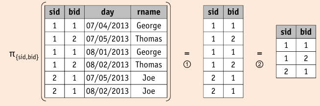

## Projection

* projection $\pi_l$ modifies each record in its input file:

    1. _removes_ unwanted attributes (not in attribute list $l$)
    2. _eliminates_ any duplicate tuples (SQL ``DISTINCT``)

* resulting file will be only fraction of original size
* projection uses _iteration_ and _partitioning_
* projection _without duplicate elimination_ can be fully _pipelined_
* projection _with duplicate eliminiation_ hat to _materialize_ intermediate results
* Duplicate elimination:

    * compare _each tuple_ to _all other tuples_ to check whether its a duplicate
    * generally its not possible to fit all other tuples in memory
    * => _partitioning_
    
        * given $B$ buffer pages, group "similar" tuples into partition
        * load partitions into memory one after another
        * only compare a tuple to other tuples in that partition

### Projection Based on Sorting

* Records will fields equal will be adjacent after sorting

    1. scan $R_{in}$ and output set of tuples contain _only_ desired attributes
    2. scan this set of tuples using _all_ of its attributes as sort key
    3. scan the sorted result, comparing adjacent tuples and discard duplicates

* $\pi_l^{sort}$ has sorted result

* combine sorting and projection with duplicate elimination

    * integrate _projection_ and _duplicate elimination_ into merge sort algorithm
    * **Pass 0**:
    
        1. read $B$ pages at a time, _projecting unwanted attributes out_
        2. use in-memory sort to sort records of these $B$ pages
        3. write a sorted run of $B$ internally sorted pages to disk

    * **Pass 1, …, n**
    
        1. select $B-1$ runs from previous pass, read a page from each run
        2. perform a $(B-1)$-way merge, _eliminating duplicates_
        3. use the $B$-th page as an output buffer

* I/O cost: $\undercomment{projection}{\Vert R_{in} \Vert + \Vert R_{tmp} \Vert} + \undercomment{duplicate elimination}{2 \cdot \Vert R_{tmp} \Vert \cdot \left( \left\lceil \log_{B-1} \cdot \left\lceil \nicefrac{ \Vert R_{tmp} \Vert }{B} \right\rceil \right\rceil \right)}$

### Projection Based on Hashing

* $\pi_l^{hash}(R_{in})$: needs large number of buffer pages $B$ relative to total number of pages in $R_{in}$
* two phases:

    1. **partitioning**:
    
        1. Allocate $B$ buffer pages: one _input buffer_, $B-1$ _hash buckets_
        2. Read file $R_{in}$ for each record $r$: _project out_ attributes not listed in $l$.
        3. For each record, apply hash function $h_1(r) = h(r) \mod(B-1)$, which depends on _all remaining fields of $r$_, store in hash bucket $h_1(r)$.
        4. If hash bucket is _full_, write it to disk
    
    2. **duplicate elimination**
    
        1. For each partition, read each partition page by page (possibly in parallel), using same buffer layout as before.
        2. each record: apply hash function $h_2$ ($h_2 \not= h_2$) to all record fields
        3. Only if two records collide with respect to $h_2$, check if $r=r'$, if yes, discard $r'$.
        4. After entire partition has been read in, append all hash buckets to result file, free of duplicates.
        
* I/O cost: $\undercomment{projection}{\Vert R_{in} \Vert + \Vert R_{tmp} \Vert} + \undercomment{duplicate elimination}{\Vert R_{tmp_2} \Vert + \Vert R_{tmp_2} \Vert}$

    * $R_{tmp_2}$ may be smaller than $R_{tmp}$

### Sorting versus Hashing

* Sorting is standard approach for duplicate elimination.

    * superior to hashing, if there are many duplicates
    * superior if distribution of (hash) values very non-uniform
    * sorting already required for other operations and therefore already implemented in most systems

* For $B > \sqrt{ \Vert R_{tmp} \Vert}$ buffer pages, both approaches have same cost.
* Choice depends on _CPU cost_, desireability of _sort order_, _skew_ in value distribution, …

### Using Indexes for Projection

* Index contains _all attributes_ retained in projection

    * use index-only plan (don't access data records)
    * apply hashing or sorting to eliminate duplicates from (much smaller set of pages)
    * Index key contains projected attributes as _prefix_ and is _sorted_

