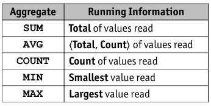
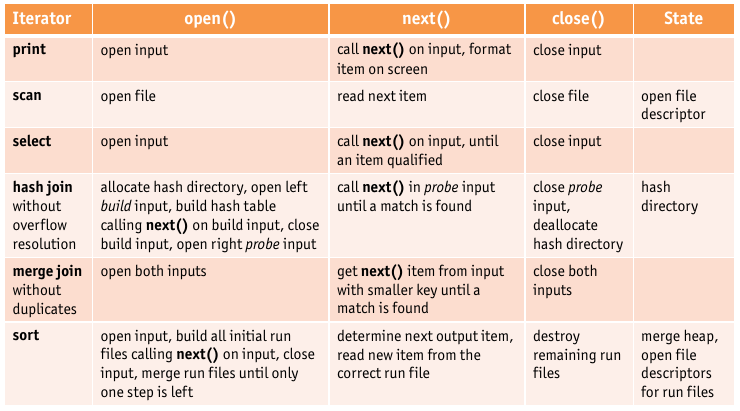

## Aggregate Operations

* ``SUM``, ``AVG``, ``COUNT``, ``MIN``, ``MAX``
* basic algorithm

    

    * scan whole relation (on-the-fly ?), maintain _running information_
    * upon completion of scan, compute aggregate value from running information

* For _aggregation combined with grouping_, two evaluation algorithms based on sorting and hashing respectively

    * **Sorting Approach** (cost equal to I/O cost of sorting)

        * sort on grouping attributes
        * scan again to compute result of aggregate operation for each group
        * refinement => aggregation can be done as part of sorting
    
    * **Hashing Approach** (if hash table fits into memory, cost is $\Vert R \Vert$)
    
        * build (in-memory) hash table on grouping attributes with entries ``<grouping value, running information>``
        * for each tuple of relation, probe hash table to find entry of group to which tuple belongs and update running information
        * when hash table is complete, its entries for grouping value can be used to compute the corresponding result tuples in a straightforward way

* index is not applicable to select subset of tuples
* under certain conditions, index entries instead of data records can be used to evaluate aggregate operations eeficiently

    * if index search key includes _all attributes_ needed for aggregation => use index only plan
    * if ``GROUP BY`` clause attribute list forms a prefix of index search key, index is a tree => sorting can be avoided => index only

## Impact of Buffering

* Effective use of buffer pool is very important.

    * crucial for efficient implementation of relational query engine
    * several operators use size of available buffer space as parameter

* operators that execute concurrently have to **share** buffer pool
* if tuples are accessed through an index, likelihood of finding a page in buffer pool becomes (unpredictably) dependent on its _size_ and _replacement policy
* if tuples are accessed through unclustered index, buffer pool _fills up quickly_, as each tuple likely requires new page to be brought into buffer pool
* if an operation has a _repeated pattern of page access_, replacement policy and/or number of buffer pages can speed up operation significantly

## Materialization vs. Pipelining

* Implementations assume materialization so far

    * Communication through secondary storage => lots of I/O
    * operator cannot start, until inputs are fully materialized
    * operators have to be executed in sequence
    * first result is only available after last operator has executed

* pipelined evaluation => avoid writing temporary files whenever possible

    * each operator passes its results directly to next operator
    * results propagate, as soon as they are available
    * as soon as input is available, computation can start
    * operators can execute in parallel
    * typically implemented in _open-next-close_ interface or _"Volcano iterator"_ model
    
        * each operator implements the functions:
        
        ``open()``: _initialize_ the operators internal state
        
        ``next()``: produce and return _next result tuple_ or ``<EOF>``
        
        ``close()``: _free_ any internal ressources, typically after all tuples have been processesd
        
        * _state_ is kept within each operators instance
        
            1. upon call to ``next()``, operator produces a tuple, updates internal states, then pauses
            2. upon subsequent calls to ``next()``, operator uses internal state to resume and produce another tuple

    * iterator implements _demand drive_ processing infrastructure

* blocking operators cannot be implemented in pipelined fashion

* Alternative processing infrastructure is _data-driven_

    * Producers and consumers are connected by _queue_
    * operators execute _asynchronously_ and in _parallel_
    * produce results as fast as possible and _enqueue_ them

* queues buffer data that is pipelined between operators
* queues suspend operators using blocking queue/enqueue calls

* Data-driven pipelines can _exploit more parallelism_ that demand-drive

