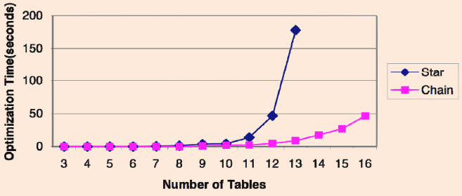
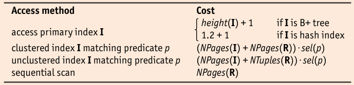
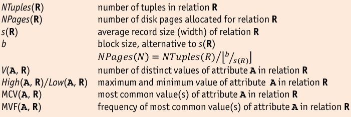

## Plan Enumeration

* Search space given by:

    * relational algebra equivalences
    * choice of implementation technique for relational operator
    * choice of access method based on presence of indexes
    * other available resources, e.g. number of buffer pages, etc.

* explicit enumeration is impossible in general => prohibitively large space
* important cases:

    * single-relation queries
    * multiple relation queries
    
### Single-Relation Queries

* Optimizer enumerates _all possible plans_ and assess cost
* main decision is access method used

    * plan without indexes
    * plan utilizing and index

* different single-relation queries might have different _physical properties_, i.e. sort order
* for each set of _physical properties_, plan with least cost is retained
* plans without index

    1. heap file scan on (single) relation
    2. apply selection and projection (without duplicate elimination) on-the-fly
    3. sort according to ``GROUP BY`` clause
    4. apply aggregation and ``HAVING`` clause on-the-fly to each group
    
* Single-index access path

    1. choose index that is estimated to retrieve the fewest pages
    2. apply projections and non-primary selections
    3. proceed to compute grouping and aggregation operations by sorting
    
* Multiple-index access path (for index entry variants 2 and 3)

    1. retrieve and intersect $rid$ sets and sort results by page id
    2. retrieve tuples that satisfy primary condition of all indexes
    3. apply projections and non-primary selection terms, followed by grouping and aggregation operations

* Sorted-index access path

    1. retrieve tuples in order required by ``GROUP BY`` clause
    2. apply selection and projection to each retrieved tuple on-the-fly
    3. compute aggregate operations for each group on-the-fly

* Index-Only access path

    1. retrieve matching tuples or perform an index-only scan
    2. apply (non-primary) selection conditions and projections to each retrieved tuple on-the-fly
    3. possibly, sort the result to achieve grouping
    4. compute aggregate operations for each group on-the-fly

### Multiple Relation Queries

* Queries over multiple relations require joins (or cross-products)
* since joins are expensive, good plan is very important
* _size of final result_ can be estimated by taking product of (size of relations) and (reduction factors of all selection predicates)
* _size of intermediate results_ can vary substantially, depending on join order
* number of possible plans much to large (catalan numbers)

    * only consider **left-deep plans**
    
        * Can be fully pipelined, because inner relation is already materialized (i.e. read)
        * indexes on inner relations can be utilized
        * number of possible left-deep joins is "only" $n!$
    
    * Optimizer has to make sure it selects the best _left-deep_ plan

* Enumerate candiate plans:

    * directly prune cross-products
    * For each candidate plan: enumerate possible join algorithm
    
        * For each candidate plan: enumerate access methods
        
            * For each candidate plan: estimate cost

* Cost estimation will enumerate multiple identical sub-plans

    * use **dynamic programming** to memoize already considered sub-plans
    * find cheapest plan for $n$-way join in $n$ _passes_
    * in each pass $k$ , find the best plan for all _$k$-relation sub-plans_
    * construct the plans in pass $k$ by joining another relation to the best $(k-1)$-relation sub-plans found in earlier passes

* Dynamic Programming Algorithm

    * **Pass 1**: (all 1-relation plans)
    
        * find best 1-relation plan for each relation
        * this pass mainly consists of seleccting access methods
        * also see discussion on single-relation queries
        * keep the best 1-relation plans for each set of physical properties
    
    * **Pass $n$**: (all $n$-relation plans)
    
        * find best way to join sub-plans from Pass $n-1$ to the $n$th relation
        * sub-plans of Pass $n-1$ appear as outer relation in this join
        * Return the _overall best_ plan

* Dynamic Programming record _cost_ and _result size estimates_ for each retained plan
* pruning for each subset of joined relations:

    * keep cheapest _overall_ sub-plan
    * keep cheapest sub-plan that generates and intermediate result with an _interesting order_ of tuples
    
        * presence of SQL ``ORDER BY`` clause in query
        * presence of SQL ``GROUP BY`` clause in query
        * join attributes of subsequent equi-joins (prepare for merge join)
    
    * discard sub-plans that involve _cross-products_ immediately
    * Subroutines in dynamic programmin algorithm:
    
        * ``accessPlans(`` $R$ ``)``: enumerates all access plans for a single relation $R$
        * ``possibleJoins(`` $R \Join S$ ``)``: enumerates the possible joins between relations $R$ and $S$, e.g. $\Join^{NL}$, $\Join^{SM}$, $\Join^{H}$
        * ``prunePlans(`` $set$ ``)``: discard all but the best plans from $set$

* ``optimize()`` draws it advantage from _filtering_ candidate plans early
* heuristics are used to reduce the search space and balance _plan quality_ and _optimizer runtime_

### Joining Many Relations

* Star: Join all relations to on center relation.
* Chain: Join subsequent relations to temporary table.
* Join enumeration has _exponential_ resource requirements

    * time complexity: $\mathcal{O}(3^n)$
    * space complexity: $\mathcal{O}(2^n)$

* might still be too expensive

    * for many relations (~10-20 and more)
    * for simple queries with many indexes (where the choice should have been easy)

* **greedy join enumeration** tries to close this gap

    * in each iteration, choose _cheapest_ join that can be made over remaining sub-plans (greedy)
    * ``optimize-greedy()`` operates similar to finding binary tree for _Huffman coding_
    * time complexity: $\mathcal{O}(n^3)$
    
        * each loop with $n$ iterations: $\mathcal{O}(n)$
        * each iteration looks at all remaining pairs of plans in _worklist_: $\mathcal{O}(n^2)$
        
    * consider all types of join trees: mitigate risk of returning a really bad one
    
* other possible ways to replace greedy algorithm:

    * **randomized algorithm**: randomly rewrite join tree, using _hill-climbing_ or _simulated annealing_ to find optimal plan
    * **genetic algorithms**: explore plan space by _combining_ plan ("offspring") and _altering_ some plans randomly ("mutations")

### Cardinality Estimation

* Cost estimation of multi-relation plans additionally involves **cardinality estimation** of intermediate query results

    * cost is dominated by page I/O
    * I/O is determined by size of inputs
    
* Cardinality estimates are used to allocate buffer pages and to determine blocking factor $b$ for blocked I/O

* A **database profile** is one of two principal approaches to query result cardinality estimation.

    * **base relations**: maintain statistical information, e.g. number and sizes of tuples, distribution of attribute values, … in _database catalog_
    * **intermediate query results**: derive this information based on a simple statistical model during query optimization.

    * statistical model assumes _uniformity_ and _independence_
    * both are typically _not valid_, but allow for simple calculations
    * system can record _histograms_ that approximate value distribution to provide better cardinality estimates
    * Alternatively, _sampling techniques_ can be used to estimate query result set cardinality
    
        1. run query on _small sample_ of database
        2. _gather statistics_ about query plan
        3. _extrapolate_ to full input size
        * balance between sample size (performance) and resulting accuracy of estimation must be found

* Keep **profiling information** in _database catalog_

* in order to obtain simple and tractable estimation, assume one of:

    1. **Unifmormity and independence assumption**: values uniformly appear with same probability, values of different attributes are independent of each other
    2. **Word Case assumption**: no knowledge about relation contents available => calculate upper bounds
    3. **Perfect Knowledge assumption**: details about exact distribution are known => huge catalog or prior knowledge of incoming queries is needed

### Histograms

* uniformity not realistic
* histograms need to be maintained

    1. divide active domains of $A$ into _adjacent intervals_ (=> buckets) by selecting boundary values $b_i \in dom(A)$
    2. collect _statistical parameters_ for each interval such as the number of tuples $b_{i-1} < t[A] \leq b_i$ or the number of distinct $A$ values in that interval

* Histograms allow for more exact estimates of both _equality_ and _range selections_
* two common types:

    1. **Equi-Width Histograms** All histogram buckets have the _same width_.
    2. **Equi-Depth Histograms** All histogram buckets contain the _same number of tuples_ => varying width

        * better adaptable to data skew

* Number of histogram buckets can be used to control _resolution <--> size_ tradeoff
* Maintaining histogram under insertions and deletions => update histogram
* inside bucket: assume uniformity

### Sampling

* Maintaining histograms can be _costly_ and _error prone_
* sampling might be better instead
* parameters: one parameter can be chosen, the other is then calculated

    * sample size
    * extrapolation precision

* usual approaches
* _adaptive sampling_: tries to achieve given precision with minimal sample size
* _double (two-phase) sampling_: obtain a course picture from very small sample => compute sample size in second step
* _sequential sampling_: uses sliding (continuous) calculation of characteristics => stop estimation once precision is high enough

