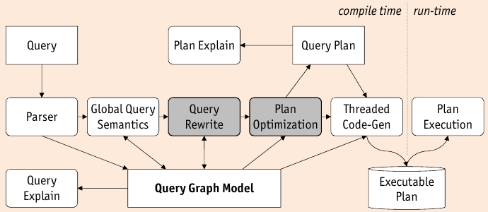

## Example Query Optimizers

* **Bottom-Up**: start with individual relations of query

    * global cost of a plan _must_ be computed bottom-up as the cost of each operator depends on the cost of its inputs
    * dynamic programming _requires_ breadth-first enumeration to pick the best plan
    * impossible to pick best plan until its cost has been computed

* **Top-Down**: start with entire expression of query

    * operators may _require_ certain properties (e.g. order or partitioning)
    * limit exploration based upon context of use
    * prune based on upper and lower bound

* **Starburst**: _query graph model_ (QGM)

    

    1. _query rewrite_ uses rules to transform a QGM representation of a query into another equivalent QGM representation.
    2. _plan optimization_ dreives a query execution plan from QGM representation of a query bottom up using production rules
    * first phase performs rewrite (heuristic) optimization, second phase uses cost-based optimization

* **Cascades**: transformation-based, top-down approach:

    * _depth-first search_: beginning with original query, consider subqueries and optimize
    * _goal-driven_ no need to maintain bottom-up interesting orders
    * Fully Cost-Based
    * flexible and extendible:
    
        * **operators**: expressions consisting of logical, physical, and item operators => represent query trees and execution plans
        * **rules**: plan search space ise defined by set of transformation, implementation and enforcer rules
        * **strategy**: search space exploration strategy is guided by sequence of optimization tasks

* Query trees and execution plans are represented as expressions

    * Logical Operators:
    
        * matching rule pattern to expressions
        * hashing for detecting duplicate expressions
        * deriving logical properties (e.g. schema) from input
    
    * Physical Operators:
    
        * computing cost from opertor algorithm and input cost
        * checking cost limit between optimizatin of two inputs
        * translation optimization goals to input operators
    
    * Item Operators:
    
        * represent selection predicates for easy manipulation by rules

### Starburst vs. Cascades

* Phases:

    * Starburst optimizes queries in _two phases_

        * (heuristic) query rewrite phase
        * (cost-based) plan optimization phase

    * Cascades uses one phase with only cost-based transformations

* Mapping logical to physical operators

    * Starburst expands expressions _step-by-step_
    * Cascades does _one single step_

* Rule application

    * Starburst applies rule by _forward chaining_ in query rewrite phase
    * Cascades performs _goal-driven_ application of rules

