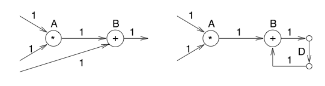
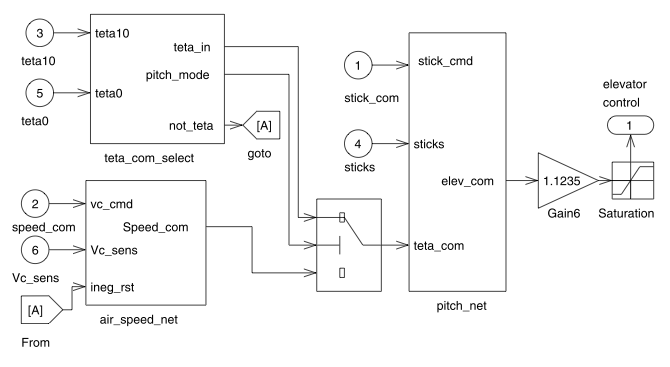

# Functional Safety of Embedded Systems - Part 1 - Introduction & Modeling II

## Dependability

* **Reliability**: probability not to fail
* **Maintainability**: probability of repair upon a failure
* **Availability**: probability, that a system is available, includes high reliability and high maintainability
* **Safety**: property, that system won't cause harm
* **security**: property, that confidential data will remain confidential

Dependability must be thought of early in the development process, not as an afterthought, because some things may not be easy to change afterwards.

Even perfectly designed systems may fail, if operated outside of of assumptions.

## Efficiency

Efficiency is especially important in embedded systems.

* **Energy**: Computational efficiency helps save energy. Hardwired circuits have best energy consumption per computation (ASICs), FPGAs (field programmable gate arrays) have an order of magnitude higher consumption. Programmable processors have an even lower amount, but are far more flexible.

    Processors specially designed for their domain of application are more power-efficient

* **Run-Time efficiency**: exploit the the hardware architecture as much as possible, compilers should not induce overhead.
* **Code size**: normally not dynamically linked. No hard drives present, so code should be kept small, especially for SoCs, newer technologies like flash-memory may change this in the future.
* **Weight**: portable systems must be lightweight (and small?)
* **Cost**: high volume embSys: price per unit is a crucial value, use least amount of hardware, keep software cost low, omit components, that don't increase the worst case runtime.

## Sensors & Actuators

**Sensors** feed information about the environment to the system, **Actuators** feed the will of the system into the environment.

=> Cyber-Physical Systems do something in the real world.

## Real-Time constraints

* **hard constraints**: system will fail, if deadlines not met
* **soft constraints**: result will degrade, if deadlines not met

In real-time systems, arguments that care about the average performance are not valid as one has to give a guaranteed system performance.

## Reactive Systems

_"A reactive system is one that is in continual interaction with its environment and executes at a pace determined by that environment."_ (Berge et al, 1995)
State machines and automata are very good models for this, as one can assume them to be in a state, waiting for input and reacting on it.

## Hybrid Systems

analog and digital parts

## Challenges

* Embedded Systems must be really dependable, much more than in traditional software.
* Software is interdependent with the hardware.
* many non-functional requirements (real time constraints, energy / power efficiency / dependability requirements)
* connection to physical world, real time
* concurrency
* complexity, compositional design, _"can we add component X without overloading component Y"_
* traditional, sequential programming languages are not good for concurrent systems.

## Specifications and Modeling

Models for **SUD** (system under design):

_"A model is a simplification of another entity, which can be a physical thing or another model.
The model contains exactly those characteristics and properties of the modeled entity that are relevant for a given task.
A model is minimal with respect to a task if it does not contain any other characteristics than those relevant for the task."_ (Jantsch, 2004)

Models are described in languages, which should be capable of representing the following features:

* **Hierarchy**: Use hierarchies to simplify the model, as humans can not comprehend overly complex systems at once.
    * **Behavioral hierarchies**: contain objects necessary to describe _system behavior_ (e.g. states, events, in / output signals)
    * **Structural hierarchies**: describe, how a system is composed of physical components (e.g. processors, memory, actuators, sensors)
* **Component-based design** (Sifakis, 2008): It must be easy to derive the behavior of a system form the behavior of its components
* **Concurrency**: Humans are not good at understanding concurrent behavior, modeling languages must therefore provide a convenient way to describe concurrency.
* **Synchronization and Communication**: Components need to communicate, to be able to synchronize.
* **Timed-behavior**: timing requirements for real-time systems _must_ be captured in the requirement specification.

    _"The lack of timing in the core abstraction (of computer science) is a flaw, from the perspective of embedded software."_ (Lee, 2005)

    * measure elapsed time
    * delay of a process for a specified time
    * specify timeout (e.g. waiting for network)
    * specify deadlines and schedules (not very good today, _timing analysis_ is still very hard)

* **state oriented behavior**: classical automata are not good, as no timing and hierarchy are supported
* **Event-handling**: due to reactiveness of many embSys, events must be describable
* **Exception-oriented behavior**: Traditionally in state diagrams every exception needs to be specified. This is not feasible for embSys
* **Presence of programming elements**: Programming is a good way to express computations, some of those elements should be present.
* **Executability**: Execution of specifications as a means of plausibility checking.
* **Support for the design of large systems**: Trend towards complex systems. Something like object orientation should be possible.
* **Domain specific support**: It is not feasible to have one language cover all domains.
* **Readability**: Natural language may be used in the beginning, later we need some other artifact to take its place
* **Portability and Flexibility**: Specifications should be independent of specific hardware platforms.
* **Termination**: Specifications for which the halting problem is decidable.
* **Support for non-standard I/O-devices**: embSys are special
* **Non-functional properties**: May not be expressible formally.
* **Support for design of dependable systems**: e.g. unambiguous specification semantics, facilitate formal verification, describe security and safety requirements
* **No obstacles to the generation of efficient implementations**
* **Appropriate model of computation** (MoC): von-Neumann model of sequential execution combined with some communication technique is common, problems for embedded systems (incomplete):
    * no timing description
    * van-Neumann assumes globally shared memory -> deadlocks

Obvious: we will not find a single language for those requirements. Will have to have compromises, the choice of language will depend on domain and the problem at hand.

## Models of Computation MoC

MoCs describe the mechanism assumed for performing computations. It is common to distinguish between computations in the components and communication:

* **Components** and their organization: procedures, processes, functions, finite state machines, …
* **Communication protocols**: describe how communication between components work, e.g., asynchronous message passing, rendezvous based communication

Relations between components => task graphs, process networks

* Nodes in the graph represent components performing computations.
* Computations map input stream to output streams. Typical computations contain non-terminating iterations, consuming input and producing output data
* Edges represent relations between components

### Dependence Graph

$G=(V,E)$, $V$ -> vertices / nodes, $E$ -> edges, $E\subseteq V \times V$ -> relation on $V$

If $(v_1, v_2)\in E$, then $v_1$ is an _immediate predecessor_ of $v_2$ and $v_2$ an _immediate successor_ of $v_1$.

Suppose $E^*$ is the transitive closure of $E$, if $(v_1,v_2) \in E^*$, then $v_1$ is called a _predecessor_ of $v_2$ and $v_2$ is a _successor_ of $v_1$.

Dependence Graphs may include additional information:

1. **Timing Information**: tasks may have arrival time, deadline, periods, execution times
2. **Distinction between different types of relations between computations**: Edges may be precedence, communication, partially filled circles may denote input
3. **Exclusive access to resources**:
4. **Periodic schedules**, e.g., in signal processing, lead to infinite task graphs
5. **Hierarchical graph nodes**: Nodes may be huge parts of code, or down to only a single statement. This is called **granularity**. Hierarchical nodes may contain other nodes. This may be displayed by a rectangle.

### Models of Communication

#### Shared Communication

Shared memory based communication may be fast, but hard to implement in multiprocessor architectures (without any common memory). Access to shared memory should be protected, unless read-only. => _critical section_

* Semaphore
* Conditional Critical Regions
* Monitor

#### Message Passing

Message passing is generally slower than shared memory, but easier to implement in case of no shared memory.

1. **Asynchronous Message Passing / Non-Blocking Communication**: buffer, sender does not wait for receipt, risk of buffer overflow
    _Communicating Finite State Machines_, _Data Flow Models_
2. **Synchronous Message Passing / Blocking Communication / Rendezvous-based Communication**: atomic, instantaneous communication events, sender waits, till partner receives message, performance may suffer
    _CSP_, _ADA_
3. **Extended Rendezvous / Remote Invocation**: sender continues only after message receipt has been acknowledged. The recipient can check some stuff before sending this receipt.

### Organisation of computations within components

* **von-Neumann model**: sequential execution of sequences of primitive computations.
* **Discrete Event model**: events are carrying a totally ordered time stamp indicating the time the event occurred. Global event queue, processes are worked on according to this order. _VHDL_, _SystemC_, _Verilog_

    Needs a global order of events
* **Finite State Machines** (FSMs): finite set of states, inputs, outputs, transitions. Several FSM form **Communicating Finite State Machines** (CFSMs)
* **Differential Equations**: model analog circuits and physical systems

### Combined Models

Actual languages combine a certain model of communication with an organisation of computation. Non-von-Neumann models are sometimes called _model-based designs_

+----------------------------+---------------+----------------------------+
| communication /            | shared memory |       message passing      |
| organization of components |               +-------------+--------------+
|                            |               | synchronous asynchronous   |
+============================+===============+=============+==============+
| Undefined component        |     plain text or graphics, use cases      |
|                            +---------------+----------------------------+
|                            |               | (message) sequence charts  |
+----------------------------+---------------+-------------+--------------+
| CFSM                       | state charts  |             | SDL          |
+----------------------------+---------------+-------------+--------------+
| Data Flow                  | (not useful)  |             | Kahn networks|
|                            |               |             | SDF          |
+----------------------------+---------------+-------------+--------------+
| Petri Nets                 |               | C/E nets, P/T nets, ...    |
+----------------------------+---------------+----------------------------+
| Discrete Event model (DE)  | VHDL, VeriLog | (Only Experimental Systems)|
|                            | SystemC       | Distributed DE in Ptolemy  |
+----------------------------+---------------+----------------------------+
| von-Neumann model          | C, C++, Java  | C, C++, Java, ... with libs|
+----------------------------+---------------+-------------+--------------+
|                            |               | CSP, ADA    |              |
+----------------------------+---------------+-------------+--------------+

### Early Design Phase

#### Use Cases

#### Message / Sequence Charts

#### Time / Distance Diagrams (TDD)

* Vertical dimension reflects time, the horizontal distance is the distance between the objects.
* UML 2.0 has _timing diagrams_

### Communicating Finite State Machines (CFSMs)

* modeled in state diagrams

#### Timed Automata

* Classically: no information about time
* timing information has been included, variables take place of clocks, act like guards
    * Transitions can take place, but don't have to.

#### StateCharts: Implicit Shared Memory Communication

StateChart language, based on automata and supporting hierarchical models as well as concurrency, limited way of specifying time. StateCharts language describes _extended FSM_

##### Modeling of Hierarchy

Hierarchy through _super-states_

* **super-state**: states comprising other states
* **sub-states**: states included in other states
* The state the FSM is currently in is the _active state_. When a sub-state is active, the corresponding super-state is active as well.
* a state not consisting of other states is called a _basic state_
* for a basic state $s$, the super state containing $s$ are called _ancestor states_
* when only one sub-state can be active at one time, the super-state is called _OR-super-state_
* a super state $S$, in which all of the sub-states of $S$ are active, when $S$ is active, is called _AND-super-state_

=> States in StateCharts are either AND-states, OR-states or basic states

##### Timers

denoted by a coil-like symbol

##### Edge labels and StateMate semantics

considers outputs and inputs from the FSM. General form: `event[condition]/ reaction `, where all three label parts are optional

* _reaction_ describes, what the FSM does as a reaction to a state transition (e.g. generation of events, assignments to variables)
* _condition_ implies a test of variables or the current state of the system.
* _event_ describes a test of current events (internally or externally)
    * internal events are generated as a result of transitions
    * external events are are described in model environment

StateMate is a commercial implementation of StateCharts. It assumes a step-based execution of StateMate-descriptions. Each step consists of three phases:

1. evaluate impact of external changes (does not include any state changes)
2. calculate set of transitions to be taken in current step. New values are assigned to temporary variables.
3. state transition become effective and variables are assigned

This separation into phases ensures, that no overwriting of variables takes place if not wanted (example: two coupled registers swapping the values). This behavior is called _determinate_

From StateCharts, C or VHDL code can be compiled. From VHDL hardware can be generated. Still it is not object oriented and cannot describe hardware structures for non-functional behavior.

_UML_ has _state (machine) diagrams_. They differ from StateMate

#### Synchronous Languages

StateCharts can not describe computations that well. Programming languages can. But with synchronous languages understanding concurrency is hard. Meld StateCharts and synchronous languages into one construct to obtain concurrently operating automata.

##### Example: Esterel, Lustre, SCADE

* **Esterel** is a synchronous reactive language, upon an input, the model creates an output, it is synchronous, all computations are assumed to finish in zero time. Esterel uses $\Vert$ as concurrency operator. Communication is instantaneous, meaning in the same clock cycle => Several rounds of propagation may happen before a stable state is reached, but still in the same tick.
* **Lustre** is more like a data flow language. _SyncCharts_ is a graphical version. Semantics are from the underlying CFSMs.
* **SCADE** combines elements of the above languages => is used for safety critical stuff by e.g. Airbus

#### SDL: A case of message passing

For distributed systems message passing is better. SDL (specification and description language) is based on CFSM and asynchronous message passing.

* It has a graphical and a textual variant.
* It is based on processes. A process represents a components (FSMs).
* Can perform operations on data.
* Contains program language elements (like procedures).
* Communication uses _FIFO_-queues, exactly one per process.
* Does not support nesting of processes. Hierarchical grouping is possible in _blocks_. Blocks at the highest hierarchical level are called _systems_.

##### Evaluation of SDL

* good for distributed applications (ISDN)
* not necessarily determinate
* buffers not unbounded in reality => upper bound must be proven
* hierarchy support not as good as in StateCharts
* no full programming support
* no description of non-functional properties
* interest in SDL seems to be decreasing

### Data Flow

* Describes how data move in an information system.
* Nodes -> Actors (computations)

#### Kahn Process Networks - KPN

* special case of data flow models
* shows computations and dependence, but not order of computation
* edges imply communication, FIFO buffers (possibly infinite), writes are non-blocking, read blocks, when buffer is empty
* sequence of operation is independent of nodes producing data
* scheduling at run-time

#### Synchronous Data Flow - SDF

* Graph is directed
* $A\equiv \textrm{ computation }*$ and $A\equiv \textrm{ computation }+$
* Inputs are infinite streams of samples. Nodes start their computations, when input is available.
* Edges must be used, when there is data dependency
* For each computation, the node is called _"firing"_, consuming and producing a fixed number of data tokens
* delays can be denoted by $D$

* no scheduling at run-time needed
* not appropriate for modeling control flow (branches, etc)
* several extensions have been proposed
    * modes corresponding to states
    * _Homogeneous synchronous data flow_ - HSDF (number of tokens consumed and produced per firing is $1$)
    * _cyclo-static data flow_ - CSDF (number of tokens produced and consume may _periodically_ vary)

#### Simulink (computational graph structures)

* toolbox of MATLAB
* based on mathematical models, e.g., partial differential equations
* also models control flow
* software is modeled from models => model-based design

