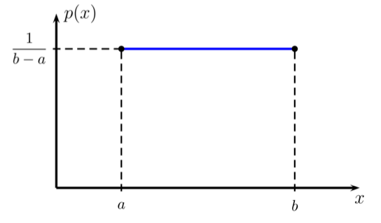
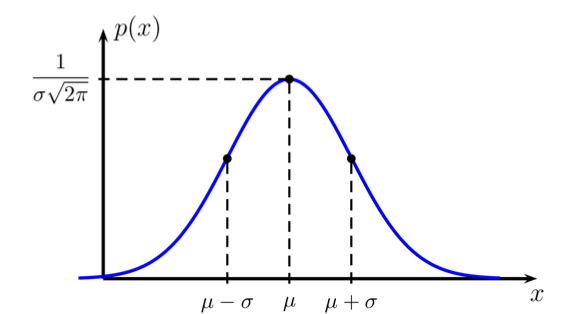
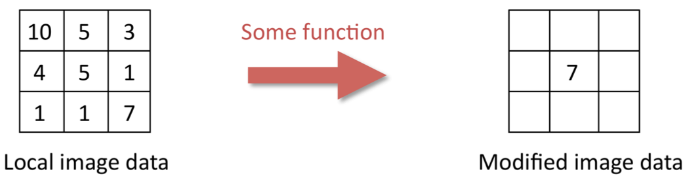
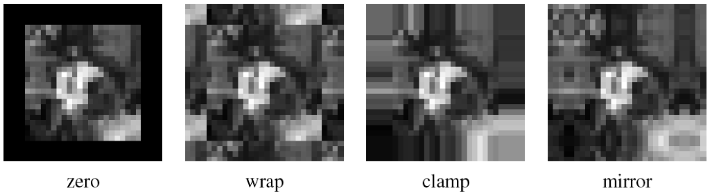
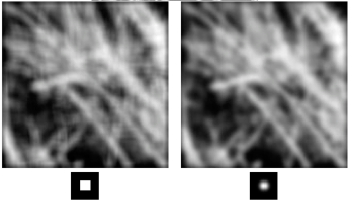
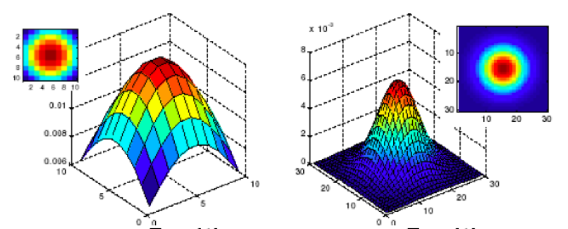
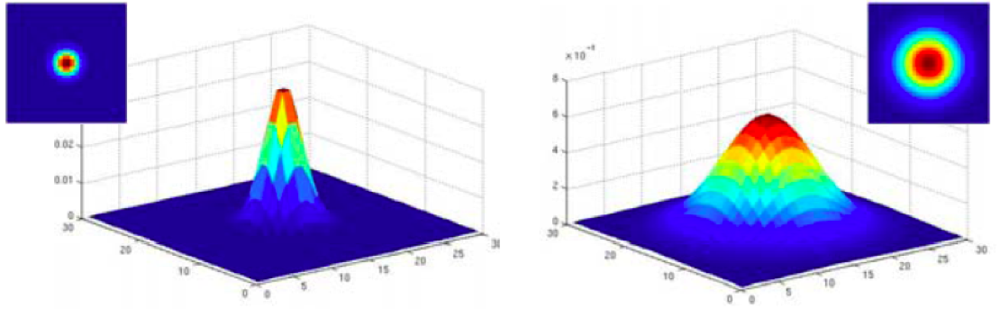
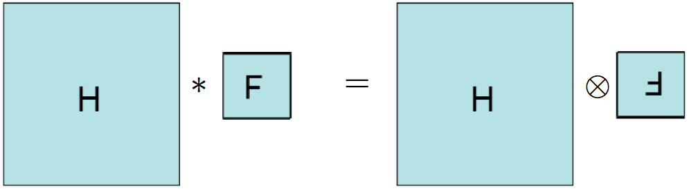
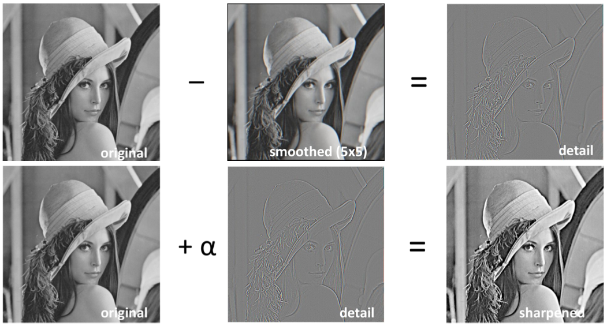

# Image Types and Discretization

* mapping $f$ from a rectangular domain $\Omega = (0,w) \times (0,h)$ to a co-domain $\mathbb{R}$ $$f:\mathbb{R}^2 \supset \Omega \to \mathbb{R}$$

    * $\Omega$ is called _image domain_ or _image plane_

* image data only given on rectangular point grid within image domain $\Omega$
* grid point $(i,j)$ is called _pixel_ (picture element)
* **Aliasing**: Signals become indistinguishable when sampled

    * Sampling rate must be above _Nyquist rate_ (two times the bandwidth of the signal) => aliasing-free result

## Image Noise

### Additive Noise

* most important noise
* Gray values and Noise are _independent_ $$f_{i,j} = g_{i,j} + n_{i,j}$$ where $g$ is the original image, $n$ is the noise and $f$ is the noisy image
* noise $n$ may have different distributions

    * Uniform Distribution (very simple)

        
        
        $p(x) = \begin{cases}
            b-a & \text{for } x\in[a,b] \\
            0 & else
        \end{cases}$

    * Gaussian Distribution (very common)
    
        
    
        * most important noise model
        * good approximation for many practical situations
        * density function: $$p(x) = \frac{1}{\sqrt{2\pi\sigma^2}} \cdot 10^{\frac{(x-\mu)^2}{2\sigma^2}}$$ where $\mu$ is the _mean_ and $\sigma$ is the standard deviation ($\sigma^2$ is called the _variance_)
        * $\mu-\sigma$ => $68\%$
        * $\mu-2\sigma$ => $95.5\%$
        * $\mu-3\sigma$ => $99.7\%$
        
### Multiplicative Noise

* signal dependent
* often proportional to the gray value: $$f_{i,j} = g_{i,j} + n_{i,j}\cdot g_{i.j} = (1+n_{i,j}) \cdot g_{i,j}$$
* often present in radar, ultrasound and tomographic images

### Impulse Noise

* degrade image at some pixels only (erroneous grey values are created)
* _unipolar impulse noise_ => only one grey value
* _salt-and-pepper noise_ => bipolar noise, highest and lowest value inserted

## Correlation and Convolution

* goal is to reduce noise
* take multiple images with same camera (and setup) and average them
* **Image Filtering**: modify pixels based on some function of local neighborhood

    

    * replace pixel by average of neighborhood
    
### Correlation

* weighted combination of pixels in small neighborhood, e.g. weighted sum: $$g_{i,j} = \Sigma_{k,l \in\mathbb{Z}} f(i+k,j+l)h(k,l)$$ where $h(k,l)$ is the **mask** or **weighted kernel** (_filter coefficients_)
* **correlation operator**: $g = f \otimes h$
* _boundary conditions_: What happens on image border.

    

    * _zero_: everything outside of images is zero
    * _wrap_: move out of image? move back in on the other side!
    * _clamp_: last pixel gets replicated
    * _mirror_: move out of image? move back on the same side, reverse direction
    
* **Gaussian Correlation**: Removes high-frequency components from the image (low-pass filter)
    
    
    
    * approximates a 2D Gaussian function
    * Gaussian Function has infinite support, discrete filters use finite kernels
    
        
    
    * _Standard Deviation_ determines extent of smoothing
    
        
        
### Convolution

* Correlation filters will be flipped by mathematical operation
* Convolutions of two images: $g = f * h$ defined as: $$g(i,j) = \Sigma_{k,l\in\mathbb{Z}} f(i-k,j-l) h(k,l)$$
* for symmetrical filters (gaussian, box) result is the same
* Visualization of Correlation filters much more intuitive.
* mathematical properties:

    * **commutative**: $f*h = h*f$
    * **associative**: $(f*h)*g = f*(h*g)$
    * **identity**: $\delta*h = h*\delta = h$
    * **linear** (superposition): \begin{align*}
        f*(h_1+h_2) &= f*h_1 + f*h_2 \\
        (f+g)*h &= f*h + g*h \\
        (\alpha f)*h &= \alpha(f*h)
        \end{align*}
    * **shift-invariant**: $(shifted \; f)*h = (f*h) shifted$ (shifted image => convolution with shifted impulse)
    
* **Sharpening** 
* Different phenomena in Optics are actually convolutions, e.g. motion blur

### Non-Linear filters + denoising

* Measures for denoising quality:

* Mean Square error (MSE): $$MSE(f,g) = \frac{1}{N} \Sigma_{n=1}^N(f_n-g_n)^2$$
* Peak signal-to-noise ratio (PSNR) $$PSNR(f,g) = 10 \log_{10} \left( \frac{V^2}{MSE(f,g)} \right)$$
* **bilateral filter**:

    * idea: preserve edges, average only over pixels which are nearby _and_ have similar color
    * two weights: one for distance, one for intensity, both are gaussian filters
    * parameters $\sigma,\tau > 0$, greyscale image $f$, _bilateral filter_:
    \begin{align*}
        g(n) &= \frac{1}{K_n}\Sigma_{m=1}^N f_m N_\sigma(\Vert x_n-x_m\Vert) \cdot N_\tau (\vert f_n-f_m\vert) \\
        K_n &= \Sigma_{m=1}^N N_\sigma (\Vert x_n-x_m\Vert) \cdot N_\tau(\vert f_n-f_m \vert)
    \end{align*}

* **non-local means**: images have similat patches, **idea**: when averaging, put most weight on similar patches

    * around each pixel $n$, define a $k \times k$ window of pixels $\mathcal{W_n}$, which is written as vector of pixel indices
    * define distance $$d_{n,m}^2 := \Sigma_{s=1}^{k^2} \left( f(\mathcal{W}_n(s)) - f(\mathcal{W}_m(s)) \right)^2$$
    * kernel weights: $k_{n,m} := 10^{- \frac{d^2_{n,m}}{2 \sigma^2}}$, where $\sigma>0$ is a parameter.
    * sums are usually restricted to window around $n$th pixel
    * very slow filter

* **median filter**: very good for removing outliers => _salt-and-pepper noise_

    * for each pixel $n$, compute vector $f$ consisting of $k^2$ grayscale values: $f=(f_{n,1}, \dots, f_{n,k^2}$) in local $k \times k$ window around $n$.
    * filtered result is the _median value_
    * usually $k=3$, better to apply it multiple times (twice)

