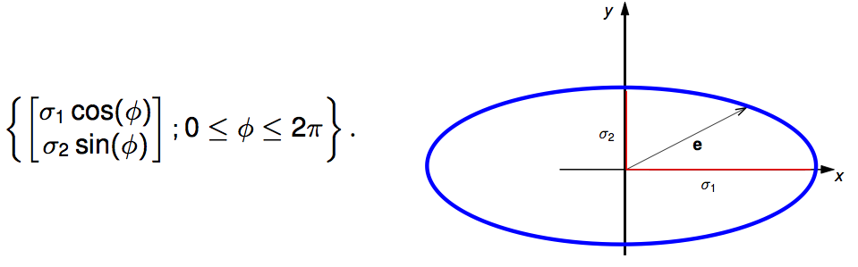

# Features and Patterns

## Image Edges and Image Derivates

* Identify sudden changes (discontinuities) in an image
* naive: changes in intensity

    * often does not work: texture, shadows, back- and foreground of similar color, …
    * => focus on gradient-based edge detection ok for now

* **approximation of the gradient**

    

    * _interpolate image as function, differentiate, resample_: $$\delta_x f(x,y) = \lim_{\epsilon\to0} \frac{f(x+\epsilon,y) - f(x,y)}{\epsilon}$$
    * _difference approximation_: \text{\tiny $h_x$ is pixel size in $x$-direction (usually normalized to 1)}
    
        * _forward differences_: $(\partial_x f)_{i,j} \approx \frac{f(i+1,j) - f(i,j)}{h_x}$
        * _backward differences_: $(\partial_x f)_{i,j} \approx \frac{f(i,j) - f(i-1,j)}{h_x}$
        * _central differences_: $(\partial_x f)_{i,j} \approx \frac{f(i+1,j) - f(i-1,j)}{2 h_x}$
        * can be writte as _convolutions_:
        
            * forward difference kernel: \begin{tabular}{|c|c|c|} \hline 1 & -1 & 0 \\ \hline \end{tabular}
            * backward difference kernel: \begin{tabular}{|c|c|c|} \hline 0 & 1 & -1  \\ \hline \end{tabular}
            * forward difference kernel: \begin{tabular}{|c|c|c|} \hline $\frac{1}{2}$ & 0 & $-\frac{1}{2}$ \\ \hline \end{tabular}

    * for greyscaleimage, gradient $\nabla f$ is a vector field consisting of partial derivatives: $\nabla f = \begin{bmatrix} \partial_x f \\ \partial_y f \end{bmatrix}$
    * the magnitude of the gradient is the length of the vector in every point: $\Vert \nabla f \Vert = \sqrt{ (\partial_x f)^2 + (\partial_y f)^2 }$
    * Noise makes this nearly impossible => smooth first, apply gradient later
    
        
    
    * Under some technical conditions on $f$ and $g$, partial derivatives wrt $i$th variable satisfy $$\partial_i (f*g) = (\partial_i f)*g = f*(\partial_i g)$$
    
        
    
        * more _efficient_: can be pre-computed, no second convolution necessary
        * more _accurate_: if filter function is known, derivates can be computed analytically
        * normalize to zero after building filter => constant signal

## Canny Edge Detection

* maxima of gradient
* not important for exam

## Feature Detection

* _Detection_: indentify interesting points
* _Description_: Extract Feature descriptor for each point
* _Matching_: Determine correspondences between views
* Goals for detectors:

    
    
    

    * _locality_: robust to clutter and occlusion
    * _quantity_: quantity: hundreds or thousands in single image
    * _distinctiveness_: differentiate large database of objects
    * _efficiency_: real-time performance?
    * _geometric invariance_: translation, rotation, scale, …
    * _photometric invariance_: brightness, exposure, …

* Look for **unsusual** regions => unambiguous matches

### Singular Value Decomposition (SVD)

* If $A\in\mathbb{R}^{m \times n}$ is a $m\times n$ matrix => there exists a factorization of the form $A = U\Sigma V^T$ where

    * $U\in \mathbb{R}^{m\times m}$ is an orthogonal matrix: $U U^T = U^T U = I_m$
    * $V\in \mathbb{R}^{n\times n}$ is also orthogonal
    * $\Sigma\in \mathbb{R}^{m\times n}$ is a diagonal matrix, whose diagonal consists of sortet, non-negative real numbers $\sigma_1 \geq \sigma_2\geq\dots\geq 0$ => _singular values_ of $A$

* $A = U\Sigma V^T \;\Leftrightarrow\; AV = \Sigma U$
    
    * $A$ maps the columns of $V$ to the columns of $U$ scaled by the singular values
        
* **properties of SVD**:

    * $rank(A)$ => number of non-zero singular values
    * columns of $V$ are eigenvectors of $A^T A$
    * columns of $U$ are eigenvectors of $AA^T$

* **PCA**: Characterize joint probability distribution of several variables to find directions with greates variance

    * _sample expectation value_: $E(Z) = \Sigma^m_{i=1} p_iz_1$ ($\approx$ weighted average)
    * _sample variance_: $Var(Z) = \Sigma^m_{i=1}p_i(Z_i-E(Z))^2$
    * _sample standard deviation_: $\sigma(Z) = \sqrt{Var(Z)}$
    * _covariance_: $cov(X,Y) := \Sigma_{i=m}^m p_i(x_i - E(X))(y_i - E(Y))$
    
        * "centered measurements": $E(X_j) = 0$ => $cov(X_j,Y_k) := \Sigma_{i=m}^m p_i\cdot x_{ji}\cdot y_{ki}$
        * intuition: generelly, whenever two values increase together, the covariance is posivite
        
    * _covariance matrix_: $C(X) := (cov(X_j,X_k))_{j,k=1,\dots,n}
    
        * properties:
        
            * _symmetric_
            * $cov(X_j,X_j) = var(X_j)$ => diagonal consists of variances
            * _semi-definite_
            
* $M = U\Sigma V^T$ be SVD of measurement matrix => transform all measurements by $V$ => $M' = MV = U\Sigma$ => covariance matrix: $C' = \Sigma^T U^T U \Sigma = Sigma^2$ 

    

    * The radius of the ellipse yields the standard deviation of the measurements projected onto the corresponding direction.

* PCA can be used to _decorrelate data_
* dimensions corresponding to larger singular values have higher variance => more important

### Structure Tensor

<!--
* distribution around $(i,j)$ characterized by the _covariance matrix_ $$C(\nabla^\sigma f) = \begin{bmatrix}
    cov(f_x^\sigma,f_x^\sigma) & cov(f_x^\sigma,f_y^\sigma) \\
    cov(f_x^\sigma,f_y^\sigma) & cov(f_y^\sigma,f_y^\sigma)
    \end{bmatrix} = \begin{bmatrix}
    E(f_x^\sigma f_x^\sigma) & E(f_x^\sigma f_y^\sigma) \\
    E(f_x^\sigma f_y^\sigma) & E(f_y^\sigma f_y^\sigma)
    \end{bmatrix}$$
-->
$$\tau := \begin{bmatrix}
    G_\tau * (f_x^\sigma)^2 & G_\tau * (f_x^\sigma f_y^\sigma) \\
    G_\tau * (f_x^\sigma f_y^\sigma) & G_\tau * (f_y^\sigma)^2
    \end{bmatrix} = G_\tau * \begin{bmatrix}
    (f_x^\sigma)^2 & f_x^\sigma f_y^\sigma \\
    f_x^\sigma f_y^\sigma & (f_y^\sigma)^2
    \end{bmatrix}$$
    
* _inner scale parameter_ $\sigma>0$: determines image scale at which derivates are taken
* _outer scale parameter_ $\tau>0$: determines size of the windows on which derivate information is sampled from

=> Harris Corner Detector

### Compare Features in different images

* **Sum of Squared Differences** (SSD): Given two rectangular image patches $f,g$ on $\{1,\dots,W\} \times \{1,\dots\}$, the _sum of squared differences distance_:
$$E_{SDD}(f,g) = \Sigma^{W}_{i=1}\Sigma^H_{j=1} \left( f(i,j) - g(i,j) \right)^2$$

    * Smaller value => better fit
    * normalization: divide by $W\cdot H$
    
* use error threshold $\theta$ to compare patches (for every possible matching patch)
* _properties_

    * fast
    * invariant to _translation_
    * _not_ invariant to rotation
    * _not_ invariant to scaling
    * _not_ invariant to contrast/brightness changes

* **Normalized Cross-Correlation** (NCC) Given two rectangular image patches $f,g$ on $\{1,\dots,W\} \times \{1,\dots\}$, the _normalized cross-correlation distance_:
$$ E_{NCC}(f,g) = \frac{cov(f,g)}{\sigma(f)\cdot \sigma(g)}$$

    * range is within $[-1,1]$, larger value is better, value below $0$ is opposite of fit.

* _properties_

    * _not_ fast
    * invariant to _translation_
    * _not_ invariant to rotation
    * _not_ invariant to scaling
    * invariant to contrast/brightness changes

* **Autocorrelation** for patch $f$ and shift $u$ (sum runs over all pixels)

    
    
    $$E_{AC}(f,u) := \Sigma_i w(p_i) (f(p_i+u) -f(p+i))^2$$
    
    
    * algorithm:
    
        1. taylor series approximation: $f(p_i+u) \approx f(p_i)+\nabla f(p_i)^T\cdot u$
        2. compute $E_{AC}$ using 1. $E_{AC}(f,u) \approx u^T \left(\Sigma_i w(p_i)\nabla f(p_i)\nabla f(p_i)^T \right) \cdot u$
        * its actually the structure tensor:
        * approximation to _autocorrelation_ for small shifts $u \mapsto u^T \tau u$

