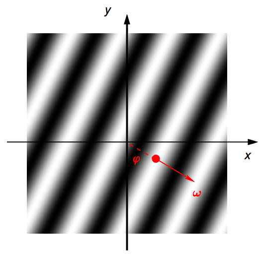
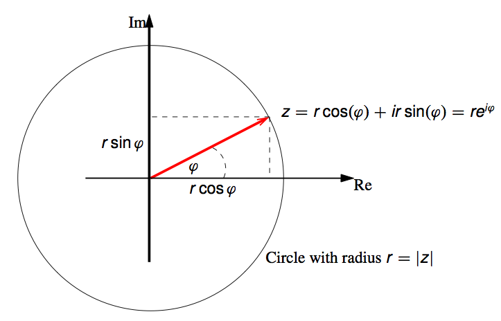
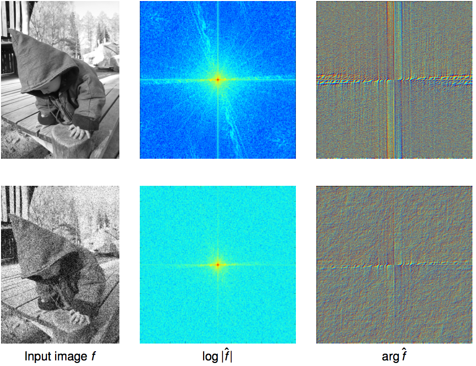
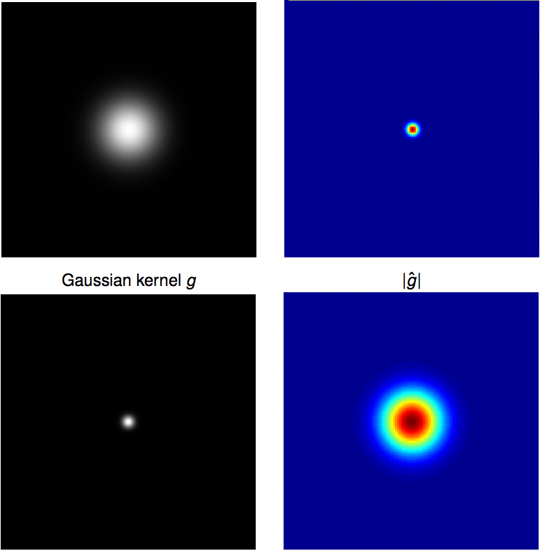
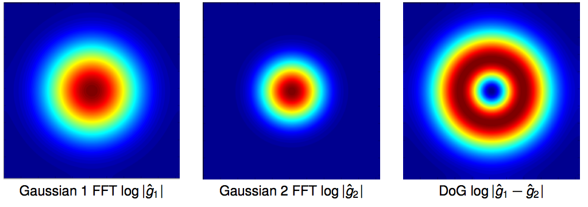

# Frequency

* Fouriers idea:

    > Any univariate function can be rewritten as a weighted sum of sines and cocsines of different frequencies.

* Elementary building blocks: $f(x,y) = r\cdot \cos(2\pi (\omega_x x + \omega_y y)+\varphi)$

    * _wave number_: $\omega = [\omega_x \omega_y]$
    * _frequency_$ $f=\vert \omega \vert_2$ => number of peaks per unit length
    * _direction of the wave_: $\frac{\omega}{f}$
    * _phase_: $\varphi\in\mathbb{R}$ => gives distance of the first peak to the origin
    * _amplitude_: $r\geq 0$ => gives maximum peak height
    
* write waves with complex numbers => formulas become easier to understand

    

    * $e^{it} = \cos(t) +i\cdot \sin(t)$
    * lies on the unit cirlce
    * angle between $e^{it}$ and real axis is $t$
    * complex number => $z=r\cdot e^{i\varphi}$
    
        * _norm_ $r=\vert z \vert$
        * _argument_ $\varphi$

* complex elementary wave: \begin{align*}W_\omega (p) &= e^{2\pi i (\omega\cdot p)} \\
&= \cos(2\pi (\omega\cdot p)) + i\sin(2\pi (\omega\cdot p))
\end{align*}
* multiplication with comples numbers:
\begin{align*}W_\omega (p) &= r\cdot e^{i\varphi} \cdot e^{2\pi i (\omega\cdot p)} \\
&= e^{i(2\pi (\omega\cdot p)+\varphi)} 
\end{align*}

    _amplitude_ $r$ and _phase_ $\varphi$

* Write function $f:\mathbb{R}^2 \to \mathbb{C}$ as _infinite linear combination_ of elementary waves with complex coefficients $\hat{f}(\omega)$: $$f(p) = \int_{\mathbb{R}^2} \hat{f}(\omega) W_\omega (p) d\omega$$

* Complex valued function $\hat{f}:\mathbb{R}^2 \to \mathbb{C}$ is called **Fourier Transform**

    * For each point in _frequency space, the value $\hat{f}(\omega) = re^{i\varphi}$ gives amplitude and phase of the elementary wave $W_\omega$

* interpretation:

    * Noise amplifies high frequencies:
    
        

* Phase seems more important for the actual image

## Filtering in Frequency Space

* convolution of elementary wave: $(g*W_\omega) (p) = W_\omega(p) \hat{g}(\omega)$

    * => convolution theorem: $\widehat{f*g} = \hat{f} \cdot \hat{g}$
    * much more efficient than direct convolution

### Gaussian in Frequency Space

* The Fourier Transform of a Gaussian is a Gaussian-like Function:
$$ f(p) = \frac{1}{2 \pi \sigma^2} \cdot e^{-\frac{p^2}{2\sigma^2}}
\;\Rightarrow\;
\hat{f}(\omega) = e^{-\frac{4 \pi^2\omega^2}{2\sigma^{-2}}}$$

### Types of Filers:

* **low-pass filter** filter which leaves low frequencies intact (e.g. gaussian)
* **high-pass filter** filter which leaves high frequencies intact (e.g. impuls - Gaussian)
* **band-pass filter** filter which leaves a range of frequencies intact while suppressing high and low frequencies (Difference of Gaussians)

### Properties of Fourier Transform

* _linearity_: $\widehat{\alpha f + \beta g} = \alpha \hat{f} + \beta \hat{g}$
* _rotation invariance_: when $f$ is rotated, the Fourier transform $\hat{f}$ is rotated by the same angle.
* _shift theorem_: shifting $p_0$ leads to a phase change according to $\widehat{f(p-p_0)}(\omega) = e^{-2 \pi i \omega \cdot p_0} \hat{f}(\omega)$
* _convolution theorem_: $\widehat{f*g} = \hat{f} \cdot \hat{g}$
* _derivates_: $\widehat{\partial_x^n \partial_y^m f}(\omega) = (2\pi i \omega_x)^n (2\pi i \omega_y)^m \hat{f}(\omega)$

