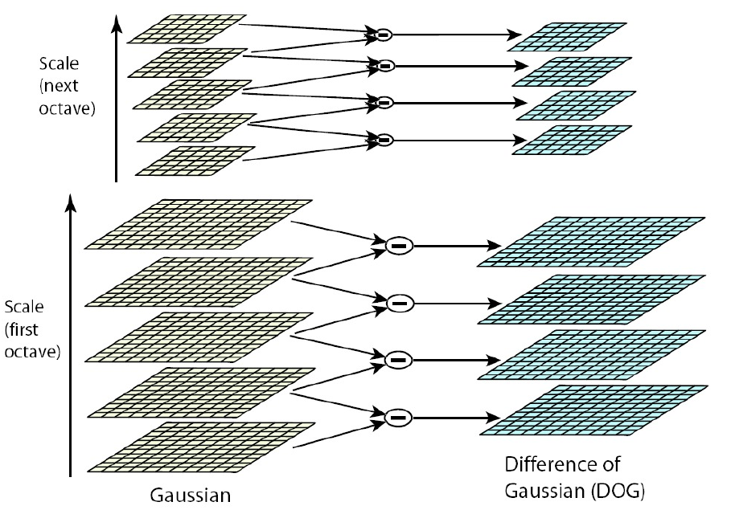
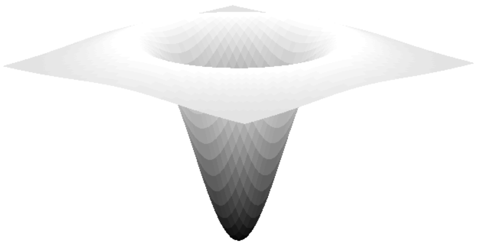

# Scale Invariant Feature Transform (SIFT)

* **Goals**:

    * detect characteristic feature points in images
    * create detailed descriptos that represents each feature as uniquely as possible
    * ensure invariance with respect to changes in location, scale and orientation

* **Applications**:

    * Finding sparse correspondences between images
    * usefull in computer vision: global relations between images, tracking, structure-from-motion
    * object detection and recognition

* **idea**

    1. **detection of characteristic feature points**
    
        * based on Gaussian scale-space using difference of Gaussians
        * extrema provide location and scale
        
    2. **accurate localization of key points**
    
        * performs sub-pixel refinement by fitting quadratic functions
        * additionally discards points with high ratio between principal curvatures
        
    3. **assignment of the dominant orientation(s)**
    
        * based on a histogram of gradients within the local neighbourhood
        * refines orientation by fitting quadratic functions
    
    4. **computation of suitable key point descriptor**
    
        * unit vecrot based on accumulated histograms of gradients
        * compensated by location, scale and dominant orientation

## SIFT Feature Detection

* Starting Point: _Gaussian Scale-Space of input image $f$_

    * discrete levels of smoothing: $\sigma_0, \sigma_1, \dots, \sigma_t, \dots, \sigma_{max}$
    * scale-space given by convolution of $f$ with increasing Gaussian $G_{\sigma_t}$: $$f_t = G_{\sigma_t} * f$$

* Difference-of-Gaussian (DoG)

    

    * Difference of two consecutive scales of the Gaussian scale-space:
        \begin{align*}
        D_t &:= f_{t+1} - f_t \\
            &= G_{k \sigma_t} * f - G_{\sigma_t} * f \\
            &= (G_{k \sigma_t} - G_{\sigma_t}) * f
        \end{align*}

* DoG is related to scale derivative via approximation: $$\partial_\sigma \approx \frac{G_{k\sigma} - G_\sigma}{k_\sigma - \sigma}$$

    * The analytical scale derivative is the scaled _Laplacian-of-Gaussian_ (LoG): $$\partial_\sigma G_\sigma = \sigma\delta G_\sigma = \sigma(\partial_x^2 G_\sigma + \partial_y^2 G_\sigma)$$
    * DoG is an _approximation_ of the LoG: $$G_{k\sigma}-G_\sigma \approx (k-1) \sigma^2\delta G_\sigma$$
    
        
        
        * $(k-1)$ can be neglected (independent of scale $\sigma$)
        * $\sigma^2\delta G_\sigma$ is the _normalized Laplacian-of-Gaussian_

    * filters detect shapes that look like them => the LoG detects _"blobs"_

* Structures live only at certain scale => appear at certain scale, then vanish again (bandpass property of DoG)

    * _characteristic scale_ => magnitude of normalized LoG => extremal value (min or max)
    * provides _scale_ and _location_
    
## Accurate Localization of Key Points

* not important for exam

## Assignement of Dominant Orientations

* histograms of gradients (HoG) (computed from gradients of corresponding scale $\hat{\sigma}_i$)
* not important for exam

## SIFT Descriptor

* histograms
* not important for exam

## SIFT properties

* **invariant** to:

    * **rotation**
    * **translation**
    * **scaling**

* **robust** wrt "general changes" (brightness, contrast, …)

* downside: computation intensive

