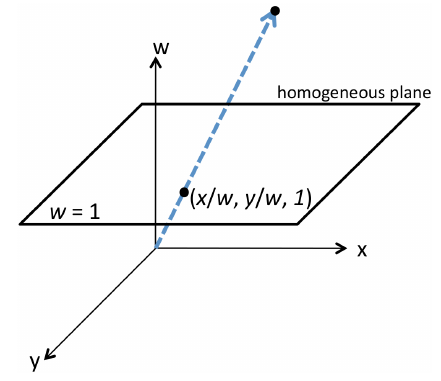
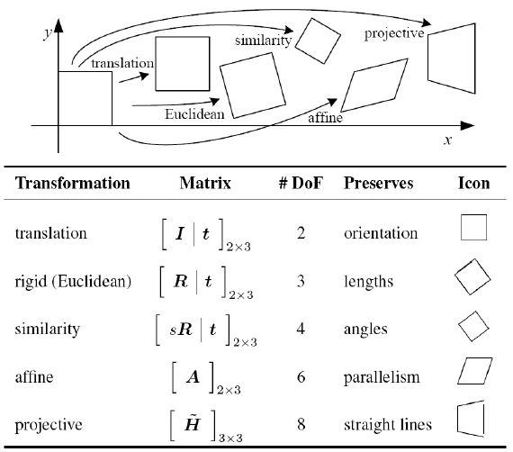

# Coordinate Transformation

* Image warping (not important for exam)

## Linear Transformations

* linear transformation $T: \mathbb{R}^2 \to \mathbb{R}^2$ is a map of the form: $T(p) = Ap$ with $A\in\mathbb{R}^{2\times 2}$
* **scaling**: $A = \begin{pmatrix} s_x & 0 \\ 0 & s_y \end{pmatrix}$ with $s_x, s_y \not= 0$
* **rotation**: $A = \begin{pmatrix} \cos \theta & -\sin \theta \\ \sin \theta & \cos\theta \end{pmatrix}$ with $\cos \theta \in \mathbb{R}$

* $A=U\Sigma V^T \;\Leftrightarrow\; AV = U\Sigma$, $A$ maps the columns of $V$ onto scaled columns of $U$ (SVD)

    * any linear transformation can be written as rotation $V^T$ followed by scaling $\Sigma$ followed by another rotation $U$

* **properties**:

    * origin maps to origin
    * lines map to lines
    * parallel lines remain parallel
    * ratios are preserved
    * closed under composition

## Affine Transformations

* extend linear transformations with **translations**: $$T(x) = A\cdot x + t, \; A\in\mathbb{R}^{2\times2}, t\in\mathbb{R}^2$$
* **properties**:

    * origin does _not necessariliy_ map to origin (only when $t=0$)
    * lines map to lines
    * parallel lines remain parallel
    * ratios are preserved
    * closed under composition
    
* Special cases of affine transformations:

    * _pure translation_: $A=I_2$
    * _Euclidean_: (rigid motion): $A$ is pure rotation + translation (no scaling)
    * _Similarity_: $A = sR$, where $R$ is rotation and $s>0$, rotation and scaling
    * _Area preserving_: $\det(A) = 1$, five degrees of freedom 

## Homogenous Transformations => Homographies

* moving to _homogenous coordinates_: $p\in\mathbb{R}^2 \Longrightarrow \hat{p} = \widehat{\begin{bmatrix} x \\ y \end{bmatrix}} := \begin{bmatrix} x \\ y \\ 1 \end{bmatrix} \in \mathbb{P}^2$
* $\mathbb{P}^2$ is called _projective space_, coordinates are _homogenous coordinates_
* Reverse projection to image coordinates is given by: $$\pi\left( \begin{bmatrix} x \\ y \\ w \end{bmatrix} \right) := \begin{bmatrix} \nicefrac{x}{w} \\ \nicefrac{y}{w} \end{bmatrix}$$
* _affine transformations_ can now be written as matrices: $\widehat{T(p)} = \begin{bmatrix} A & t \\ 0 & 1 \end{bmatrix} \begin{bmatrix} p \\ 1 \end{bmatrix}$

* **Homography**: $H = \begin{bmatrix} A & t \\ b^T & 1 \end{bmatrix}, A\in \mathbb{R}^{2\times 2}, \det(A)\not= 0, t,b\in \mathbb{R}^2$

* Special case: $H = \begin{bmatrix} 1 & 0 & 0 \\ 0 & 1 & 0 \\ -\frac{1}{f} & 0 & 1 \end{bmatrix}$ with $f\not=0$

    * image point of $\begin{bmatrix} x\\y \end{bmatrix}$ is $\begin{bmatrix} x \\ y \\ -\frac{x}{f} + 1 \end{bmatrix} \sim \begin{bmatrix} \frac{fx}{f-x} \\ \frac{fy}{f-x} \end{bmatrix}$
    * at $x=f$ the denominator becomes $0$ => points go to infinity

    * horizontal lines are mapped onto lines which "vanish" in $\begin{bmatrix} -f \\ 0 \end{bmatrix}$ => vanishing point
    * two vanishing points: $H = \begin{bmatrix} 1 & 0 & 0 \\ 0 & 1 & 0 \\ -\frac{1}{f_x} & -\frac{1}{f_y} & 1 \end{bmatrix}$ with $f\not=0$
    

