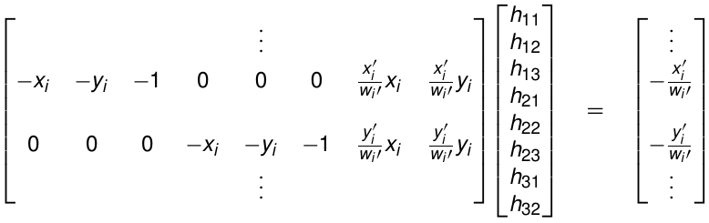

## Model Fitting 1: Least squares

* estimating Homographies can be done from _correspondence information_ => feature detection + matching
* want to find: $H = \begin{bmatrix} h_{11} & h_{12} & h_{13} \\ h_{21} & h_{22} & h_{23} \\ h_{31} & h_{32} & 1 \end{bmatrix}$ => eight unknowns

    * projective coordinates are only correct up to a scale factor:
    
        \begin{align*}
            x_i' &= h_{11} x_i + h_{12} y_i + h_{13} \\
            y_i' &= h_{21} x_i + h_{22} y_i + h_{23} \\
            w_i' &= h_{31} x_i + h_{32} y_i + 1 \\
        \end{align*}
    
    * normalizing with $w$ and rearranging this yields linear system.
    
        
        
    * System is _over-determined_ with linearly dependent equations => very improbable
    * naive way: If $A^TA$ has an inverse, normal equations can be solved as a normal linear system => inefficient and not very robust.
    * better way => SVD: $A=U\Sigma V^T$ => normal equations reduce to: $\Sigma^2V^T\hat{x} = \Sigma U^Tb$
    
        * Use _pseudo-inverse_ $\sigma^+$ to solve: $\hat{x} = V\Sigma^+ U^T b$
        
### Weighted Least Squares

* Often: knowledge about which features are better (e.g. from SIFT) => assign weight $\sqrt{w_i}>0$ to each row of $Ax = b$ => adjust minimization problem:
    $$argmin_{x\in\mathbb{R}^n} \nicefrac{1}{2} \Sigma_{i=1}^{m} w_i (Ax-b) ^2_i$$
* Solve as before: $A'=W^{\nicefrac{1}{2}} A$ and $b'=W^{\nicefrac{1}{2}} b$
* very sensible to outliers

## Model Fitting 2: RANdom SAmple Consensus (RANSAC)

1. Repeat $N$ times:

    1. select random subset of samples to fit the model
    2. compute model from selected subset of samples
    3. compute error between samples and estimated model
    4. count _inliers_: points with error below a threshold
    
2. Refit model using largest inlier set found during any of the above $N$ iterations

* parameters:

    * _number of $s$ points selected to fit the model_: always choose minimum number => fast, allows more trials in given time, might not get good initialization from sample size
    * _threshold for inliers_: choose in a way, that inliers have high probability to stay below threshold (e.g. $95\%$)
    * _number $N$ of trials_: choose $N$ s.t. with high probability $p$ at least one random sample is free of outliers:
        $$N=\frac{\log(1-p)}{\log(1-(1-e)^s)}$$

* In practice, RANSAC works well for outlier ratios below $50\%$
* $e$ is usually unknown in advance

    * compute $e$ from data during RANSAC: 
    \begin{align*}
        e &\leftarrow \min\left( e, 1-\frac{\text{number of inliers}}{\text{total number of points}} \right)
        N &\leftarrow \frac{\log(1-p)}{\log(1-(1-e)^s)}
    \end{align*}

* this might run for a _long time_ => use maximum number of iterations
* **Pro**

    * simple and general
    * applicability to different problems
    * works well in practice
    
* **Con**

    * several tunable parameters
    * not deterministic
    * iterative with unknown number of iterations
    * does not work well for low inlier ratios
    * can always get good initialization based on minimum number of samples

## Model Fitting 3: Hough transform

* another voting algorithm for fitting low-parameter models
* simple objeects represented by _very few parameters_
* not important for exam

