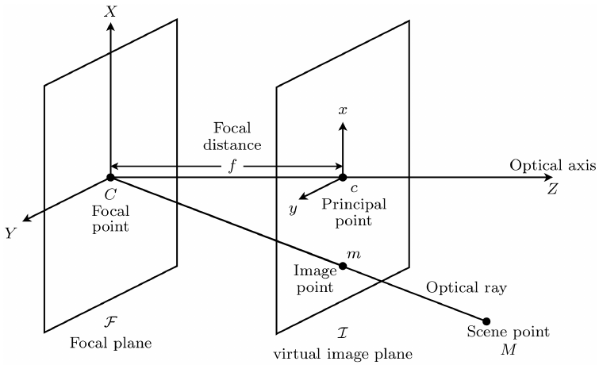
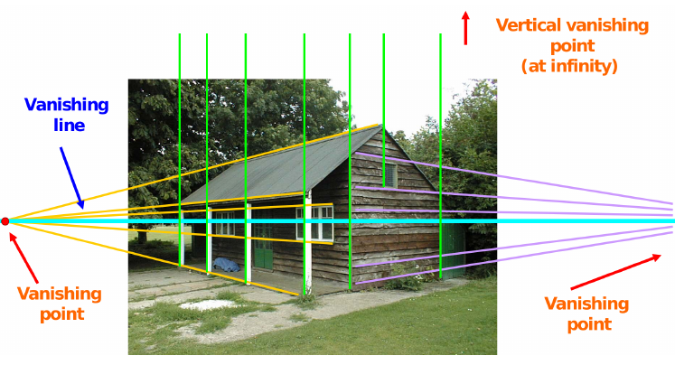

# Cameras

* **Pinhole Camera Model**: very simple, but often sufficient model of a camera system.
* perspective projection of 3D space onto 2D image plane => maps 3D camera coordinates $M=(X,Y,Z)$ with origin $C$ to 2D image coordinates $m=(x,y$)
* _notation_:

    * $M$: _scene point_ in 3d Space
    * $C$: _focal point_, _optical centre_: location of pinhole
    * $m$: _image point_
    * $I$: _image plane_
    * $F$: _focal plane_: coplanar to image plain, contains focal point $C$
    * _optical axis_: orthogonal to image plane, passes through $C$
    * _optical ray_: passes through $m$, $C$, $M$
    * $f$: focal distance: distance $I$ to $C$
    * $c$: _principal point_: intersection between image plane and optical axis

* $\frac{x}{X} = \frac{y}{Y} = \frac{f}{Z}$
* All points on the optical ray $(wX,wY,wZ), w>0$ map onto same image point $m=(x,y)$ => depth information is lost
* **pinhole projection matrix**: describe 3D points in 4D projective coordinates:
    $$\hat{m} = \begin{bmatrix} x \\ y \\ 1 \end{bmatrix} \hat{=} \begin{bmatrix} Zx \\ Zy \\ Z \end{bmatrix} = \begin{bmatrix} fX \\ fY \\ Z \end{bmatrix} = \undercomment{$P$}{\begin{bmatrix} f & 0 & 0 & 0 \\ 0 & f & 0 & 0 \\ 0 & 0 & 1 & 0 \end{bmatrix}} \begin{bmatrix} X \\ Y \\ Z \\ 1\end{bmatrix}$$

    * P is the _projection matrix_
    
* **extrinsic parameters**: denote position of world coordinate system relative to camera coordinate system: (only depending on camera orientation => extrinsic)
    
    * _translation_: $$T=\begin{bmatrix} 1 & 0 & 0 & t_1 \\
                    0 & 1 & 0 & t_2 \\
                    0 & 0 & 1 & t_3 \\
                    0 & 0 & 0 & 1
                    \end{bmatrix}$$
    * _rotation_: $$R=\begin{bmatrix} r_{11} & r_{12} & r_{13} & 0 \\
                    r_{21} & r_{22} & r_{23} & 0 \\
                    r_{31} & r_{32} & r_{33} & 0 \\
                    0 & 0 & 0 & 1
                    \end{bmatrix}$$ with $RR^T = R^T R = I_4$

    * _combined matrix for rotation and translation_: \text{\tiny generally does not commute}
        $$TR=\begin{bmatrix} r_{11} & r_{12} & r_{13} & t_1 \\
                    r_{21} & r_{22} & r_{23} & t_2 \\
                    r_{31} & r_{32} & r_{33} & t_3 \\
                    0 & 0 & 0 & 1
                    \end{bmatrix} \not= RT$$

* **intrinsic parameters** characterize geometry of image plane inside the camera
    $$\begin{bmatrix} u \\ v \\ 1 \end{bmatrix} = \begin{bmatrix} k & 0 & u_0 \\
                                                                  0 & \ell & v_0 \\
                                                                  0 & 0 & 1 \end{bmatrix}
            \begin{bmatrix} x // y // 1 \end{bmatrix}$$
            
    * generalisation: $H= \begin{bmatrix} k & -k\cot\theta & u_0 \\
                                                    0 & \nicefrac{\ell}{\sin\theta} & v_0 \\
                                                    0 & 0 & 1 \end{bmatrix}$

        * skew is generally assumed to be zero => $\theta = 90\degree$
        
* matrix $H$ and projection $P$ are often multiplied into a single **intrinsic matrix**:
    $$K = \undercomment{$H$}{\begin{bmatrix} k & -k\cot\theta & u_0 \\
                          0 & \nicefrac{\ell}{\sin\theta} & v_0 \\
                          0 & 0 & 1 \end{bmatrix}}
            \cdot
            \undercomment{$P$}{\begin{bmatrix} f & 0 & 0 & 0 \\ 0 & f & 0 & 0 \\ 0 & 0 & 1 & 0 \end{bmatrix}}
            =
            \begin{bmatrix} kf & -kf\cot\theta & u_0 & 0\\
                          0 & \nicefrac{\ell f}{\sin\theta} & v_0 & 0\\
                          0 & 0 & 1 & 0\end{bmatrix}
            $$
    
    * $f$ is usually given in some physical unit (i.e. meters), $k,\ell$ are also given (i.e. pixels per meter)

* **$3\times 4$ perspective projection matrix**:
    $$\Pi = KTR =   \begin{bmatrix}
                        \pi_{11} & \pi{12} & \pi{13} & \pi_{14} \\
                        \pi_{21} & \pi{22} & \pi{23} & \pi_{24} \\
                        \pi_{31} & \pi{22} & \pi{33} & \pi_{34} \\
                    \end{bmatrix}$$
    
    * Approximated by **affine projection matrix**
        $$\Pi_{affine}= \begin{bmatrix}
                            \pi_{11} & \pi{12} & \pi{13} & \pi_{14} \\
                            \pi_{21} & \pi{22} & \pi{23} & \pi_{24} \\
                            0 & 0 & 0 & Z_{const} \\
                        \end{bmatrix}$$

## Properties of Camera projection

* **many to one**: all points along same visual ray map to same image point
* **points map to points**, but projection on focal plane is undefined
* **lines map to lines**, but lines through focal point (visual rays) project to a point
* convex sets in 3D are mapped to convex sets in 2D

## Vanishing Points

* each direction in space has a vanishing point

## Homographies

* rotation of camera leads to homography in image plane

## Camera Calibration

* basic equations:
    $$\widehat{\begin{bmatrix} u^i \\ v^i\end{bmatrix}}
      =
      \begin{bmatrix} u^i \\ v^i \\ 1\end{bmatrix}
      \hat{=}
      \begin{bmatrix}Z^iu^i \\ Z^iv^i \\ Z^i\end{bmatrix}
      =
      \begin{bmatrix}
        \pi_{11} & \pi{12} & \pi{13} & \pi_{14} \\
        \pi_{21} & \pi{22} & \pi{23} & \pi_{24} \\
        \pi_{31} & \pi{22} & \pi{33} & \pi_{34} \\
      \end{bmatrix}
      \begin{bmatrix} X^i_w \\ Y^i_w \\ Z^i_w \\ 1 \end{bmatrix}
      $$
      
    * Depth $Z_i$ was lost during projection
    
        
    
    * Solve camera calibration equation  $Ax=0$: find $argmin_{x\in\mathbb{R}^n,\Vert x \Vert=1} \Vert Ax \Vert ^2$
    * => Use SVD, use last column of $V$
    * Image-to-world correspondences through some _calibration object_ with known geometry

## Lens Distortion

* Usually, images have some kind of distortion (radial + tangential)
* not important for exam

