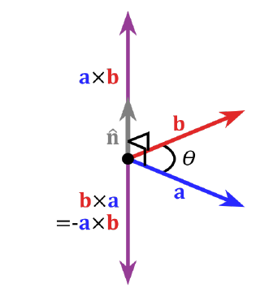

# Geometry of Two Views

* Now consider two cameras $P$ and $P'$, $X$ is a point in space => $x=P X$, and $x'=P'X$ are projections of two views.

* **Correspondence geometry**: Given $x$ in the first view, what are constraints on corresponding point in $x'$ in second view.
* **Camera geometry** (motion): Given a set of corresponding image points: What can we learn about the projections $P, P'$
* **Scene Geometry** (structure): Given corrspondence $x \leftrightarrow x'$ and two cameras, what is $X$

## Generalization of Points in Projective Space

* $\mathbb{P}^2$ is the space of vectors with three components $0 \not= (a,b,c)\in\mathbb{R}^3$ with: $$\begin{bmatrix} a \\ b \\ c \end{bmatrix} \hat{=} \begin{bmatrix} wa \\ wb \\wc \end{bmatrix} \text{ for all } w\not= 0$$
* $\mathbb{R}^2$ is embedded in $\mathbb{P}^2$ by defining for $m=(x,y)\in\mathbb{R}^2$ $$\hat{m} := \begin{bmatrix} x \\ y \\ 1 \end{bmatrix} \in \mathbb{P}^2$$
* If $c\not=0$ a point from $\mathbb{P}^2$ can be projected back into $\mathbb{R}^2$ by normalizing $a,b$ with $c$
* Points in $\mathbb{P}^2$ with $c=0$ => Point lies "_at infinity_" or _ideal points_

## Lines in Projective space

* A line in 2D space is given by all points $(x,y)$: $$ax+by+c=0$$
* $(a,b,c)$ determines the line, but is not unique: multiplication with $w\not=0$ => same line
* If $a^2+b^2=1$ => line is in normal form, $c$ is distance to origin
* Almost one-to-one correspondence between _lines_ in $\mathbb{R}^2$ and _points_ in $\mathbb{P}^2$
* **line at infinity** $I_\infty := \begin{bmatrix} 0 \\ 0 \\ 1 \end{bmatrix}$

* **Intersection of Lines**: $x = \ell \times \ell$

### Cross-Product

* either as you are used to
* or by **cross-product matrix**: $a\times b \;\hat=\; [a]_xb = \begin{bmatrix} 0 & -a_3 & a_2 \\ a_3 & 0 \\ -a_1 \\ -a_2 & a_1 0 \end{bmatrix}$
* A line connecting points $x$ and $x'$ is given by $\ell = x\times x'$
* lines and points are _dual partners_

### Infinity

* If lines $\ell$ and $\ell'$ have the same direction $d$ (i.e. they are parallel), the point of intersection is $\begin{bmatrix} d_x \\ d_y \\ 0 \end{bmatrix}$
* if $\ell$ has direction $d$, it intersects $I_\infty$ in $\begin{bmatrix} d_x \\ d_y \\ 0 \end{bmatrix}$
* If $x$ and $x'$ are points at infinity, the line through them is $\ell_\infty$

## Homogprahies of lines

* The projection of a line is: $\ell' = H^{-1\cdot T} = H^{-T}$ (multiplication with the _inverse-transpose_)

## Fundamental Matrix

* $C$ and $C'$ are _cameras_
* $x$ and $x'$ are _corresponding_ points, $X$ is the world point
* $e$ and $e'$ are the _epipoles_ (location of the other camera)
* $\ell$ and $\ell'$ are the _epipolar lines_ (lines connecting) $x'$ and $e'$
* $\pi$ is the _epipolar plane_ (plane between $e,e'$ and $X$)
* the _baseline_ is the line through $C,C'$ (and $e,e'$)

* The **fundamental matrix** for two view: projects one view onto the other

    * _project epipolar line onto point_: $\ell' = Fx$
    * any pair of correspondences satisfies: $x'^TFx=0$
    * => The fundamental matrix can be computed using correspondences alone
    * $F$ is the fundamental matrix for $(P,P')$ => $F^T$ is the fundamental matrix for $(P',P)$
    * the epipole $e'$ is the _left nullspace_ of $F$: $e'^T F =0$ and $F e=0$ => Compute epipoles when $F$ is found
    * $F$ has only rank two
    * $F$ has seven degrees of freedom (9 Entries, -1 for homogenousness, -1 for $\det(F)=0$)

### Computing the Fundamental Matrix

* a single 3D world point $X_w$ projects onto $x$ => $X_w = P^+ x$

    * project $X_w$ into second image via $P'$
    * epipolar line connects epipole $e'$ with $P'X_w$: $$\ell' = [e']_x P' X_w = \undercomment{$=F$}{[e']_x P'P^+ x}$$
    * SVD: $P=U\Sigma V^T$ => $P^+ = V\Sigma^+ U^T$, where $\Sigma^+$ is $\Sigma$ with reciprocal of all non-zero diagonal elements
    * Pseudo-Inverse is _left-inverse_: $A^+A=I_m$
    
* Computing the fundamental matrix: $$F = [e']_x P' P^+$$ with $e' = P'C_w$ and $PC_w =0$

    * If rotation and translation are known: $C_w = T^{-1} R^T \begin{bmatrix} 0 \\ 0 \\ 0 \\ 1 \end{bmatrix}$

### Projection matrix

$P = K[R\vert t]$

### Fundamental Matrix for translational motion (pure translation)

* Choose $P=K[I\vert 0]$ (world-CO and camera-CO were the same) => second camera translated only $P'=K[I\vert t]$ (translation, no rotation) => $P^+ = \begin{bmatrix} K^{-1} \\ 0 \end{bmatrix}$

    * => $P'P^+ = KK^{-1} = I_3$
    
### Horizontal motion

* Motion parallel to x-axis: epipole is at $e' = \begin{bmatrix} 1 \\ 0 \\ 0 \end{bmatrix}$
* $F= \begin{bmatrix} 0 & 0 & 0 \\ 0 & 0 & -1 \\ 0 & 1 & 0 \end{bmatrix}$

    * correspondence equation reduces to: $x'^T F x =0 \;\leftrightarrow\; y=y'$
    * also goal of _rectification_

### Estimating Fundamental Matrix from Correspondences

$$\begin{bmatrix} x_ix_i' & y-ix_i' & x_i' & x_iy_i' & y_iy_i' & y_i' & x_i & y_i & 1 \end{bmatrix} \begin{bmatrix} f_{11} \\ f_{12} \\ f_{13} \\ f_{21} \\ f_{22} \\ f_{23} \\ f_{31} \\ f_{32} \\ f_{33} \end{bmatrix} = 0$$

* homogenous linear system with $n\times 9$ matrix $A$ => interested in non-trivial solution corresponding to smalles singular value (rightmost column of $V$ from the SVD)
* enforce rank 2

    1. inital solution $\tilde{F}$
    2. SVD: $\tilde{F} = V \begin{bmatrix} \lambda_1 & 0 & 0 \\ 0 & \lambda_2 & 0 \\ 0 & 0 & \lambda_3 \end{bmatrix} V^T, \quad \lambda_1\geq\lambda_2\geq\lambda_3$
    3. $F = V \begin{bmatrix} \lambda_1 & 0 & 0 \\ 0 & \lambda_2 & 0 \\ 0 & 0 & 0 \end{bmatrix} V^T$ (which obviously has rank 2)

### Increasing robustness with RANSAC

* important to remove outliers
* 8 points are sufficient for estimation
* _inliers_ are feature matches, that satisfy the epipolar constraint within given accuracy: $x'^T F x \leq \epsilon$

