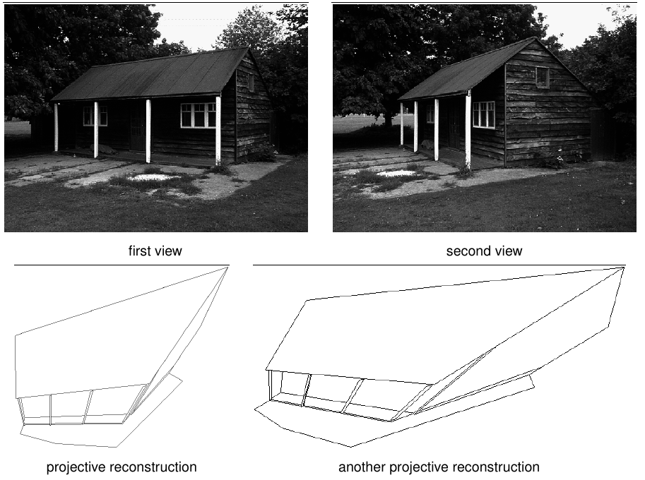
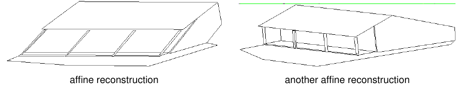
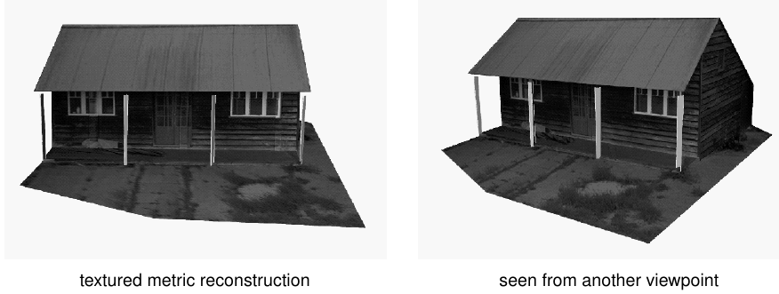
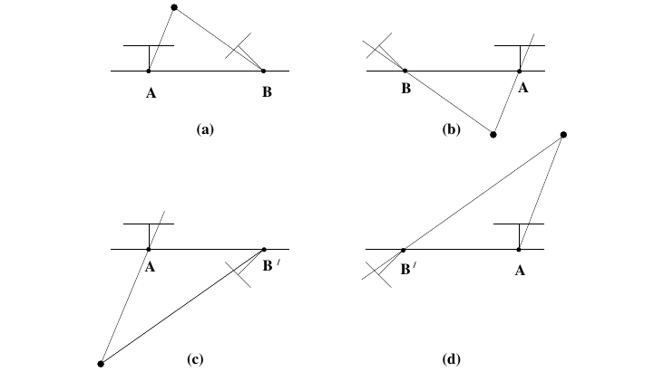
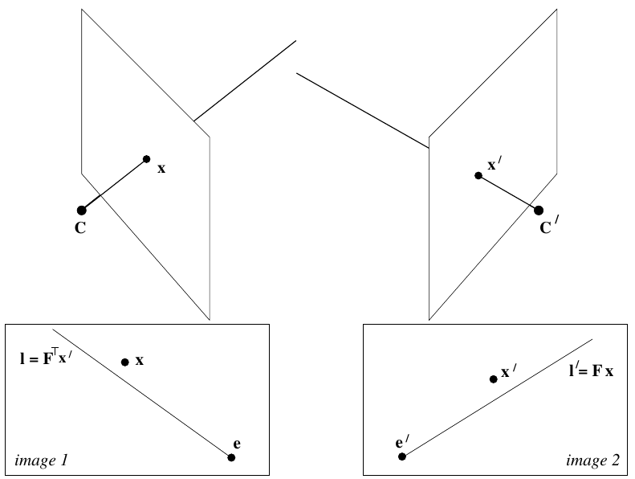

## Ambiguity of Reconstruction

### Projective reconstruction

* Given a set of correspondences $x_i \leftrightarrow x_i'$ => projection matrices: $P$ and $P'$ and set of world points: $X_i$
* only accurate up to a homography
* possible from feature matches alone

### Affine Reconstruction

* **affine reconstruction**: the scene is correctly reproduced up to an _affine transformation_:

    * parallel lines are parallel
    * angles are _not_ necessarily correct
    
* need to find plane at infinity $\pi_\infty$ ("2D boundary of 3D space")

    * e.g. three vanishing points needed in both images => three sets of parallel lines

### Metric Reconstruction

* **metric reconstruction**: scene is correctly reproduced up to similarity transformation_

    * parallel lines are parallel
    * angles are correct
    * scale is _not_ necessarily correct
    
        * inserting a segment with known length identifiable in both images can help here
        
* need to have some information about _absolute angles_ in scene (=> intrinsics of camera)
* => computing the _Image of the Absolute Coniac_ (IAC): $\omega = (KK^T)^{-1}$

    * e.g. assumption of square pixels plus set of three vanishing points

## Pose Estimation: The Essential Matrix

* **essential matrix** $E$ is a specialization of the fundamental matrix

    * pre-calibrated camera => intrinsic parameters (i.e. matrix $K$) are known

* immediately obtain _metric reconstruction_
* given $P=[I\vert0]$ and $P'=[R\vert t]$ => $E=[t]_x R$

    * decompose $E$ into rotation and translation: SVD
    * four possible solutions 

## Triangulation: Structure from Motion

* in 3D space two rays do not necessarily meet, even if they are not parallel
* _Direct Linear Triangulation_ (DLT): Recover $X$ as $AX=0$, where $A= \begin{bmatrix} x(p^3)-p^1 \\ y(p^3) - p^1 \\ x'(p^{'3}) - p^{'1} \\ y'(p^{'3}) - p^{'2} \end{bmatrix}$

    * solution is last column in $V$ of SVD

## Bundler: Practical example

