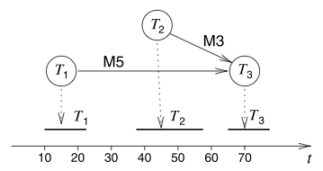
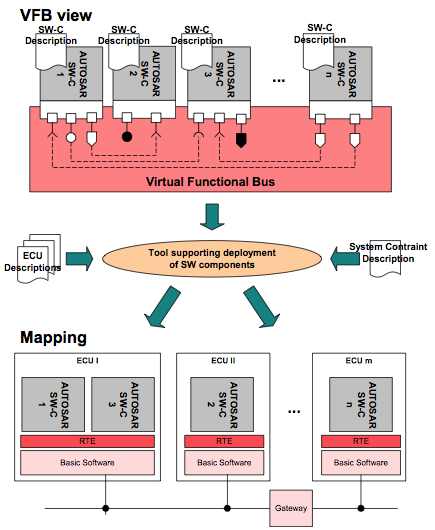
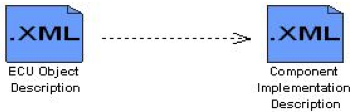

# Functional Safety of Embedded Systems - Part 5 - Application Mapping
* Mapping of Application onto execution platform.
* Certain applications will be used together (e.g. call, blue-tooth, PIM) => still need to meet deadlines.
* **hardware-software-co-design** => find combination of hardware and software s.t. design is most efficient
    * => Platform-based design
* _homogeneous multiprocessor systems_: all processors provide same functionality (PC-like) => code compatibility between processors => reallocate processors at run-time (fault tolerance)
* _heterogeneous multiprocessor systems_: processors of different types => special processors for special tasks
* _definition of mapping problem_:
    * _given_: set of applications, use cases, set of candidate architectures
    * _find_: mapping of applications to processors, appropriate scheduling technique, target architecture
    * _objectives_: keep deadlines, maximize performance, minimize cost/ energy, ...
* _design space exploration_ (DSE): exploration of possible architectural options

## Scheduling in Real-Time Systems
* One of the key issues to be solved.
* Already roughly considered in Specification.

### Classification of Scheduling Algorithms

* classes used to classify schedulers:
    * _soft and hard deadlines_:
        * soft => extension to OS-default
        * hard => periodic and aperiodic
    * _periodic and aperiodic tasks_:
        * periodic: Task must be executed once every $p$ units of time, $p$ is the period, each execution is a _job_
        * aperiodic: all other, if minimum time between two calls => _sporadic_
    * _preemptive and non-preemptive_:
        * preemptive: tasks may be interrupted
        * non-preemptive: tasks run until finished
    * _static and dynamic_:
        * static: decision about scheduling at compile/ design time (can respect resource requirements, dependences between tasks)
        * => _entirely time triggered_ (TT systems): totally controlled by a timer, _task descriptor list_ (TDL) contains schedule
        * dynamic: decision about scheduling at run-time (overhead run-time)
    * _independent and dependent tasks_: dependencies between tasks in embSys rule
    * _mono- and multiprocessor_: single processor more simple, multi => distinguish between hetero- and homogeneous systems
    * _centralized and distributed_: scheduling algorithm can either be on one processor or distributed among many
    * _type and complexity of schedulability test_: exact prediction is often NP-hard => sufficient and necessary tests => can show, that no schedule exists, but schedule can still not exists, even if successful
    * _cost functions_: different algorithms aim at different minimizations
        * _maximum lateness_: difference between deadline and completion, maximized over all tasks (negative => all tasks before deadline)

### Aperiodic scheduling without precedence constrains
* $c_i$ execution time, $d_i$ deadline interval => $l_i=d_i-c_i$ **laxity** or **slack** => denotes time that a process can still wait

#### Earliest Due Date (EDD)
* _static scheduling_ deadlines known in advance (=> preemption not used)
* sort tasks by deadline => $\mathcal{O}(n\log(n))$
* EDD is an optimal scheduling algorithm

#### Earliest Deadline First (EDF)
* is optimal with respect to maximum lateness
* _dynamic scheduling_: every time a job arrives, it is inserted into a list sorted by deadlines
* _preemption_: when task is inserted at head of list
* sorted lists => $\mathcal{O}(n^2)

#### Least Laxity (LL), Least lack Time First (LST), Minimum Laxity First (MLF)
* task priorities are a monotonically decreasing function of laxity (less laxity => higher priority)
* negative laxities => deadline will be missed (early warning)
* _preemptive_ (not only when new tasks become available)
* optimal for mono-processor systems => it will find a schedule if one exists

#### Scheduling without preemption
* processor may be forced to be idle sometimes for optimal schedule (tasks with early deadlines arrive late)
* needs knowledge about future (when will task with early deadline arrive)
* no knowledge about future? => EDF most optimal of all
* if arrival times known => NP-hard

### Aperiodic scheduling with precedence constraints
#### Latest Deadline First (LDF)

* **a priory?**
* put task with no successor in queue, execution is opposite
* non-preemptive optimal for mono-processors
* asynchronous arrival => modified EDF

#### As-Soon-As-Possible (ASAP), As-Late-As-Possible (ALAP), Force-Directed (FDS), List (LS)
* popular in high-level synthesis community (HLS)
    * dependencies between tasks
    * multi-processor scheduling
    * simplified resources (processor) model
    * use heuristics (optimality not guaranteed)
    * are typically fast
    * almost never exploit global information about periodicity
* ASAP and ALAP => no resource or time constraints
* LS => resources constraints
* FDS => global time constraint
* ASAP: start tasks as soon as all inputs are available
* ALAP: start with tasks that no other tasks depend on, build task list in negative time domain => run-time: shift all values to positive
* LS: requires some priority function
* FDS: probability (likelihood, that task is scheduled), define forces (move tasks away from "high pressure" areas)

### Periodic scheduling without precedence
* _Optimal Schedule_: For periodic scheduling, a scheduler is **optimal**, iff it will find a schedule, if one exists.
* pi: period, ci: execution time, di: deadline, li=di-ci: laxity
* &#xB5; _utilization_ (accumulated (execution time/period)) %\[\mu=\sum^n_{i=1}\frac{c_i}{p_i}\]%

#### Rate Monotonic Scheduling (RM)
* Most well known for periodic processes.
* _RM assumptions_ (when true: _the priority of tasks is a monotonically decreasing function of their period_):
    1. All tasks that have hard deadlines are periodic.
    2. All tasks are independent
    3. di=pi for all tasks
    4. ci is constant and is known for all tasks
    5. The time required for context switch is negligible.
    6. For a single processor and _n_ tasks, the following equation holds for &#xB5; :

        %\[ \mu = \sum^n_{i=1}\frac{c_i}{p_i} \leq n(2^{\frac{1}{n}-1}) \]%
        The right side is about 0.7

* preemptive scheduling with fixed priorities
* schedulability not guaranteed (especially when &#xB5; is high)

#### Earliest Deadline First (EDF)
* can also be applied to periodic task sets
* _hyper period_: least common multiple of the periods of the individual tasks
* => only need to solve scheduling for one hyper period
* EDF can also solve for di!=pi

### Periodic Scheduling With Precedence Constraints
* scheduling for dependent tasks more difficult (NP-complete)
* possible: add additional resources => scheduling becomes easier
* possible: partition scheduling into static and dynamic parts (make as many decisions at design time as possible)

### Sporadic Events
* connect to sporadic events via interrupt, execute the immediately if priority is highest
* => very unpredictable behavior for all other tasks
* **sporadic task servers** => tasks, that are periodic and check for ready sporadic events

## Hardware/ Software partitioning
* What must be implemented in hardware, what in software?
* For each node in task graph => need information about effort and benefits of hardware/ software implementation

### COOL (CO-design toOL)
* partition on multi-processor infrastructure
* COOL input:
    * _target technology_: available hardware platform components (only homogeneous processors)
    * _design constraints_ required throughput, latency, maximum memory size, maximum area for application specific hardware, ...
    * _behavior_ hierarchical task graphs (communication & timing edges) in VHDL
* partitioning:
    1. Translation into internal graph model.
    2. Translation of behavior from VHDL to C
    3. Compilation of C programs for selected processor type
    4. Synthesis of hardware components: for each leaf node
    5. Flatten the hierarchy: extract flat task graph => no merging/ splitting of nodes, cost from compilation and hardware synthesis are added
    6. Generate and solve mathematical model of optimization problem: integer linear programming (ILP) to solve
    7. Iterative improvements: merge nodes on the same hardware (better communication estimates)
    8. Interface Synthesis: glue logic required for interfacing processors, application-specific hardware and memory is created.
* **0/1-ILP**-model:
    * sets: V -> graph nodes, L -> node types, M -> component types, hardware can have multiple instances j, KP -> processors
    * decision variables: X_vm node-v-to-hardware-m, Y_vk node-v-to-processor-k, NY_lk node-of-type-l-to-processor-k, Type V->L from task graph node to type
    * cost function: C = processor cost + memory cost + cost of application specific hardware
    * implementation either in hardware, or in software
    * _resource constraints_ => ensure, that "not too many" nodes on one component
    * _precedence constraint_: ensure that schedule is consistent with task graph
    * _design constraints_: put limit on cost of hardware components
    * _timing constraints_: input into COOL => convert to ILP

## Mapping to heterogeneous multi-processors
* still research topic (**2010**)
* DOL tool from ETH
    * _automatic selection of computation templates_: processor types can be completely heterogeneous (processors, micro-controllers, DSP, FPGA, etc)
    * _automatic selection of communication techniques_: interconnection schemes like central buses, hierarchical buses, rings, etc
    * _automatic selection of scheduling and arbitration_: DOL design space exploration tools choose rate monotonic, EDF, TDMA or priority based

+---------------------+--------------------------+---------------------+
| Architecture fixed/ | Fixed Architecture       | Architecture to be  |
| Auto parallelizing  |                          | designed            |
+=====================+==========================+=====================+
| Starting from a     | HOPES, mapping to CELL   | COOL, DOL           |
| given model         | proc., Q, Xu, T. Simunic | SystemCodesigner    |
+---------------------+--------------------------+---------------------+
| Auto-parallelizing  | Mnemee, O'Boyle and      | Daedalus            |
|                     | Franke                   |                     |
|                     +--------------------------+---------------------+
|                     | MAPS                                           |
+---------------------+------------------------------------------------+

* input of DOL consists of set of tasks together with use cases
* output of DOL describes the execution platform, the mapping of tasks to processors together with task schedules
* => specification graph
    * _allocation &#120630;_: subset of architecture graph, representing hardware components
    * _binding &#120689;_: selected subset of edges between specifications and architecture denoting a relation => _bindings_
    * _schedule &#120533;_: assigns start times to node

## Autosar (AUTomotive Open System ARchitecture)

* _AUTOSAR SW-C_: software components encapsulate an application which runs on AUTOSAR infrastructure => _SW-C Description_
* _Virtual Functional Bus_ (VFB): sum of all communication mechanisms
* _System Constraint and ECU Description_: to integrate AUTOSAR into a network of ECUs
* _Mapping on ECUs_
* _Runtime Envinronment_ (RTE): from the view of autosar software component => implements VFB functionality.

### Components
* separation between application and infrastructure
* autosar software component encapsulates the functionality of the application
* autosar software component is an atomic component => cannot be distributed over several ECU
* autosar software: complete formal description of software components
* _autosar software component description_
    * operations and data elements the component provides
    * the requirements of the component for the infrastructure
    * the resources needed by component (CPU, memory, etc)
    * information on specific implementation of component
    * => software component template
* software component implementation is independent from
    * type of micro-controller of ECU
    * type of ECU
    * location of other autosar software components
    * number of times a software component is instantiated
* Sensor/ Actuator Software Components
    * encapsulate dependency on actuators, sensors
* generic "Component"
    * logical interconnection between components may be modeled as component => composition

### VFB
* components implemented independently from underlying hardware
* VFB is abstraction of global communication in vehicle
* _autosar interface_: client/ server or sender/ receiver
* pport (provides), rport (requires)
* _client/ server_: client initializes, + request a service, server responds
    * client can be blocked or not blocked
* _sender/ receiver_: solution for asynchronous distribution of information
    * sender is not blocked
    * sender does not know the identity of receivers

### AUTOSAR ECU Software Architecture

## AUTOSAR methodology
* uses the _Software Process Engineering Meta-model_ (SPEM) by OMG
* _Work-Product_: Piece of information or physical entity produced by an activity
* _Activity_: describes a piece of work performed by one or a group of persons
* _Guidance_: associated with activities and represent additional information or tools
* _Flow of Work-Products_:  from source to destination, states in-/output
* _Dependency_:  direction clarifies, who depends onf whom

### Methodology Overview

### System Configuration

### ECU Design and Configuration Methodology

### Component Implementation

## Detailed ECU Architecture
### Layered Architecture

### The Runtime Environment
* provide uniform environment, make implementation of software components independent from communication mechanisms and channels

### Complex Device Driver
* loosely coupled container, where specific software implementations can be placed