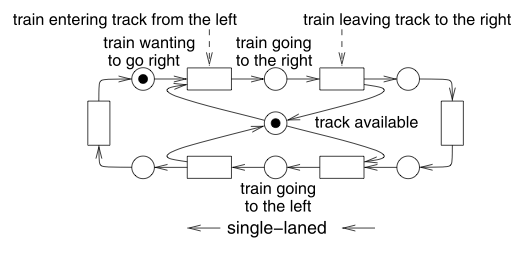
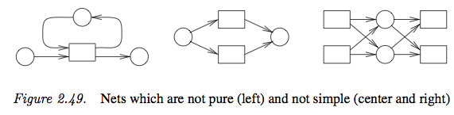
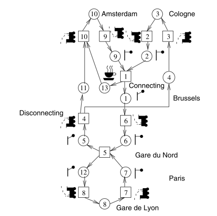
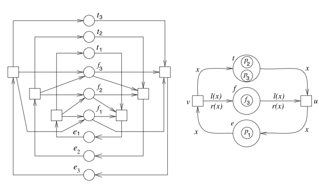
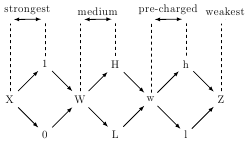
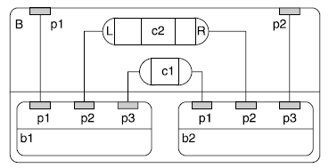
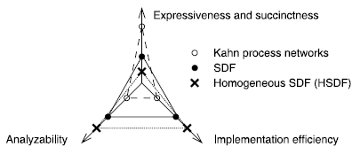
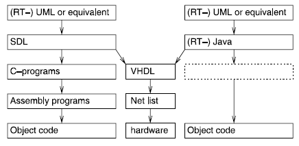

# Functional Safety of Embedded Systems - Part 2 - Modeling II

## Petri Nets
* very comprehensive descriptions of control flow, modeling data requires extensions
* especially suited for distributed systems
* key elements: conditions, events, flow relation
* circles represent conditions
* semi-filled circle: token (condition is true, when condition changes, filling vanishes)
* boxes denote events
* a conditions that have to be true for an event are _preconditions_
* a condition met after an event is _postcondition_
* in nondeterminism, any path can be taken
* can be basis for formal proofs



### Condition/Event Nets
* _loop_: $cFe \wedge eFc$, without any loops, it is _pure_
* _simple_: no two transitions have the same pre- and postconditions

Simple nets with some additional restrictions are called _condition/event nets_. They are bipartite graphs. They have at most one token per condition.



### Place/Transition Nets
Nets allowing more than on token per transition are called _place/transition net_.

* conditions -> places
* events -> transitions
* number of tokens per event is called _marking_
* edge weights affect number of tokens required before transition can take place
* weight of edges for preconditions denotes the number of tokens removed, the weight of edges for postconditions denotes the number of tokens added



### Predicate/Transition Nets
* used to reduce size of other nets
* tokens have an identity (philosophers -> $p$, forks -> $f$)
* example: left condition/event, right predicate/transition
    * $t$ -> thinking, $e$ -> eating
    * $x$ -> philosophers (as a variable)
    * $l(x)$ -> left fork of $x$, $r(x)$ -> right fork of $x$



### Evaluation
* key advantage: model causal dependencies
* no notion of time, hierarchy, no programming language elements, no object orientation (default)
* (geographically) distributed systems (local decisions)
* strong theoretical foundation => formal proofs
* not determinate (different execution can lead to different results)
* descriptivity encompasses other _MoC_s (also finite state machines)
* Petri Nets in UML => activity diagram

## Discrete Event Based Languages
Idea: Simulate the generation of events and process events over time. Events are sorted by the time they should be processed. Remove the event with the current time from the queue and execute it, possible entering new events into the queue. _Hardware Design Languages_ (HDL) are typically discrete event models. Example is VHDL.

### VHDL
* uses _processes_ for modeling concurrency (process => component)
* communication through _signals_ (connection/wires)
* modeling of analogue and mixed-signal systems by differential equations

#### entities and architecture
* hardware component => _design entity_ or _VHDL entity_
    * _entity declaration_
    * _architectures_
* _processes_ are a part of entity (model concurrency)
* connections between local component and entity ports are described in _port maps_

#### VHDL processes and assignments
assignments are special cases of statements

* _variable assignment_: ```variable := expression;``` when control reaches this, the expression is executed and the output assigned to the variable
* _signal assignment_: attempt to model electrical signals: ```signal <= expression;``` when control reaches this assignment, the expression is computed and used to predict the future of the waveform
* ```wait on signal```, ```wait until condition```, ```wait for duration```, ```wait```
* oponent => _Verilog_

#### VHDL simulation cycle
initialization phase => repetive execution of process statements

each repetition is a _simulation cycle_

#### Multi-valued logic and IEEE 1164
Like in electric systems, there can be more than binary logic.

* _level_ of a signal: like voltage
* _strength of a signal: like impendance/resistance
* Using discrete values avoids the solving of Kirchhoff's equation.
* **CSA**-theory (connector, switch, attenuator)

##### 1 signal strength (two logic values)
=> binary logic

##### 2 signal strengths (three and four logic values)
* Signal strength $Z$ is smaller than 0 or 1, but output level is unknown.
* in VHDL each output is connected to a _signal driver_
* computations from multiple drivers are called _resolutions_
* Often additional value $X$ which represents unknown values of signal (0 or 1)
* $sup(c)$ (supremum) is the lowest value, for which $c$ holds $Z \to 0,1 \to X$ ($sup(0,X)=X$), this corresponds to the _connect_ function of CSA-theory

##### 3 signal strengths (seven logic values)
* weak logic one => $H$ (depleting transistors)
* weak logic zero => $L$
* weak logic undefined => $W$
* $sup(c)$ analogous to 2 signal strength

##### 4 signal strengths (ten logic values)
* charging and uncharging of capacitors
* very weak signal values => $l$ and $h$
* very weak unknown value => $w$

##### five signal strengths (46 logic values)
* not very popular (power supply signals)

##### IEEE 1164
* in VHDL there are only binary logic
* standard for exchange of VHDL models: IEEE 1164 (nine values)
    * $X,0,1,L,H,W,Z,U,-$ where the former seven are as defined above.
    * uninitialized => $U$
    * don't care => $-$



### SystemC
System for representing hardware structures in software. The following problems must be solved before modeling with software languages:

* _Concurrency_ (as found in hardware) must be modeled in software
* representation of simulated _time_
* _multiple valued logic_ and _resolution_
* _determinate behavior_ of almost all hardware must be guaranteed

SystemC is a C++ class library designed to solve these problems.
=> SystemC has the potential to replace VHDL

_transaction-level modeling_: high-level approach to modeling digital systems with communication, emphasis is on functionality of data transfer

### Verilog and SystemVerilog
* many features similar to VDHL
* some areas less flexible and more comfortable with built-in features
    * e.g. no support for defining enumerations, but built-in four value logic or 8 strength logic
* Verilog more popular in USA, VHDL more popular in Europe, similar number of users
* interfacing C and C++ is possible, thus interaction with SystemC is possible

### SpecC
* separation between computation and communication
* enables plug & play (for system components)
* models systems as hierarchical network of behavior and communication through channels
* _interfaces_ link behavior and channels together
* syntax is based on c/c++, model is translated to c++ for simulation



## Von-Neumann languages
* sequential execution
* almost unrestricted access to global variables
* not really fit, but still widespread
* distinction between KPN (Kahn Process Networks) not easy: KPN is more modeling centered, how computation in nodes works is irrelevant

### CSP - communicating sequential processes

* contains mechanism for interprocess communication based on channels
    * c!a => c?a
    * rendezvous, blocking, synchronous
* is determinate (commitment to wait for communication)
* foundation for OCCAM-language

### ADA
* PASCAL-based, US Department of Defence
* ADA'95 => object oriented extension
* nested declarations of processes
* rendezvous communication
* not determinate (process can select between options)

### Java
* computation is sequential, communication through libraries
* platform-independent
* meets safety-requirement for embedded systems (no pointer-arithmetic)
* exception handling
* no memory leakage (garbage collector)
* concurrency (start multiple threads)
* object orientation
* powerful libraries
* problems for use of Java in embedded systems:
    * size of run-time libraries has to be added to application
    * no direct control over I/O-devices
    * garbage collection requires computing time, no control over when it starts => hard to predict worst-case runtime

    * not able to predict in which order threads are run => harder to predict worst-case runtime
    * typically less efficient than c-programs
* some problems could be addressed by hardware-garbage collection, better runtime-scheduler, tagging of memory segments

#### CardJava
Java for use with SmartCard applications.

#### J2ME (micro edition)
Java environment for all types of embedded systems.

* CDLC => library for mobile phones
* CDC  => library for TV + powerfull phones

### Pearl
* designed for industrial control applications
* small number of language elements for controlling processes or time, requires underlying real-time operating system
* communication based on shared memory (semaphore)

### Chill
* designed for telephone exchange system
* extended PASCAL

### Communication Libraries
* Von-Neumann languages normally don't have built-in communication => libraries
    * in local system or over great distances (ip)

## Levels of hardware modeling
Design can start at different levels, common are bottom-up (circuits first) and top-down (overall design first).

* _system level models:_ not clearly defined
    * describes the entire embedded system and probably the environment
    * mechanical and information processing parts
    * VHDL-AMS, SystemC, MATLAB
* _algorithmic level:_ simulate algorithms you want to use
    * _bit-true:_ when one bit in the simulation is one bit in the final product
    * may not be precise, e.g. no double floating points in final system, but in simulation
* _instruction set level:_ algorithms have been compiled for the instruction set of the processor to be used. Several variations are possible:
    * coarse-grained model: only effect of instructions is simulated, no timing
    * _transaction level modeling:_ reads, writes, communication are modeled
    * _cycle-true instruction set simulating:_ calculates the exact number of clock cycles, requires detailed knowledge about processor hardware
* _register-transfer level (RTL):_ model at register level, algorithmic/logic units (ALU), register, memory, muxes, decoders
    * always cycle-true
* _Gate-level models:_ gates are the basic component
    * provide accurate information about signal transition properties
    * delay calculations more precise than in RTL
    * no info about wire-length, so no info on power consumption and delay
* _switch-level models:_ use switches (transistors)
    * can reflect bidirectional transfer of information
* _circuit-level models:_ circuit theory, current, voltages, resistors, capacitors, inductances, semi-conductors
    * partial differential equations
    * simulator most used => SPICE
* _layout models:_ actual circuit layout
    * geometric information
    * cannot be directly simulated
* _process and device models:_ model fabrication process

## Comparision for Models of Computations

### Criteria
Stuijk:

* **Expressiveness** and **succinctness**: which system can be modeled and how compact are they
* **Analyzability**: scheduling algorithms? run-time support?
* **implementation efficiency**: scheduling policy and code size



Compare MoC to type of supported processes:

* **number of processes**: can be _static_ or _dynamic_ (hot plugging)
* statically **nested** or at the same level => encapsulation of concern
* technique for **process creation**

requirement - language matrix

+-------------+------------+------------+-------------+------------+----------+
|             | Behavioral | Structural | Programming | Exceptions | Dynamic  |
|             | Hierarchy  | Hierarchy  | Language    | supported  | Process  |
| Language    |            |            | Elements    |            | Creation |
+=============+============+============+=============+============+==========+
| StateCharts |   +        |   -        |   -         |   +        |   -      |
+-------------+------------+------------+-------------+------------+----------+
| VHDL        |   +        |   +        |   +         |   -        |   -      |
+-------------+------------+------------+-------------+------------+----------+
| SpecCharts  |   +        |   -        |   +         |   +        |   -      |
+-------------+------------+------------+-------------+------------+----------+
| SDL         |   o        |   o        |   o         |   -        |   +      |
+-------------+------------+------------+-------------+------------+----------+
| Petri nets  |   -        |   -        |   -         |   -        |   +      |
+-------------+------------+------------+-------------+------------+----------+
| Java        |   +        |   -        |   +         |   +        |   +      |
+-------------+------------+------------+-------------+------------+----------+
| SpecC       |   +        |   +        |   +         |   +        |   +      |
+-------------+------------+------------+-------------+------------+----------+
| SystemC     |   +        |   +        |   +         |   +        |   +      |
+-------------+------------+------------+-------------+------------+----------+
| ADA         |   +        |   -        |   +         |   +        |   +      |
+-------------+------------+------------+-------------+------------+----------+

SpecC and SystemC meet all req in this list, but don't have other reqs, like deadlines etc.

In the beginning, _Assembler_ was used, then _C_ and _C-dialects_, now object oriented languages + SDL + UML. example (Java does not need intermediary steps, like _C_, but does not benefit from good compilers:



### UML
+-------------------------+----------------+----------------------------+
| Communication/          | Shared Memory  | Message passing            |
| Component               |                +-------------+--------------+
|                         |                | synchronous | asynchronous |
+=========================+================+=============+==============+
| Undefined Component     |                | Use cases, Sequence charts,|
|                         |                | timing diagrams            |
+-------------------------+----------------+-------------+--------------+
| Finite State Machines   | State diagrams | -           |  -           |
+-------------------------+----------------+-------------+--------------+
| Data Flow               | (not useful)   | Data Flow Diagrams         |
+-------------------------+----------------+----------------------------+
| Petri Nets              | (not useful)   | Activity Charts            |
+-------------------------+----------------+-------------+--------------+
| Distributed Event model | -              | -           | -            |
+-------------------------+----------------+-------------+--------------+
| Von-Neumann model       | -              | -           | -            |
+-------------------------+----------------+-------------+--------------+

Additionally the following charts exist:

* **Deployment Diagrams:** execution architecture (hardware - software mapping)
* **Package Diagrams:** partitioning of software
* **Class Diagrams:** inheritance relations
* **Communication Diagrams:** classes, relations between classes, exchanged messages
* **Component Diagrams:** components in system
* **Object Diagrams**, **Interaction Overview Diagrams**, **Composite Structure Diagrams:** seldom used

UML 1.4 was not designed for embedded systems:

* partitioning of software into tasks and processes missing
* no describing of timing behavior
* presence of essential hardware components missing

=> UML 2.0 is better suited for modeling embedded systems, also extensions )"profiles") exist

### Ptolemy II
Modeling, simulation, design of heterogeneous systems. Emphasis is on embedded systems mixing different technologies (and MoCs).

## SysML Overview
* general-purpose graphical modeling language
* additional to UML:
    * _Requirement Diagram_
    * _Parametric Diagram_