# Functional Safety of Embedded Systems - Part 3 - Embedded Systems Hardware

## Introduction
* software and hardware important
* reuse of available hard-/software components => platform-based design methodology
* much less standardized  than PC-hardware
* hardware-loop (especially fit for control systems, other systems need to evolve)
* 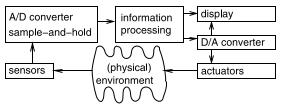
* discrete (input/ sensor) values can be created by special circuits:
    * _sample-and-hold_
    * _analog-to-digital_ (A/D)
* actuators generally analog => need for conversion

## Input
* Sensors for any quantity (weight, velocity, acceleration, electrical current, voltage, temperature, ...), physical phenomena can be used to advantage
    * _Acceleration Sensors_: small mass, that is displaced from default position, changing the resistance of tiny wires
    * _Rain Sensors_: control speed of wipers automatically
    * _Image Sensors_ (small arrays of light sensors)
        * _CCD_ (charged-coupled device): optimized for optical applications
            * charges are passed from one pixel to the next and read at array boundary (sequential charge) => interface rather complex
        * _CMOS_: use standard CMOS technology for integrated circuits => sensors and logic can be on the same chip => cheap
        * Selecting optimal type not easy, CMOS quality improving, but still less power efficient.
        * Smart sensors => CMOS (integrated logic) => compact cameras
    * _Biometric Sensors_: => to protect mobile/ removable equipment (smart cards, biometric/ biomedical authentication) => authenticate a person _or_ check, if the person is who it claims to be
        * iris scan, fingerprint, face recognition
        * exact matches are not possible, also real person might be denied
    * _Artificial Eyes_: affect the eye/ provide vision indirectly
    * _RFID_ (Radio Frequency Identification): response of a _tag_ to radio frequency signals
        * _tag_: consists of integrated circuit + antenna
        * _RFID readers_: maximum distance to tag depends on type of tag
    * Other sensors: pressure, proximity, engine control, Hall effect, ...

Sensors generate **signals**

### Discretization of time: Sample-and-hold circuits
* Computers work in discrete time domain $D_T$
* Computers can process _streams_ of values (discrete sequences)
* 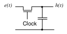
    * Every time the clock closes the swith, the capacitor is charged to the incoming voltage
* Only the times, at which a sample is taken, can be used later.
    * Capacitor needs some time to charge up => voltage at time $x$ will correspond to time windows $x$
    * => need to be able to reconstruct original signal ($p$ is period [Oppenheim et al, 2009]:

    $e'_k(t) = \sum^K_{k=1,3,5,\dots} \left( \frac{4}{\pi k} \sin\left( \frac{2 \pi k t}{p} \right)\right)$

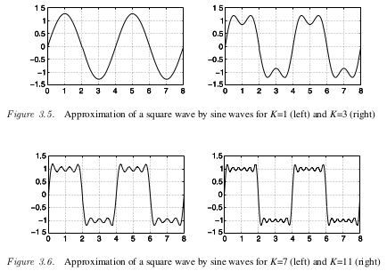

* transformation $T_r$ is _linear_, if for two signals $e_1(t), e_2(t)$: $T_r(e_1+e_2) = T_r(e_1) + T_r(e_2)$
    * functions may have the same approximation, if measured at the wrong times (aliasing):
    * %\begin{align*}
    e_3(t) &= \sin\left( \frac{2 \pi t}{8}\right)+0.5\sin\left( frac{2\pi t}{4} \right) \\
    e_4(t)&=\sin\left( \frac{2 \pi t}{8}\right)+0.5\sin\left( frac{2\pi t}{4} \right)+0.5\sin\left( \frac{2\pi t}{1} \right)
    \end{align*}%

* 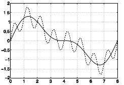
    * => reconstruction of original unsampled signal is not possible, unless additional knowledge is given
    * aliasing is avoided, if incoming frequencies is less than half of the sampling frequency (=> **Nyquist sampling criterion**)
    * anti-aliasing filter: low-pass-filter

### Discretization of values: A/D-converter
* map from continuous value domain to discrete value domain => A/D-converters
* large range of A/D converters, presented are two extreme cases:
    * _Flash A/D converter_: large number of comparators
        * _comparator:_ two inputs (+, -), if the voltage at + exceeds that at - the ouput is a logical 1, else it's a 0
        * 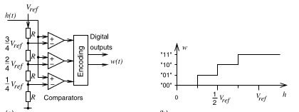
        * converting negative numbers (two's complement) requires extensions
        * _resolution_: characterization for A/D-converters:
            * bits produced by a converter
            * resolution in volts per step $Q=\frac{V_{FSR}}{n}, \; V_{FSR}: \textrm{difference between largest and smallest voltage},\; n:\textrm{number of voltage intervals} $
        * advantage of flash-converter: speed (good for video)
        * disadvantage: complex hardware ($n-1$ comparators needed)
    * _Successive Approximation_: Distinguish between a large number of digital values
        * 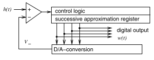
        * uses binary search, most significant bit is set to 1 until signal is exceeded, current bit is set to 0, set next to 1, ...
        * 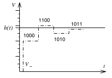
        * measured value needs to be constant during operation => Sample-and-Hold-circuit
        * advantage: hardware efficiency
        * disadvantage: slow log(n) steps
    * quantization noise: $noise(t) = w(t)-h(t)$, $h(t)$: original, $w(t)$ (square): digitalization
        * 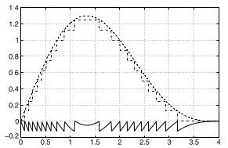
        * signal to noise ratio %\begin{align*}
        SNR &= 10\cdot\log\frac{\textrm{power of "`useful"' signal}}{\textrm{power of the noise}} \\
        &= 20\cdot\log\frac{\textrm{voltage of "`useful"' signal}}{\textrm{voltage of the noise}}
        \end{align*}%
        * measured in dB (decibel), logarithmic, dimensionless
    * several type of other A/D-converters, differ by speed and precision
    * Techniques for automatically selecting the most appropriate converter exist.

## Processing Units
### Overview
* embedded systems use electrical energy => _consumed energy_
* power and energy efficiency mucho importante (=> also generally => green computing)
* _ASIC_ (application-specific integrated circuits): hardwired multiplexed design, reconfigurable logic, programmable processors
* energy efficiency => cannot be flexible, flexibility => cannot be energy efficient
* power and energy: $E=\int_0^t P(t)dt$
    * systems with more power consumption may be more energy efficient, if they are also faster
    * more power consumptions means more heating => need for cooling

### Application Specific Integrated Circuit (ASIC)
* Cost of designing and manufacturing ASICs is quite high => may only be feasible for large quantities
* Design of ASICs is time consuming. Correcting faulty design is hard and therefore expensive
* => ASICs only, if maximum energy efficiency is needed & large number of systems can be sold (or the price is not as important)

### Processors
* Processors are programmable => very flexible. Behavior of whole system can be changed with change of software.
* Embedded processors don't need instruction set compatibility like PCs do.

#### Energy Efficiency
* optimize architectures for energy-efficiency => need to take care, that efficiency of software (generation) is not compromised
* _gate clocking_: parts of processors are disconnected from clock during idle periods
* maybe rid parts of the processor from the clock altogether
    * _globally synchronous, locally asynchronous processors_
    * _globally asynchronous, locally synchronous processors_ (GALS)
* _Dynamic Power Management_ (DPM): processors have power saving states in addition to operating states (e.g. _run_, _idle_, _sleep_, sleep is powered down, long time returning to run)
* _Dynamic Voltage Scaling_ (DVS):
    * Power consumption of CMOS changes quadratically with supplied voltage. (maximum clock frequency is function of supply voltage)
    * Run-time of algorithms is linearly dependent on supply voltage.

#### Code-Size Efficiency
* Memory very limited => take as little space as possible. (Even more important for _System on a Chip_ (SoC), memory => embedded memory, more expensive than regular memory)
* RISC ("normal processors") => designed for speed
* CISC ("older processors", early complex instruction set processors) => designed for code-efficiency (slow memory, no/little cache)
* _Compression Techniques_ => reduce amount of silicon + reduce energy needed to fetch information => faster transmission
    * hardware decoder (hopefully small, fast and efficient)
    * save ROM and RAM
    * no run-time penalty
    * decoding of limited context should be possible (don't decode everything to find something)
    * branching into arbitrary addresses must be possible
* _second instruction set_: (e.g. ARM) smaller instruction set called _THUMB_ (may increase software development cost, as compiler need to know second instruction set)
* _dictionaries_: each instruction is only stored once, lookup-table for reference of instructions (_nanoprogramming_, _procedure ex-lining_)

#### Run-Time Efficiency
* Architectures can be customized for certain application domains. => more efficient processors without need for higher clock frequencies.
* _digital signal processing_ (DSP): Add filter operations as hardware blocks. Single instruction triggers the chip to compute something more complex. => sinlge instruction realizations of loop bodies

#### Digital Signal Processing
* _Specialized Addressing Modes_: ring buffers, modulo addressing
* _Separate Address Generation Units_ (AGU): directly connected to address input of memory
* _Saturation Arithmetic_: changes the way over- and underflow are managed: try to return a result, which is as close as possible to actual result
    * _overflow_: largest possible result
    * _underflow_: slowest possible result
* _Fixed-Point Arithmetic_:
    * 80% of DSP processors don't include Floating Point hardware
* _Real-Time Capability_: Some features in PCs improve average execution time, but at the same time worsen the worst-case execution time. E.g. embedded processors often don't have caches, virtual addressing, demand paging
* _Multiple Memory Banks or Memories_: DSP processors often have two memory banks.
* _Heterogeneous Register Files_: see filter application
* _Multiply/ Accumulate Instructions_: instructions, that can perform multiplication followed by addition.

#### Multimedia Processors/ Instruction Sets
* Registers/Arithmetic Units often 64 bits => two doubles, four words, 8 bytes can be stored
* _SIMD_ (single instruction, multiple data): suppress carry bits at boundaries, write into next object => more efficient overflow handling
    * Has been added to several processors (streaming SIMD extension SSE, short vector instructions)

#### Very Long Instruction Word (VLIW) processors
* Computational demands increase (especially multimedia, advanced coding techniques, cryptography)
    * No instruction set compatibility needed => instructions explicitly identify parallelism => _explicitly parallel instruction computing_ (EPIC)
        * detection of parallelism moved to compiler
        * _very long instruction set words_ (VLIW):
            * several operations in instruction word/_instruction packet_ => execution in parallel
            * each instruction encoded in separate field => each field controls one hardware component
            * fields may be unused, if not enough parallelism
            * => flexible packet size => note really VLIW, but still EPIC
    * many parallel register accesses due to many parallel processes => partitioned register files => functional unit is only connected to subset of register files
    * potential problem: _delay penalty_ (due to branch instructions: additional instructions have already entered the pipeline, before branch instructions enter it)
    * 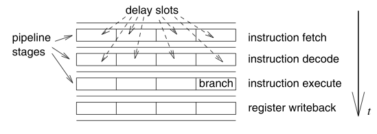
        1. fill _delay slots_ with useful stuff, that needs to be executed before branch, some must be filled with _no-operation instructions_ (NOP), _branch delay penalty_ denotes the loss of performance from NOPs
        2. pipeline is stalled until branch has finished
* _predication_ is used to predict, if small if-statements are true and thus executed or NOPs

#### Micro-Controllers
* not complex, example: Intel 8051 (quite typical)
* 8 bit cpu, optimized for control applications
* large set of operations on boolean data types
* program address space of 64kb
* separate data space of 64kb
* 4 kb of program memory (on chip), 128 b of data memory (on chip)
* 31 I/O lines, each addressable individually
* 2 counters (on chip)
* universal asynchronous receiver/ transmitter for serial lines available (on chip)
* clock generation (on chip)
* many variations

#### Multiprocessor System-On-a-Chip (MPSoC)
* increase in clock speed => more energy consumption
* PC => homogeneous _multi-core_ systems (all processors of same type)
* embedded systems => highly specialized processors => energy efficiency close to ASIC

## Reconfigurable Logic
* ASICs often too expensive, software too slow/ energy consuming => _Reconfigurable Logic_: almost as fast as special purpose hardware, reconfigurable by configuration data
* _fast prototyping_: prototype behaves like final system, but can be changed, essential functions need to be available
* _low volume applications_: ASICs too expensive, use reconfigurable logic
* _real-time systems_: timing of FPGA is precisely predictable
* reconfigurable hardware:
    * often includes RAM (volatile), configuration needs to be copied at startup
    * configuration data may be stored on ROM (non-volatile)
* _FPGA_ (field programmable gate array): most common reconfigurable logic
    * contain configurable logic blocks
    * 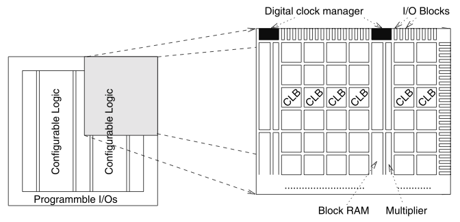 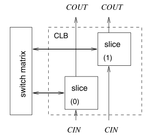 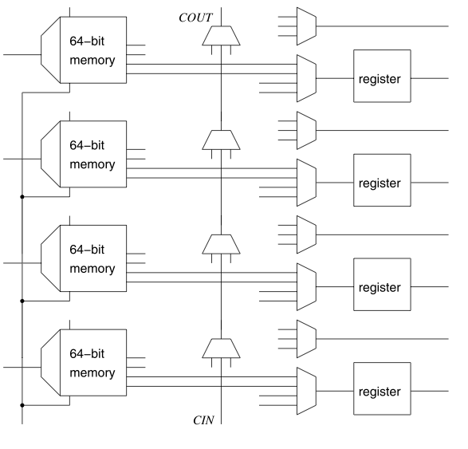
    * each slice contains 4 memories, each memory can implement single 6-input or two 5-input logic functions
    * configuration data determines setting of multiplexers, clocking of registers and RAM, content of RAM components, connections between CLBs
* processors may be part of FPGA
    * _hard core_: physical processor in a special area (efficient)
    * _soft core_: synthesize processor from CLBs (flexible)

## Memories
* efficient storage
    * run-time => memory hierarchies (large memory is slower)
    * code-size => compiler, compression
    * energy => memory hierarchies (large memory needs more energy)
* _Moore's Law_: Speed of processors doubles every 18 - 36 months, memory only gets faster by about 1.07
* => use small and fast memory as buffers between main memory and processor
    * _Cache_ was introduced to improve run-time efficiency => also works for energy efficiency.
    * predictability may be low
* _Scratch Pad Memories_ (SPM): small, fast memory, stores small things for rapid retrieval

## Communication
* _Channel_: abstract entity characterized by essential properties of communication
    * maximum information transfer capacity
    * noise parameters
    * probability of errors
* _Communication Media_: physical entities (wireless (radio frequency, infrared), optical (fiber), wires)

### Common Communication Requirements
* _Real-Time Behavior_: (standard Ethernet is too slow)
* _Efficiency_: point-to-point often unfeasible (weight, ...)
* _Appropriate Bandwidth and Communication Delay_: enough bandwidth, not to large
* _Support for Event-Driven Communication_: Polling => very predictable real time behavior but delay may be large => emergencies need to immediately be communicated
* _Robustness_: extreme conditions (temperatures, radiation) may affect system (voltage, ...) => communication must be maintained
* _Fault Tolerance_: Design in a way, that faults don't crash the system => retries may invalidate real-time requirements
* _Maintainability, Diagnosability_: obvious
* _Privacy_: may require encryption

### Electrical Robustness
* _Single-Ended Signaling_: signals travel a single wire
    * represented by voltage over common ground
    * susceptible to noise => message corruption
    * common ground not easy to achieve
    * 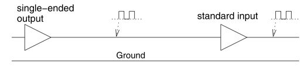
* _Differential Signaling_: signal needs two wires
    * represented:
        * first -> second = positive voltage => 1
        * otherwise => 0
    * Noise added to both wires => no effect
    * magnitude of voltage irrelevant => reflection, resistance, ... have no effect
    * signals don't generate currents => quality of ground wires less important
    * no common ground wire required
    * => larger throughput than single-ended signaling
    * requires two wires for every signal
    * 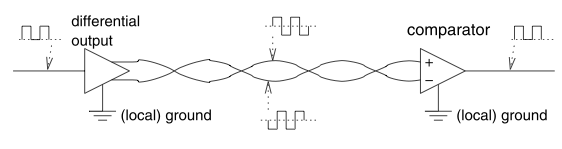

### Guaranteeing Real-Time Behavior
* point-to-point => good real-time behavior
* _common, shared buses_ more common, as they don't need a wire for every system
* _priority based arbitration_ => poor timing predictability (conflicts difficult to predict at design time), can lead to starvation
* _TDMA_ (time division multiple access): each party gets a time slot
    * reduces maximum amount of data
    * guaranteed bandwidth for all partners => no starvation
* _Ethernet_: collisions may occur => all partners must stop sending, wait and retry (_carrier-sense multiple access/ collision detect_ (CSMA/CD)) => conflicts can impose great time penalty, but not likely
* solution: _carrier-sense multiple access/ collision avoidance_ (CSMA/CA)
    * priorities assigned to partners
    * communication media is assigned to partners during _arbitration phase_
    * during arbitration, partners wanting to communicate say so, higher priority wins
    * highest priority partner has guaranteed real-time behavior, others don't (starvation possible)

### Examples
* _Sensor/ Actuator Bus_: communication between simples devices
* _Field Bus_: similar to sensor/ actuator bus, support larger data rates:
    * _Controller Area Network_ (CAN): automotive industry, very cheap (huge quantities) => also in smart phones/ home fabrication
        * differential signaling with twisted pairs
        * arbitration with CSMA/CA
        * 10kbit/s - 1Mbit/s
        * low/ high priority signals
        * max latency of 134 &#956;s (high priority)
    * _Time-Triggered-Protocol_ (TTP): fault-tolerant safety systems like airbags
    * _FlexRay(TM)_: TDMA
        * static + dynamic arbitration => real-time and no starvation
        * _Bus Guardians_ protect against flooding parties (_babbling idiots_)
    * _LIN_ (Local Interconnect Network): low cost, standard for connecting sensors and actuators in automotive
    * _MAP_: bus designed for car factories
    * _EIB_ (European Installation BUS): bus designed for smart homes
* _Wired Multimedia Communication_: large data rates
    * _MOST_ (Media Oriented System Transport): standard for multimedia in automotive
    * _IEEE 1394_ ("FireWire")
* _Wireless Communication_
    * _HSPA_ (High Speed Packet Access): 7 Mbit/s
    * _LTE_ (long term evolution): even higher rates
    * _Bluetooth_ high rate of security
    * _IEEE 802.11_ => Ethernet
    * _DECT_: standard for wireless phones in Europe

## Output
* _Displays_: very wide field, many technologies (LCD, organic displays, ...)
* _Electro-Mechanical Devices_: motors, gauges, ...

Conversion Pipeline:
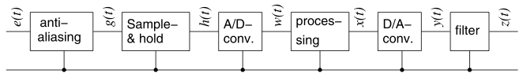

### D/A Converter
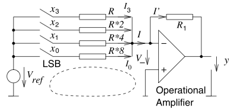

* idea:
    * generate a current proportional to value of digital signal $x$
    * convert current into voltage $y$
* convert time- and value discrete signals to continuous time and value domain

### Sampling Theorem
* A/D -> D/A => signal is not reproducible (aliasing)
* When sampling rate is larger than twice the highest frequency => Interpolation is possible:
    * $z(t)=\sum^\infty_{s=-\infty} \frac{y(t_s) sin\frac{pi}{p_s}(t-t_s)}{\frac{\pi}{p_s}(t-t_s)}=\sum^\infty_{s=-\infty} y(t_s) sinc(t-t_s)$ (Shannon-Whittaker interpolation)
    * 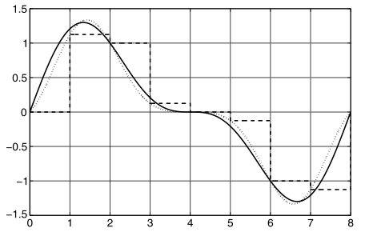
    * not possible in digital domain => time-continuous signal needed
    * Fourier-Transformation: folding operation in time is multiplication with frequency dependent filter in frequency => Low-pass filter does the job!
        * no ideal low-pass filter => approximations

### Actuators
* wide range => move large masses or move tiny distance?
    * _Microsystem Technology_: move in the &#956;m area

## Secure Hardware
* Might demand special hardware, cryptography, ...
* Might need to resists attacks (like fault injection, radiation)