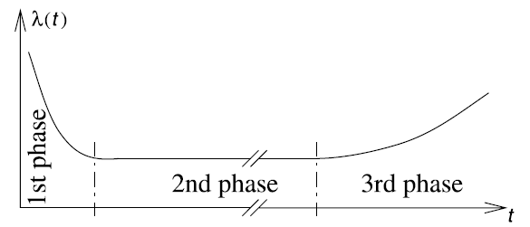
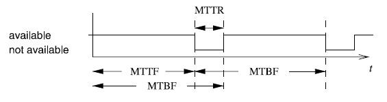

# Functional Safety of Embedded Systems - Part 4 - Embedded Systems Software / Evaluation and Validation
* reuse of _intellectual property_ (IP) => saves cost & effort
    * embedded operating systems
    * middleware (intermediate layer between the OS and application software)
        * extend communication
        * real time database
        * API (of standard components)

## Embedded Operating Systems
### General Requirements
* very simple systems => does not need OS
* OS => task switching/ dispatching, I/O, scheduling
    * Special processors for this may exist.
* systems with virtual memory => distinguish between address spaces, processes, threads,
* **Each process has its own address space, whereas several threads may share an address space.**
* RT-OS must have:
    * communication & synchronization between processes & threads
    * must be small
    * flexibly tailored towards application
    * configurability (object orientation, aspect-oriented programming, conditional compiling, advanced compile-time evaluation, linker-based removal of unused functions)
* peripheral devices
    * no hard-disk, no keyboard, no screen, no mouse
    * devices => maybe direct handling by application => OS does not take care about this => drivers in "user space"
    * connect interrupts to any process => use OS service calls
    * => real-time operating systems

### Real-Time Operating Systems
_"A real-time operating system is an operating system that supports the construction of real-time systems."_

* key requirements:
    * _timing_ must be _predictable_
        * upper bound must be guaranteed
        * scheduling must be deterministic
        * interrupts must be possible to disable
        * prevent unpredictable disk head movement (if HDD is used)
    * manage _task scheduling_
        * OS must be aware of deadlines
    * _manage time_ (if internal processing is linked to absolute time in physical environment)
        * _global clock synchronization_
            * _Universal Time Coordinated_ (UTC): defined by astronomical standards
            * international atomic time (temps atomic internationale TAI)
        * networked embedded systems: synchronize via network
        * sometimes only provision for precise local delay
    * _must be fast_
* includes OS kernel: manages resources found in every real time operating system
* available RTOS:
    * _fast proprietary kernels_: not for complex systems, tend to be not predictable
    * _real-time extensions to standard OS_: => hybrid systems
        * mainstream operating systems
            * _RT-kernel_ for RT-tasks, rest of OS is one of those tasks
            * comforts:
                * standard OS API, GUI, filesystem, enhancement to OS
                * problems in standard-OS don't affect RT-part
            * problems:
                * device drivers (OS brings it's own)
                * RT-tasks generally cannot use the OS
            * _research systems_ that try to overcome those limitations: Melody, Gupta, MARS, Spring, MARUTI, Arts, Hartos, DARK

### Virtual Machines
* emulate several processors on single processor => virtual machines
* => timing predictability may be lost
* PikeOS

### Resource Access Protocols
#### Priority Inversion
* cases, where a process needs exclusive access to some resources (shared variables, ...) => _critical sections_, mutex primitives
* request operation P(S), release operation V(S), => _semaphore_
* => mutually exclusive access to resources may change the priority of tasks (**priority inversion**) => preemption needed

#### Priority Inheritance
* deal with priority inversion => **priority inheritance**
* available in many RT-OS
    * tasks are scheduled according to priorities, same priority => first come, first serve
    * when task T1 has high priority and requests access to a critical section occupied by T2 with lower priority, T2 inherits T1s priority
    * when T2 frees the critical section, its priority is reduced back to its normal priority, the task with the highest priority waiting for the critical section get granted
    * priority inheritance is transitive
* This ensures, that the high priority process gets access to the critical section according to its own priority
* priority inheritance can still lead to deadlocks
* alternative approach: **priority ceiling protocol**

## ERIKA
* entire application has to be hosted on small micro-controllers
* OS services => reduce to minimum (multi-threading, periodic and aperiodic tasks, shared resources)
* OSEK-group defined minimal set of services: OSEK/VDX
* quasi reference implementation for RT-micro-controller-OS, ERIKA (open source)
    * all kernel objects statically defined at compile-time (no dynamic memory allocation, no dynamic creation of tasks)
    * configuration language _OIL_
    * provides stack sharing
* _Conformance Classes_: specify subset of OS-API
    * _BCC1_: smallest, minimum of 8 tasks with different priority, 1 shared resource
    * _BCC2_: BCC1 + more than one task with same priority
    * _ECC1_: BCC1 + extended tasks, that can wait for event to disappear
    * _ECC2_: multiple activations + extended tasks
    * _EDF_: _earliest deadline first_ scheduler
    * _FRSH_: extends EDF with resource reservation scheduler (based on IRIS algorithm)
* API for controlling interrupts, _Interrupt Service Routine_ (ISR):
    * category 1: simple and fast, does not implement call to scheduler
    * category 2: call some primitives that change scheduling behavior, end of this ISR is _rescheduling point_
* _ORTI_ file/ language => describe where various objects are allocated, generated by OIL compiler

## Hardware Abstraction Layer (HAL)
* access hardware through API
* neither OS, nor middleware

## Middleware
* provide services to software, that OS does not provide
* e.g. communication over long distances and local communication
* for soft rt-systems OK, for hard rt-systems probably too much overhead

### OSEK/VDX COM
* communication standard for OSEK (automotive operating system)
* provides _interaction layer_ as API
* communicates via _network layer_ and _data link layer_

### CORBA (COmmon Request Broker Architecture)
* adopted for embedded systems, communication
* object request broker (ORB)
* remote objects => standard interface, send information and parameters about the object to be accessed
* _RT-CORBA_ has predictability
    * _end-to-end predictability_ of timeliness in a fixed priority system
    * addresses priority inversion (bound time, in which this can happen)
    * thread priority management

### MPI (message passing interface)
* alternative to CORBA, communication between different processors
* synchronous and asynchronous message passing library, designed for high performance computing
* partitioning of computations/ data among processors explicitly
* synchronization is implied, explicit synchronization is also possible
* much work for programmer due to much explicit stuff
* does not scale well for number of processors
* MPI/RT => real time version, layer between OS and normal MPI
* targets homogeneous processor designs, assumption, that memory access is faster than communication

### POSIX Threads (Pthreads)
* API for threads at OS level
* shared memory communication
* multi-core processors, mutual exclusion, completely synchronized

### OpenMP
* parallelism is explicit (via "pragma"), computation partitioning, communication, synchronization are implicit
* shared memory hardware

### UPnP (Universal Plug 'n' Play)
* extension of plug 'n' play for network connected devices
* only data is transfered
* may target: printers, storage, switches

### DPWS (Device Profiles for Web Services)
* more general than UPnP
* "minimal set of implementation constraints to enable secure web service messaging, discovery, description and eventing on resource constrained devices"

### JXTA (JuXTApose)
* loose coupling over Internet-based communication
* open-source peer-to-peer protocol specification
* set of XML messages
* creates virtual overlay network

## Real-Time Databases
* databases may have time-constraints
    * e.g. soft: flight reservation system
    * e.g. hard: target recognition in military systems
* main memory databases, use of flash memory (predictability)
* reduce ACID requirement (atomicity, consistency, isolation, durability)

## Evaluation and Validation
* **validation**: The process of checking whether or not a certain design is appropriate for its purpose, meets all constraints and will perform as expected. => _(formal) verification_
    * validation and design should be intertwined
* **evaluation**: process of computing quantitative information of some key characteristic of a certain (partial) design.

### Multi-Objective Optimization
* Design Evaluation => characterization by several criteria (worst case/ average execution time, energy consumption, code size, dependability, safety)
* Give the designer back a set of "reasonable designs" among which he has to choose.
* try to optimize several solutions with respect to multiple objectives
* => pareto-front/ pareto-equilibrium => will not be optimal for all objectives, but as good as possible for all
* _Design Space Exploration_ on pareto points (DSE) => try to find pareto optimal solution

### Relevant Objectives
1. _Average Performance_: simulation
2. _Worst-Case Performance/ Real-Time Behavior_: timing analysis
3. _Energy_ Power Consumption_
4. _Temperature/ Thermal Behavior_
4. _Reliability_
5. _Electromagnetic Compatibility_
6. _Numeric Precision_
7. _Testability_: cost for testing can be quite large
8. _Cost_: silicon, ...
9. _Weight_, _Robustness_, _usability_, _extendability_, _security_, _safety_, _environmental friendliness_, ...

## Performance Evaluation
* predict performance of system

### Early Phase
* **Estimated Cost and Performance Values**: generating sufficiently precise estimates requires considerable effort.
* **Accurate Cost and Performance Values**: test real software on (near to) real hardware => more precise, but more expensive and more time consuming

### WCET Estimation (Worst Case Execution Time)
* WCET: largest amount of time for any input and any initial state
* => often not possible to compute (halting problem)
* => compute good _upper bounds_ for WCET => _estimated worst case execution time_
    1. $WCET_{est}\leq WCET$ (bounds should be safe)
    2. $WCET_{ext}-WCET << WCET$ (bounds should be safe)
* architectural features to reduce average execution time often omitted.
* $BCET$ & $BCET_{safe}$ are analogously defined
* => bounds must be computed from real machine code
    1. executable object file
    2. control-flow graph
    3. loop transformations, recursive functions, virtual loop unrolling
    4. => CRL (control flow representation language)
    5. static analysis (reading designers annotations)
    6. value analysis (possible values for registers and local variables, predict access to memory)
    7. cache & pipeline analysis (LRU - last recent usage, what is in cache
    8. => derive WCET (store in ILP model, take runtime of block, multiply by frequency of block) => _implicit path enumeration_

### Real-Time Calculus (RTC)
* works with rate of incoming events

## Energy and Power Models
* closely related (Energy is quadratic function of Power)
* Tiwari:
    * measurements of real systems
    * values are associated with executed instructions
    * => base cost, inter-instruction cost
* Simunic:
    * based on data sheets
    * computes contribution of all components of embedded system
    * information from data sheet may be averaged/ less precise
* Russel & Jacome:
    * precise measurement of two fixed configurations
* Lee:
    * detailed analysis of effects of pipeline
    * no multicycle operations/ pipeline calls
* Steinke:
    * precise measurement using real hardware
    * consumption of processor and memory
    * included in _energy-aware compiler_ from TU Dortmund
* WATTCH power estimation tool
    * estimates power consumption of microprocessor systems at architectural level, without information about circuits or layouts

## Thermal Models
* more energy consumption => components get hot
* => failures
* => shortage of system life
* thermal models => laws of physics => thermal conductance/ thermal resistance
* equivalent models to electrical models (masses storing heat are capacitors)
* _Tools_: HotSpot

## Risk and Dependability Analysis
* Embedded systems can cause danger to properties and lives. => Reduce probability of failure.
* Definitions
    * **Service** is delivered by a system as perceived by its users. **Correct Service** is delivered, when the service implements the system function.
    * **Service Failure**, **System failure** or just **Failure** occurs, when the service of a system deviates from the correct service.
    * **Error** exist, if there are system states, that lead to a service failure.
    * A **Fault** is the reason for an error.
    * **Reliability** $R(t)$ is the probability of the time until the first failure occurs (after time $t$)
    * **Failure Rate** $\lambda(t)$ is the probability of a system failure between time $t$ and $t+\delta t$
    * **Mean Time To Failure** (MTTF) is the average time until the next failure, provided the system was initally working.
    * **Mean Time Between Failures** (MTBF) is the average time between to failures.
    * **Mean Time To Repair** (MTTR) is the average time until the system is repaired, provided it is initially broken.
    * **Availability** is the probability, that a system is in an operational state.
* Faults can exist, without leading to a service failure
* failure rates typically not constant (bath-tub)

* $MTBF=MTTF+MTTR$

* _Fault Tree Analysis_ (FTA): top-down method of analyzing risk. Starts with possible damage and possible scenarios. Connect them using AND and OR gates.
* _Failure Mode and Effect Analysis_ (FMEA): Starts with components and tries to estimate reliability. => compute reliability of system.

## Simulation
* common technique for evaluation and validation
* execute model on general purpose computers
* for Cyber physical systems, limitations exist:
    * Simulation is slower than actual system => timing may not work, when simulation system is directly interfaced with environment.
    * Simulations in physical environment may be unsafe (car with simulated control software).
    * Huge amounts of Data must be simulated.
    * Actual systems are to complex to really simulate.

## Rapid Prototyping and Emulation
* **Emulation** is the process of executing a model of the system-under-design, where at least one component is not simulated on some host computer.
* **Fast Prototyping** is the process of executing a model where no component is represented by simulation.

## Formal Verification
* verification techniques can be classified by use of type of logic
* _Propositional Logic_: boolean logic, boolean checkers, tautology checkers, equivalence checkers
* _First Order Logic_ (FOL) includes $\exists$ and $\forall$ => Hoare calculus
* _Higher Order Logic_ (HOL) based on lambda-calculus and allows functions to be manipulated like objects.
* _Model Checking_: Need model to be verified and properties to be verified.

## Testing
* Expectations for embedded/ cyber-physical systems are higher, as they may be safety-critical.
* Testing of timing-critical applications has to validate timing behavior.
* Testing in final environment may be dangerous (e.g. nuclear power plant).
* _Early consideration_ and planning of testing important, although not common practice.
* SUD => DUT (design under test) => _test patters_
    1. test pattern generation
    2. test pattern application
    3. response observation
    4. result comparision

### Test Pattern Generation for Gate Level Models
* Identify set of patterns, that distinguish correct from faulty system. => usually based on _fault modes_
* Many techniques for test pattern generation are based on stuck-at-fault model.

### Self-Test Programs
* Hard to access internals of integrated circuits, especially at full speed (testers must be at least as fast as the system).
* Self-Test/ Diagnostic Programs for processors have existed for years.

### Fault Coverage
* _fault coverage_: percentage of potential faults that can be found by a test pattern set. Good product quality: fault coverage of 98-99% needed
* _correctness coverage_: the correct system must be recognized as correct.

### Fault Simulation
* Not feasible to predict complete behavior of system in the presence of faults. => Behavior often simulated => fault simulation
    * Know the effect of a fault on all components.
    * _Redundant Faults_: Do not affect the behavior of the system.
    * Know, whether mechanism for improving fault tolerance actually works.
* Large input space, large number of possible faults => fault simulation is time consuming and expensive.
* _Parallel Fault Simulation_: Test n different patterns in parallel. n is the machine word size.

### Fault Injection
* For actual systems => use fault injection (bring the system into a faulty state).
    * Local faults in the system
    * faults in the environment
* several kinds of fault injection:
    * fault injection at hardware level (pin manipulation, radiation)
    * fault injection at software level (e.g. toggling some memory bits)

## Design for Testability (DfT)
* Testing should not come as an afterthought, else testing may be very hard.

### Scan Design
* All flip-flops storing states are connected to form serial shift registers.
* JTAG is standard for this.

### Signature Analysis
* Responses can be compacted => avoid shifting out the response.
* Response becomes _signature_. _linear feedback shift register_ (LFSR)

### Pseudo-Random Test Pattern Generation
* For large chips this will speed up shifting the test pattern.

### Built-In Logic Block Observer (BILBO)
* Proposed as circuit combining test pattern generation, test response compaction and serial scan thing.